# Unit 2 — Convolutional Neural Networks và các kiến trúc quan trọng

## 1. Vì sao cần CNN?

Các kỹ thuật Computer Vision cổ điển thường dùng bộ lọc thủ công như Sobel, Prewitt, HOG, SIFT để trích xuất đặc trưng ảnh. Cách này hoạt động tốt trên bài toán nhỏ, dữ liệu có kiểm soát, nhưng kém linh hoạt với ảnh thực tế vì:

- ảnh có nhiều biến thể về ánh sáng, góc nhìn, kích thước, nền;
- đặc trưng thủ công không đủ tổng quát;
- khó thiết kế filter tốt cho mọi bài toán.

CNN giải quyết vấn đề này bằng cách **học trực tiếp các filter tối ưu từ dữ liệu** thông qua backpropagation.

---

# 2. Convolution — nền tảng của CNN

## 2.1 Convolution là gì?

Convolution là phép toán trượt một ma trận nhỏ gọi là **kernel/filter** trên dữ liệu đầu vào, rồi tính tổng tích phần tử tương ứng.

Ví dụ 1D với kernel:

```text
[-1, 1]
```

Kernel này đo sự thay đổi giữa hai điểm liên tiếp, tương tự đạo hàm rời rạc. Nếu tín hiệu thay đổi mạnh, kết quả convolution lớn. Vì vậy convolution có thể phát hiện cạnh, biên, vùng thay đổi.

Với ảnh 2D, kernel thường là ma trận như:

```text
[-1  0  1
 -1  0  1
 -1  0  1]
```

Đây là dạng filter phát hiện thay đổi theo phương ngang/dọc, tương tự Prewitt hoặc Sobel.

### Sơ đồ trực quan phép convolution

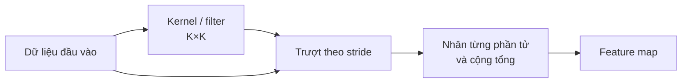

Mỗi vị trí của feature map là kết quả của kernel trên một vùng cục bộ của dữ liệu đầu vào.

---

## 2.2 Các khái niệm quan trọng

### Kernel / Filter

Là ma trận trọng số nhỏ, ví dụ `3x3`, `5x5`, dùng để trích xuất đặc trưng.

Trong CNN, kernel không còn được thiết kế thủ công mà là **tham số học được**.

---

### Feature map

Kết quả sau khi convolution ảnh với một kernel gọi là **feature map**.

Nếu dùng 32 kernel khác nhau, ta thu được 32 feature maps.

Ví dụ:

```text
Input image:       H x W x 3
Conv2D 32 filters: H' x W' x 32
```

Mỗi feature map có thể học một loại đặc trưng khác nhau: cạnh, góc, texture, hình dạng đơn giản, rồi về sau là đặc trưng phức tạp hơn.

---

### Padding

Padding là thêm giá trị, thường là zero, quanh biên ảnh.

Mục đích:

- giữ kích thước không gian sau convolution;
- cho phép kernel xử lý cả pixel ở biên.

Nếu không padding, ảnh bị giảm kích thước sau mỗi convolution.

Công thức kích thước output:

```text
Output = floor((Input + 2 * Padding - Kernel) / Stride) + 1
```

Ví dụ:

```text
Input: 28x28
Kernel: 3x3
Padding: 0
Stride: 1

Output = (28 - 3) / 1 + 1 = 26
```

---

### Stride

Stride là số pixel kernel nhảy sau mỗi lần tính.

- `stride=1`: trượt từng pixel, giữ nhiều thông tin hơn.
- `stride=2`: giảm kích thước nhanh hơn, tiết kiệm tính toán.

---

## 2.3 Pooling

Pooling dùng để giảm kích thước feature map.

Phổ biến nhất là **Max Pooling**:

```text
2x2 region:
[1 3
 2 4]

MaxPool -> 4
```

Lợi ích:

- giảm số lượng tính toán;
- giảm overfitting;
- tăng tính bất biến với dịch chuyển nhỏ;
- giữ lại đặc trưng nổi bật nhất.

Nhược điểm:

- mất thông tin vị trí chính xác.

Các loại pooling:

- Max Pooling;
- Average Pooling;
- L2 Pooling;
- Weighted Pooling.

---

## 2.4 Một CNN cơ bản

Ví dụ kiến trúc CNN đơn giản:

```python
from tensorflow import keras
from tensorflow.keras import layers

model = keras.Sequential([
    keras.Input(shape=(28, 28, 1)),

    layers.Conv2D(32, kernel_size=(3, 3), activation="relu"),
    layers.MaxPooling2D(pool_size=(2, 2)),

    layers.Conv2D(64, kernel_size=(3, 3), activation="relu"),
    layers.MaxPooling2D(pool_size=(2, 2)),

    layers.Flatten(),
    layers.Dropout(0.5),
    layers.Dense(10, activation="softmax"),
])
```

Luồng xử lý:

```text
Ảnh đầu vào
 -> Convolution: trích xuất đặc trưng
 -> ReLU: thêm phi tuyến
 -> Pooling: giảm kích thước
 -> Convolution sâu hơn: học đặc trưng phức tạp hơn
 -> Flatten
 -> Dense classifier
 -> Softmax
```

### Kích thước tensor qua CNN

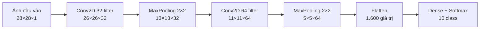

Sơ đồ cho thấy convolution và pooling dần giảm kích thước không gian, đồng thời tăng số channel để biểu diễn đặc trưng phong phú hơn.

---

## 2.5 Backpropagation trong CNN

Trong CNN, kernel chính là trọng số cần học.

Ban đầu kernel được khởi tạo ngẫu nhiên. Sau đó:

1. ảnh đi qua convolution;
2. tạo feature maps;
3. classifier dự đoán nhãn;
4. tính loss;
5. backpropagation cập nhật kernel.

Mục tiêu là học ra các kernel tốt nhất để phân biệt class.

Ví dụ với bài toán chó/mèo, CNN tự học filter phát hiện:

- cạnh;
- lông;
- mắt;
- tai;
- mõm;
- hình dạng tổng thể.

---

## 2.6 Hai ưu điểm lớn của CNN

### Parameter sharing

Một kernel được dùng trên toàn bộ ảnh.

Thay vì mỗi pixel có trọng số riêng như dense layer, CNN dùng chung kernel ở mọi vị trí.

Điều này giúp giảm rất nhiều tham số.

---

### Sparse interaction

Một neuron trong feature map chỉ nhìn một vùng nhỏ của ảnh, ví dụ `3x3`, thay vì nhìn toàn bộ ảnh.

Điều này giúp:

- giảm bộ nhớ;
- giảm tính toán;
- học đặc trưng cục bộ hiệu quả.

---

# 3. Transfer Learning và Fine-tuning

## 3.1 Transfer Learning là gì?

Transfer learning là dùng kiến thức từ một model đã học trên bài toán lớn để áp dụng cho bài toán mới.

Ví dụ model đã học ImageNet có thể nhận biết cạnh, texture, mắt, bánh xe, lông, hình dạng. Các đặc trưng này vẫn hữu ích cho nhiều bài toán khác.

Thay vì train từ đầu, ta dùng model pretrained.

### Luồng transfer learning

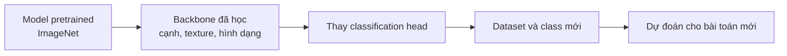

Backbone thường được giữ nguyên hoặc chỉ mở khóa một phần; classification head được điều chỉnh theo số class của dataset mới.

---

## 3.2 Fine-tuning là gì?

Fine-tuning là tiếp tục huấn luyện một model pretrained trên dữ liệu mới.

Có nhiều mức fine-tuning:

### Các mức fine-tuning

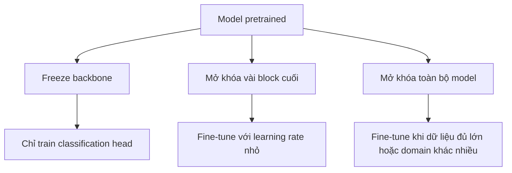

Mức mở khóa càng rộng thì khả năng thích nghi càng cao, nhưng rủi ro overfitting và chi phí tính toán cũng tăng.

### Cách 1: chỉ thay classification head

Dùng backbone để trích xuất đặc trưng, chỉ train tầng cuối.

Phù hợp khi:

- dữ liệu ít;
- bài toán mới gần với bài toán pretrained;
- muốn train nhanh.

```python
import torch.nn as nn
from torchvision import models

model = models.resnet50(weights="IMAGENET1K_V2")

for param in model.parameters():
    param.requires_grad = False

model.fc = nn.Linear(model.fc.in_features, 10)
```

---

### Cách 2: fine-tune vài layer cuối

Các layer đầu CNN học đặc trưng tổng quát như cạnh, màu, texture.

Các layer cuối học đặc trưng đặc thù hơn theo dataset.

Vì vậy thường chỉ mở khóa vài block cuối:

```python
for param in model.layer4.parameters():
    param.requires_grad = True
```

---

### Cách 3: fine-tune toàn bộ model

Dùng khi:

- dữ liệu đủ lớn;
- domain khác nhiều với ImageNet;
- cần hiệu năng cao nhất.

Rủi ro:

- overfitting nếu dữ liệu ít;
- cần learning rate nhỏ;
- tốn tài nguyên.

---

## 3.3 Khi nào transfer learning không hiệu quả?

Transfer learning không phải lúc nào cũng tốt.

Có thể kém hiệu quả nếu:

- domain quá khác nhau;
- model pretrained học bias không phù hợp;
- dữ liệu mới có đặc trưng rất khác;
- fine-tuning sai learning rate.

Nếu labeled data ít và transfer learning không đủ tốt, có thể cân nhắc **self-training**, tức tận dụng cả dữ liệu có nhãn và không nhãn.

---

# 4. VGG

## 4.1 Ý tưởng chính

VGG được giới thiệu năm 2014 bởi Visual Geometry Group, Oxford.

Đóng góp quan trọng của VGG là chứng minh rằng mạng sâu với nhiều convolution nhỏ `3x3` có thể hiệu quả hơn dùng kernel lớn.

---

## 4.2 Kiến trúc VGG

Đặc điểm:

- input: `224 x 224`;
- kernel convolution: `3x3`;
- max pooling: `2x2`;
- số channel tăng dần:

```text
64 -> 128 -> 256 -> 512 -> 512
```

VGG16 gồm:

- 13 convolution layers;
- 3 fully connected layers;
- tổng 16 layer có trọng số.

VGG19 gồm:

- 16 convolution layers;
- 3 fully connected layers.

### Luồng kiến trúc VGG

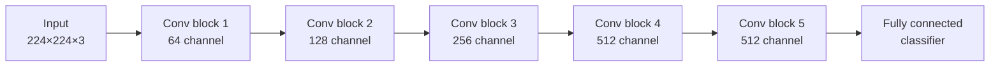

Sau mỗi block thường có max pooling; số channel tăng dần trong khi kích thước không gian giảm dần.

---

## 4.3 Vì sao dùng nhiều kernel 3x3?

Hai convolution `3x3` liên tiếp có receptive field tương đương `5x5`.

Ba convolution `3x3` liên tiếp tương đương `7x7`.

Nhưng dùng nhiều `3x3` có lợi:

- ít tham số hơn kernel lớn;
- thêm nhiều activation ReLU;
- học đặc trưng phi tuyến tốt hơn;
- kiến trúc đơn giản, dễ mở rộng.

---

## 4.4 Nhược điểm của VGG

VGG rất nặng vì có nhiều fully connected layers lớn.

Phần lớn tham số nằm ở classifier cuối.

Nhược điểm:

- nhiều tham số;
- tốn bộ nhớ;
- inference chậm;
- không phù hợp thiết bị yếu.

---

# 5. GoogLeNet / Inception

## 5.1 Ý tưởng chính

GoogLeNet thắng ImageNet 2014 và nổi bật vì hiệu quả tham số.

So với VGG16, GoogLeNet nhỏ hơn rất nhiều nhưng vẫn đạt hiệu năng cao.

Trọng tâm là **Inception Module**.

---

## 5.2 Inception Module

Thay vì chọn một kernel duy nhất, Inception chạy nhiều nhánh song song:

```text
Input
 ├─ 1x1 convolution
 ├─ 3x3 convolution
 ├─ 5x5 convolution
 └─ max pooling
      ↓
 concatenate theo channel
```

### Sơ đồ Inception Module

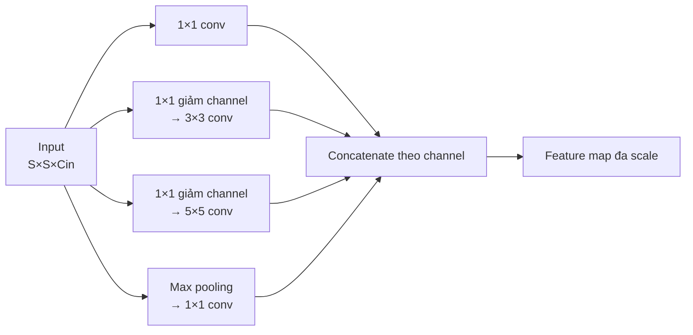

Các nhánh nhìn vùng không gian khác nhau nhưng được căn chỉnh để có cùng kích thước không gian trước khi nối lại.

Ý tưởng: ảnh có object ở nhiều scale khác nhau, nên model nên nhìn bằng nhiều receptive field khác nhau.

---

## 5.3 Vấn đề tính toán

Nếu dùng trực tiếp `3x3` và `5x5` trên nhiều channel, số tham số rất lớn.

Ví dụ convolution `5x5`:

```text
Input channels = 128
Output channels = 256

Params = 5 * 5 * 128 * 256 = 819,200
```

Giải pháp: dùng `1x1 convolution` để giảm channel trước.

```text
1x1: 128 -> 64
5x5: 64 -> 256

Params = 1*1*128*64 + 5*5*64*256
       = 8,192 + 409,600
       = 417,792
```

Gần như giảm một nửa tham số.

---

## 5.4 Vai trò của 1x1 convolution

`1x1 convolution` không nhìn hàng xóm không gian, nhưng trộn thông tin giữa các channel.

Nó dùng để:

- giảm số channel;
- tăng số channel;
- thêm phi tuyến nếu kèm ReLU;
- giảm chi phí trước convolution lớn.

---

## 5.5 Average Pooling thay Fully Connected lớn

Các mạng như AlexNet, VGG có rất nhiều tham số ở fully connected layers.

GoogLeNet thay phần lớn FC bằng average pooling, giúp giảm tham số mạnh.

---

## 5.6 Auxiliary Classifiers

GoogLeNet rất sâu, nên có nguy cơ vanishing gradient.

Giải pháp: thêm classifier phụ ở giữa mạng trong lúc training.

Classifier phụ giúp gradient truyền về các layer đầu tốt hơn.

Ở inference, auxiliary classifiers bị loại bỏ.

---

# 6. ResNet

## 6.1 Vấn đề của mạng quá sâu

Ban đầu người ta nghĩ cứ thêm layer thì model sẽ tốt hơn. Nhưng thực tế xuất hiện **degradation problem**:

- mạng sâu hơn có training error cao hơn;
- không phải do overfitting;
- vấn đề là mạng sâu khó tối ưu.

Nếu thêm layer mà không cần thiết, lý tưởng chúng nên học identity mapping. Nhưng plain network khó học điều này.

---

## 6.2 Residual Learning

ResNet giới thiệu shortcut connection:

```text
y = F(x) + x
```

Thay vì bắt block học trực tiếp mapping `H(x)`, ResNet cho block học phần dư:

```text
F(x) = H(x) - x
```

Nếu không cần biến đổi gì, block chỉ cần học:

```text
F(x) ≈ 0
```

Khi đó:

```text
y ≈ x
```

Tức block dễ dàng trở thành identity.

### Sơ đồ residual block

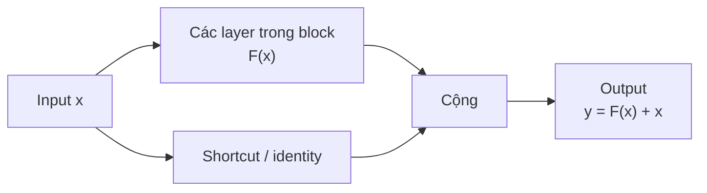

Nhánh shortcut tạo đường truyền trực tiếp cho thông tin và gradient, thay vì buộc mọi thông tin phải đi qua các convolution.

---

## 6.3 Vì sao skip connection giúp train mạng sâu?

Với residual block:

```text
y = F(x) + x
```

Gradient có đường đi trực tiếp qua nhánh `+ x`.

Điều này giúp:

- giảm vanishing gradient;
- truyền thông tin tốt hơn;
- train được mạng rất sâu;
- giảm degradation problem.

---

## 6.4 Khi kích thước không khớp thì sao?

Để cộng `F(x) + x`, hai tensor phải cùng shape.

Nếu shape khác nhau, ResNet dùng:

### Zero-padding shortcut

Thêm channel bằng zero, không có tham số học.

### Projection shortcut

Dùng `1x1 convolution` để đổi channel hoặc spatial size.

```python
nn.Conv2d(in_channels, out_channels, kernel_size=1, stride=stride)
```

---

## 6.5 Bottleneck block

ResNet-50, ResNet-101, ResNet-152 dùng bottleneck:

```text
1x1 conv: giảm channel
3x3 conv: xử lý không gian
1x1 conv: tăng channel
```

Mục tiêu:

- giảm tính toán;
- vẫn cho phép mạng rất sâu;
- giữ hiệu quả biểu diễn.

---

## 6.6 Dùng ResNet pretrained với Hugging Face

```python
from transformers import AutoImageProcessor, ResNetForImageClassification
from datasets import load_dataset
import torch

dataset = load_dataset("huggingface/cats-image")
image = dataset["test"]["image"][0]

processor = AutoImageProcessor.from_pretrained("microsoft/resnet-50")
model = ResNetForImageClassification.from_pretrained("microsoft/resnet-50")

inputs = processor(image, return_tensors="pt")

with torch.no_grad():
    logits = model(**inputs).logits

predicted_label = logits.argmax(-1).item()
print(model.config.id2label[predicted_label])
```

Input thường cần:

- RGB;
- shape tương đương `3 x H x W`;
- size tối thiểu khoảng `224`;
- normalize với mean/std ImageNet.

---

# 7. MobileNet

## 7.1 Mục tiêu

MobileNet được thiết kế cho thiết bị tài nguyên hạn chế như điện thoại, edge device.

Mục tiêu:

- inference nhanh;
- ít tham số;
- ít FLOPs;
- vẫn giữ accuracy tốt.

Kỹ thuật chính: **depthwise separable convolution**.

---

## 7.2 Standard convolution tốn kém thế nào?

Với input:

```text
H x W x Cin
```

Output:

```text
H x W x Cout
```

Kernel:

```text
K x K
```

Số tham số standard convolution:

```text
K * K * Cin * Cout
```

---

## 7.3 Depthwise Separable Convolution

Thay một convolution lớn bằng hai bước.

### Bước 1: Depthwise convolution

Mỗi channel được convolution riêng.

Số tham số:

```text
K * K * Cin
```

Trong PyTorch dùng:

```python
groups=in_channels
```

---

### Bước 2: Pointwise convolution

Dùng `1x1 convolution` để trộn channel.

Số tham số:

```text
1 * 1 * Cin * Cout
```

Tổng tham số:

```text
K*K*Cin + Cin*Cout
```

Thay vì:

```text
K*K*Cin*Cout
```

Giảm rất mạnh chi phí.

### Standard convolution và depthwise separable convolution

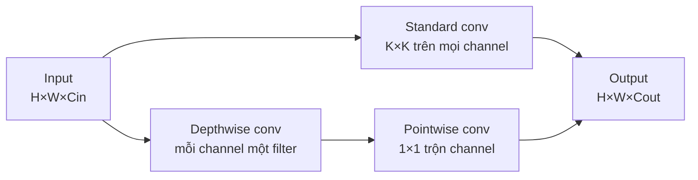

Standard convolution học đồng thời không gian và channel; MobileNet tách hai nhiệm vụ này để giảm số phép tính.

---

## 7.4 Ví dụ so sánh

Giả sử:

```text
K = 3
Cin = 32
Cout = 64
```

Standard conv:

```text
3*3*32*64 = 18,432 params
```

Depthwise separable conv:

```text
3*3*32 + 32*64 = 288 + 2,048 = 2,336 params
```

Giảm gần 8 lần.

---

## 7.5 Code PyTorch cho depthwise separable conv

```python
import torch.nn as nn

class DepthwiseSeparableConv(nn.Module):
    def __init__(self, in_channels, out_channels, stride=1):
        super().__init__()

        self.depthwise = nn.Conv2d(
            in_channels,
            in_channels,
            kernel_size=3,
            stride=stride,
            padding=1,
            groups=in_channels,
            bias=False,
        )

        self.pointwise = nn.Conv2d(
            in_channels,
            out_channels,
            kernel_size=1,
            bias=False,
        )

        self.bn = nn.BatchNorm2d(out_channels)
        self.relu = nn.ReLU(inplace=True)

    def forward(self, x):
        x = self.depthwise(x)
        x = self.pointwise(x)
        x = self.bn(x)
        x = self.relu(x)
        return x
```

---

## 7.6 1x1 convolution khác gì convolution thường?

Convolution thường như `3x3` nhìn vùng lân cận trong không gian.

`1x1 convolution` nhìn từng pixel riêng, nhưng trộn thông tin giữa các channel.

Nó thường dùng để:

- giảm channel;
- tăng channel;
- tạo bottleneck;
- trộn đặc trưng;
- giảm chi phí tính toán.

---

## 7.7 MobileNet và Transformer

MobileNet không phải Vision Transformer, nhưng có thể kết hợp với transformer.

Một số cách:

- dùng MobileNet làm feature extractor rồi đưa feature vào transformer;
- ensemble MobileNet và Vision Transformer;
- dùng kiến trúc lai như Mobile-Former.

Mobile-Former kết hợp:

- MobileNet: trích xuất đặc trưng cục bộ;
- Transformer: hiểu ngữ cảnh toàn cục.

---

## 7.8 Dùng MobileNet với Hugging Face

```python
from transformers import AutoImageProcessor, AutoModelForImageClassification
from PIL import Image
import requests

url = "http://images.cocodataset.org/val2017/000000039769.jpg"
image = Image.open(requests.get(url, stream=True).raw)

processor = AutoImageProcessor.from_pretrained("google/mobilenet_v2_1.0_224")
model = AutoModelForImageClassification.from_pretrained("google/mobilenet_v2_1.0_224")

inputs = processor(images=image, return_tensors="pt")
outputs = model(**inputs)

predicted_class_idx = outputs.logits.argmax(-1).item()
print(model.config.id2label[predicted_class_idx])
```

---

## 7.9 Dùng MobileNet với timm

```bash
pip install timm
```

```python
import timm
import torch

model = timm.create_model("mobilenetv3_large_100", pretrained=True)
model.eval()

x = torch.rand(1, 3, 224, 224)

with torch.no_grad():
    y = model(x)

print(y.shape)
```

---

# 8. Object Detection và YOLO

## 8.1 Classification vs Object Detection

Image classification trả lời:

```text
Ảnh này là gì?
```

Object detection trả lời:

```text
Có những object nào?
Ở đâu?
```

Output detection gồm:

- class label;
- bounding box;
- confidence score.

---

## 8.2 Trước YOLO: R-CNN family

### R-CNN

Pipeline:

1. dùng Selective Search tìm region proposals;
2. crop từng region;
3. dùng CNN classify từng region.

Nhược điểm:

- nhiều bước;
- chậm;
- khó train end-to-end.

---

### Fast R-CNN

Cải tiến:

- chạy CNN một lần trên toàn ảnh;
- dùng ROI Pooling lấy feature cho từng region;
- train gần end-to-end hơn;
- không cần lưu feature ra disk.

---

### Faster R-CNN

Cải tiến lớn:

- thay Selective Search bằng Region Proposal Network, gọi là RPN;
- RPN học cách đề xuất vùng có object;
- hệ thống end-to-end hơn;
- nhanh hơn Fast R-CNN.

---

### FPN — Feature Pyramid Network

FPN giúp detect object ở nhiều scale.

Ý tưởng:

- downsample tạo feature sâu;
- upsample lại;
- dùng skip connection giữa các level;
- predict trên nhiều resolution.

FPN rất quan trọng cho object detection hiện đại.

### Tiến hóa của R-CNN family

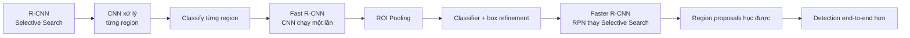

Mỗi phiên bản giảm bớt bước xử lý riêng lẻ và đưa nhiều thành phần hơn vào quá trình học end-to-end.

---

## 8.3 YOLO là gì?

YOLO = You Only Look Once.

YOLO biến object detection thành một bài toán regression duy nhất.

Thay vì:

```text
region proposal -> classify -> refine box
```

YOLO làm trong một forward pass:

```text
image -> bounding boxes + classes + confidence
```

Ưu điểm:

- rất nhanh;
- end-to-end;
- phù hợp real-time detection.

### Luồng xử lý YOLO

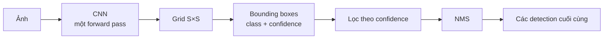

---

## 8.4 Cách YOLOv1 biểu diễn output

Ảnh được chia thành grid:

```text
S x S
```

Nếu tâm object rơi vào cell nào, cell đó chịu trách nhiệm detect object.

Mỗi grid cell dự đoán:

- `B` bounding boxes;
- mỗi box có 5 giá trị:

```text
x, y, w, h, confidence
```

- `C` class probabilities.

Output tensor:

```text
S x S x (B * 5 + C)
```

Với YOLOv1:

```text
S = 7
B = 2
C = 20
```

Output:

```text
7 x 7 x (2*5 + 20)
= 7 x 7 x 30
```

### Từ grid đến output tensor

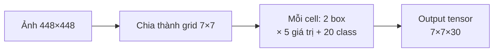

Mỗi cell chứa hai bounding box, mỗi box có tọa độ và confidence; vector class được dùng chung cho các box của cell đó.

---

## 8.5 Confidence score

YOLO định nghĩa confidence:

```text
confidence = P(Object) * IoU(pred_box, true_box)
```

Ý nghĩa:

- nếu cell không có object, confidence nên gần 0;
- nếu có object, confidence phản ánh box có khớp ground truth không.

---

## 8.6 Bounding box encoding

Mỗi bounding box gồm:

```text
x, y, w, h
```

Trong đó:

- `x, y`: tọa độ tâm box tương đối với grid cell;
- `w, h`: chiều rộng, chiều cao chuẩn hóa theo kích thước ảnh.

---

## 8.7 Class probabilities

Mỗi cell dự đoán xác suất class có điều kiện:

```text
P(class_i | Object)
```

Khi inference, YOLO nhân:

```text
P(class_i | Object) * confidence
```

Tức:

```text
P(class_i) * IoU
```

Đây là score theo từng class cho từng box.

---

## 8.8 YOLO loss

YOLOv1 dùng sum squared error, gồm 3 phần:

```text
loss = localization loss
     + confidence loss
     + classification loss
```

Nhưng các phần không quan trọng như nhau, nên YOLO dùng trọng số.

### Localization loss

Phạt sai tọa độ box.

YOLO tăng trọng số localization bằng:

```text
lambda_coord = 5
```

### No-object confidence loss

Rất nhiều grid cell không có object. Nếu phạt quá mạnh các cell này, training mất cân bằng.

YOLO giảm trọng số no-object bằng:

```text
lambda_noobj = 0.5
```

### Width/height dùng căn bậc hai

YOLO dùng:

```text
sqrt(w), sqrt(h)
```

thay vì trực tiếp `w, h`.

Lý do: lỗi nhỏ ở box nhỏ nghiêm trọng hơn lỗi tương tự ở box lớn.

---

## 8.9 Non-Maximum Suppression

YOLO có thể dự đoán nhiều box trùng nhau cho cùng một object.

NMS xử lý như sau:

1. chọn box có confidence cao nhất;
2. xóa các box còn lại có IoU cao hơn ngưỡng;
3. lặp lại.

### Trực quan hóa quy trình NMS

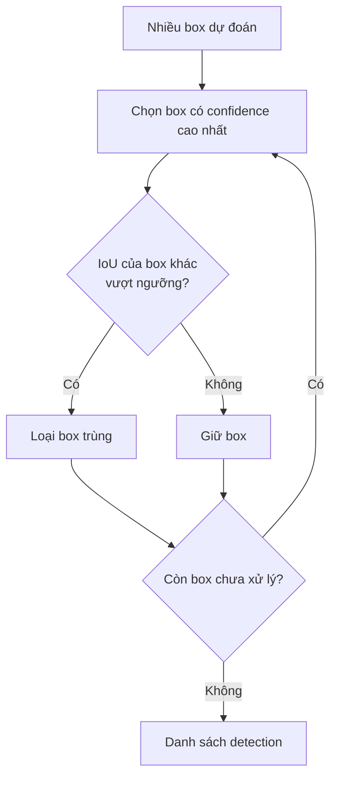

Ví dụ:

```python
import torch
from torchvision.ops import nms

boxes = torch.tensor([
    [10, 10, 100, 100],
    [12, 12, 98, 98],
    [200, 200, 300, 300],
], dtype=torch.float)

scores = torch.tensor([0.95, 0.90, 0.80])

keep = nms(boxes, scores, iou_threshold=0.5)
print(keep)
```

---

## 8.10 Tiến hóa của YOLO

### YOLOv1

- single-stage detector;
- rất nhanh;
- output grid `7x7`;
- yếu với object nhỏ và nhiều object gần nhau.

### YOLOv2

- dùng Darknet-19;
- thêm BatchNorm;
- dùng anchor boxes;
- grid `13x13`;
- cải thiện localization.

### YOLOv3

- dùng Darknet-53;
- detect ở 3 scale: `13x13`, `26x26`, `52x52`;
- tốt hơn với object nhỏ.

### YOLOv4

- backbone CSPDarknet53;
- nhiều kỹ thuật augmentation;
- bag-of-freebies;
- tối ưu speed/accuracy trên nhiều hardware.

### YOLOv5

- chuyển sang PyTorch;
- dễ dùng hơn;
- auto-anchor;
- nhiều size model: s, m, l, x.

### YOLOv6

- hướng công nghiệp;
- dùng reparameterization;
- tối ưu latency trên GPU thực tế;
- thêm loss mới;
- knowledge distillation.

### YOLOv7

- trainable bag-of-freebies;
- cải thiện label assignment;
- tối ưu gradient flow và scaling.

### YOLOv8

- anchor-free;
- hỗ trợ detection, classification, segmentation, pose;
- nhiều model size: nano, small, medium, large, extra-large.

### YOLOv9

- Programmable Gradient Information;
- GELAN architecture;
- giảm mất mát thông tin trong feature extraction;
- đạt benchmark mạnh trên COCO.

---

# 9. ConvNeXt

## 9.1 ConvNeXt là gì?

ConvNeXt là kiến trúc CNN hiện đại ra năm 2022.

Ý tưởng chính: hiện đại hóa ResNet bằng các thiết kế lấy cảm hứng từ Vision Transformer, nhưng vẫn giữ bản chất convolution.

ConvNeXt cho thấy CNN vẫn có thể cạnh tranh với Vision Transformer nếu được thiết kế và train đúng cách.

---

## 9.2 Các cải tiến chính

ConvNeXt bắt đầu từ ResNet-50 rồi cải tiến từng bước.

Các nhóm thay đổi chính:

1. training techniques;
2. macro design;
3. ResNeXt-ify;
4. inverted bottleneck;
5. large kernel sizes;
6. micro design.

### Lộ trình hiện đại hóa ConvNeXt

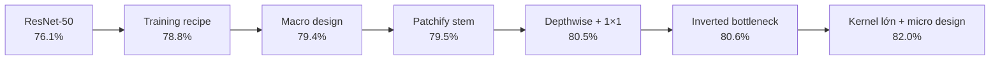

Các con số minh họa accuracy ImageNet-1K được nêu trong tài liệu tiếng Anh; chúng cho thấy tác động tích lũy của từng nhóm thay đổi.

---

## 9.3 Training techniques

ConvNeXt dùng các kỹ thuật training hiện đại giống DeiT/Swin Transformer:

- train lâu hơn: từ 90 epochs lên 300 epochs;
- dùng AdamW;
- Mixup;
- CutMix;
- RandAugment;
- Random Erasing;
- Stochastic Depth;
- Label Smoothing.

Chỉ thay training recipe đã tăng accuracy ResNet-50 từ khoảng `76.1%` lên `78.8%`.

Thông điệp quan trọng: kiến trúc tốt chưa đủ, recipe training rất quan trọng.

---

## 9.4 Macro design

Macro design là thiết kế cấp cao của network.

### Stage compute ratio

ResNet-50 có số block:

```text
(3, 4, 6, 3)
```

ConvNeXt đổi gần với Swin Transformer:

```text
(3, 3, 9, 3)
```

Tức dồn nhiều computation hơn vào stage giữa/sâu.

---

### Patchify stem

ResNet thường bắt đầu bằng:

```text
7x7 conv stride 2 + max pool
```

ConvNeXt thay bằng:

```text
4x4 conv stride 4
```

Điều này giống cách Vision Transformer chia ảnh thành patch.

---

## 9.5 ResNeXt-ify

ConvNeXt dùng ý tưởng tách:

- spatial mixing;
- channel mixing.

Cụ thể:

- depthwise convolution xử lý không gian;
- `1x1 convolution` xử lý channel.

Điều này giống cơ chế transformer tách token mixing và channel/MLP mixing.

---

## 9.6 Inverted Bottleneck

Bottleneck truyền thống:

```text
wide -> narrow -> wide
```

Inverted bottleneck:

```text
narrow -> wide -> narrow
```

MobileNetV2 đã phổ biến kỹ thuật này.

ConvNeXt dùng:

```text
96 channels -> 384 hidden channels -> 96 channels
```

Giúp tăng capacity ở giữa block mà vẫn giữ chi phí hợp lý.

---

## 9.7 Large kernel sizes

Vision Transformer có attention nên nhìn được vùng rộng.

CNN truyền thống thường dùng kernel `3x3`, receptive field nhỏ hơn.

ConvNeXt tăng depthwise convolution lên kernel `7x7`.

Lợi ích:

- receptive field rộng hơn;
- học ngữ cảnh tốt hơn;
- gần hơn với ưu điểm của self-attention.

---

## 9.8 Micro design

Các thay đổi cấp thấp:

### ReLU -> GELU

ConvNeXt dùng GELU, giống transformer.

### BatchNorm -> LayerNorm

BatchNorm phổ biến trong CNN, LayerNorm phổ biến trong transformer.

ConvNeXt giảm số normalization layer và dùng LayerNorm.

### Ít activation hơn

Không đặt activation sau mọi convolution như CNN cổ điển.

Chỉ giữ một GELU trong block.

### Downsampling layer riêng

Thêm downsampling rõ ràng giữa các stage.

---

## 9.9 Kết quả

Sau toàn bộ cải tiến, ConvNeXt tăng accuracy lên khoảng `82.0%`, vượt Swin Transformer baseline được nêu trong bài.

Bài học quan trọng:

- CNN không lỗi thời;
- nhiều cải tiến của Transformer có thể chuyển sang CNN;
- training recipe và thiết kế block hiện đại rất quan trọng.

---

# 10. Tổng kết các kiến trúc

| Kiến trúc | Ý tưởng chính | Điểm mạnh | Điểm yếu |
|---|---|---|---|
| CNN cơ bản | Học kernel từ dữ liệu | Đơn giản, hiệu quả | Cần thiết kế tốt |
| VGG | Nhiều conv `3x3` sâu | Dễ hiểu, baseline tốt | Rất nhiều tham số |
| GoogLeNet | Inception module đa scale | Ít tham số, hiệu quả | Kiến trúc phức tạp |
| ResNet | Skip connection | Train được mạng rất sâu | Vẫn tốn compute nếu lớn |
| MobileNet | Depthwise separable conv | Nhẹ, nhanh, hợp edge/mobile | Accuracy có thể thấp hơn model lớn |
| YOLO | Detection một bước | Real-time, end-to-end | Khó với object nhỏ ở bản đầu |
| ConvNeXt | CNN hiện đại hóa theo ViT | Accuracy cao, thiết kế hiện đại | Training recipe phức tạp hơn |

---

# 11. Những điểm kỹ thuật cần nhớ nhất

1. **Convolution học filter**, không cần thiết kế thủ công như Sobel/Prewitt.
2. **Feature map** là kết quả trích xuất đặc trưng từ kernel.
3. **Padding, stride, kernel size** quyết định kích thước output.
4. **Pooling** giảm kích thước và tăng tính bất biến cục bộ.
5. **Parameter sharing** làm CNN hiệu quả hơn dense network trên ảnh.
6. **Transfer learning** rất quan trọng khi dữ liệu ít.
7. **Layer đầu CNN học đặc trưng tổng quát**, layer cuối học đặc trưng đặc thù.
8. **VGG** chứng minh nhiều kernel nhỏ `3x3` hiệu quả.
9. **GoogLeNet/Inception** dùng nhiều kernel song song và `1x1 conv` để giảm chi phí.
10. **ResNet** giải quyết degradation bằng `F(x) + x`.
11. **MobileNet** giảm mạnh FLOPs bằng depthwise separable convolution.
12. **YOLO** biến detection thành regression một bước.
13. **NMS** cần để loại box trùng trong detection.
14. **ConvNeXt** cho thấy CNN hiện đại vẫn rất mạnh khi dùng thiết kế/training kiểu Transformer.

