# Unit 3 — Vision Transformers

## 1. Vision Transformer là gì?

Vision Transformer, thường gọi là **ViT**, áp dụng kiến trúc Transformer vào ảnh.

Thay vì xử lý ảnh bằng convolution như CNN, ViT làm như sau:

1. Chia ảnh thành nhiều patch nhỏ, ví dụ `16x16`.
2. Flatten mỗi patch thành vector.
3. Đưa vector qua linear projection để thành token embedding.
4. Thêm positional embedding để mô hình biết vị trí của từng patch.
5. Đưa chuỗi token vào Transformer encoder.
6. Dùng output để phân loại, phát hiện vật thể hoặc phân đoạn ảnh.

Ví dụ đơn giản:

```text
Ảnh 224x224
Patch size 16x16
=> 14 x 14 = 196 patches
=> 196 tokens đưa vào Transformer
```

Điểm quan trọng: với ViT, **ảnh được xử lý như một chuỗi token**, tương tự cách NLP xử lý chuỗi từ.

### Sơ đồ: từ ảnh đến token

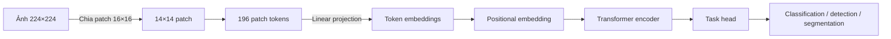

---

## 2. CNN vs Vision Transformer

### CNN có inductive bias mạnh

CNN được thiết kế sẵn với một số giả định phù hợp với ảnh:

#### 1. Locality

Pixel gần nhau thường liên quan nhiều hơn pixel ở xa.

Ví dụ: mắt, mũi, miệng nằm gần nhau tạo thành khuôn mặt.

#### 2. Translational equivariance

Nếu vật thể xuất hiện ở vị trí khác trong ảnh, CNN vẫn có thể nhận ra nhờ convolution filter trượt trên toàn ảnh.

Ví dụ: con mèo ở góc trái hay góc phải vẫn được phát hiện.

### ViT ít inductive bias hơn

ViT không tự nhiên có locality và translational equivariance như CNN.

Hệ quả:

- Với dataset nhỏ, CNN thường học tốt hơn.
- ViT cần nhiều dữ liệu hơn để học được các đặc trưng ảnh.
- Nhưng khi có dữ liệu lớn và compute mạnh, ViT scale rất tốt.

### Tại sao ViT vẫn mạnh?

Transformer chủ yếu gồm các phép tuyến tính, attention, MLP nên scale tốt với:

- dữ liệu lớn,
- model lớn,
- pretraining lớn.

Vì vậy, trong thực tế thường không train ViT từ đầu, mà dùng **pretrained model** rồi fine-tune.

### Sơ đồ: chọn chiến lược huấn luyện

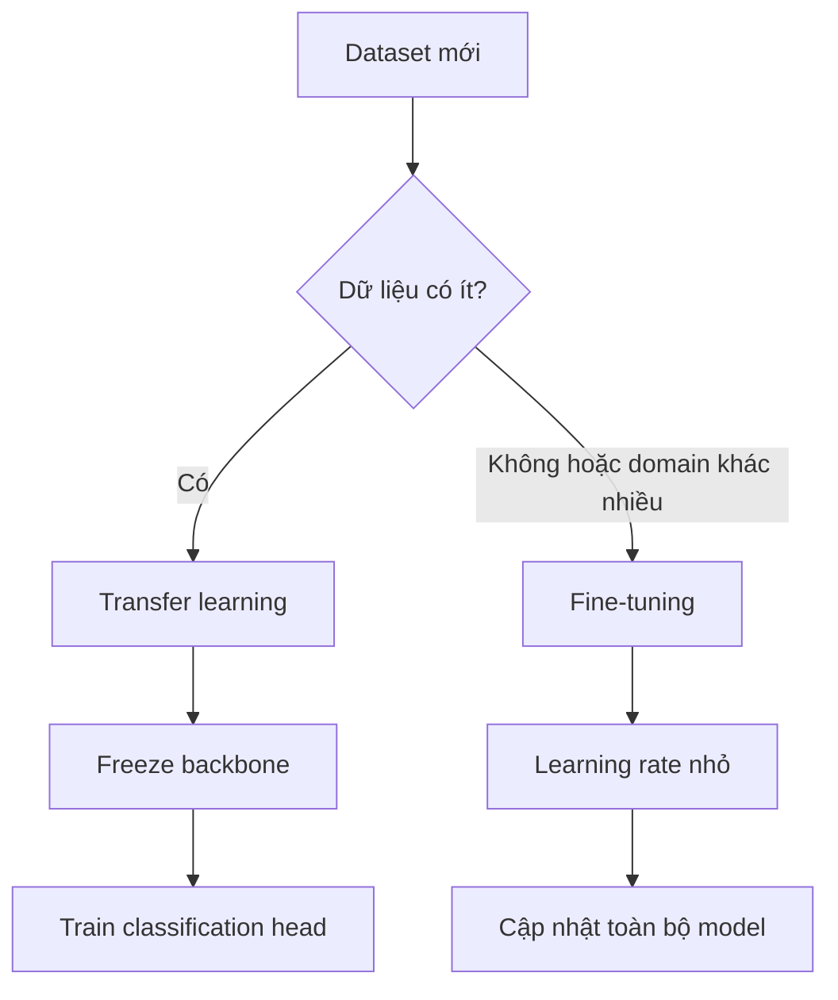

---

# 3. Transfer Learning và Fine-tuning ViT

## Transfer learning

Ý tưởng: dùng model đã được train trên dataset lớn, ví dụ ImageNet, rồi tận dụng feature đã học cho bài toán mới.

Thường làm:

- giữ nguyên phần backbone,
- thay classification head,
- train lại head hoặc một phần model.

Ví dụ với image classification:

```python
from transformers import AutoImageProcessor, ViTForImageClassification
from PIL import Image
import torch

model_name = "google/vit-base-patch16-224"

processor = AutoImageProcessor.from_pretrained(model_name)
model = ViTForImageClassification.from_pretrained(model_name)

image = Image.open("image.jpg").convert("RGB")
inputs = processor(images=image, return_tensors="pt")

with torch.no_grad():
    outputs = model(**inputs)

pred_id = outputs.logits.argmax(-1).item()
print(model.config.id2label[pred_id])
```

## Fine-tuning

Fine-tuning nghĩa là tiếp tục cập nhật weight của pretrained model trên dataset mới.

Có hai cách phổ biến:

### 1. Feature extraction

Freeze backbone, chỉ train head.

Ưu điểm:

- nhanh,
- ít GPU,
- ít overfit.

Nhược điểm:

- kém linh hoạt nếu domain mới khác nhiều domain pretrain.

### 2. Full fine-tuning

Train toàn bộ model với learning rate nhỏ.

Ưu điểm:

- thích nghi tốt hơn với dataset mới.

Nhược điểm:

- tốn compute,
- dễ overfit nếu dữ liệu ít.

---

# 4. Multi-class vs Multi-label Classification

## Multi-class classification

Mỗi ảnh chỉ thuộc **một class**.

Ví dụ:

```text
Ảnh chó Golden Retriever -> label = "golden retriever"
```

Dùng softmax + cross entropy.

```python
loss = CrossEntropyLoss(logits, label)
```

## Multi-label classification

Một ảnh có thể thuộc **nhiều label cùng lúc**.

Ví dụ:

```text
Ảnh có: dog, person, grass
```

Dùng sigmoid cho từng class + binary cross entropy.

```python
loss = BCEWithLogitsLoss(logits, multi_hot_labels)
```

Khác biệt quan trọng:

| Bài toán | Activation | Loss | Output |
|---|---|---|---|
| Multi-class | Softmax | CrossEntropy | 1 class |
| Multi-label | Sigmoid | BCEWithLogits | nhiều class |

---

# 5. DETR — Detection Transformer

DETR là viết tắt của **DEtection TRansformer**.

Đây là model object detection dùng Transformer để dự đoán trực tiếp bounding box và class.

## Object detection là gì?

Input:

```text
Ảnh
```

Output:

```text
[
  ("car", x1, y1, x2, y2),
  ("person", x1, y1, x2, y2)
]
```

Object detection cần làm hai việc:

1. phân loại object,
2. định vị object bằng bounding box.

---

## DETR khác YOLO/RCNN ở đâu?

Các model detection truyền thống thường cần:

- anchor boxes,
- region proposals,
- non-maximum suppression,
- nhiều heuristic thủ công.

DETR cố gắng đơn giản hóa pipeline:

```text
CNN backbone -> Transformer encoder-decoder -> prediction heads
```

DETR dự đoán một tập cố định object query, ví dụ 100 query.

### Sơ đồ kiến trúc DETR

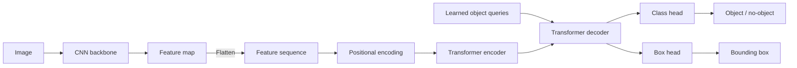

Mỗi query có thể dự đoán:

- một object,
- hoặc class đặc biệt `"no object"`.

---

## Kiến trúc DETR

Pipeline chính:

```text
Image
 -> CNN backbone
 -> feature map
 -> flatten thành sequence
 -> positional encoding
 -> Transformer encoder
 -> Transformer decoder với object queries
 -> class head + box head
```

### 1. CNN Backbone

Thường dùng ResNet để trích xuất feature map.

Ví dụ:

```text
Input image: [B, 3, H, W]
Feature map: [B, C, H', W']
```

### 2. Flatten feature map

Transformer cần sequence, nên feature map được flatten:

```text
[B, C, H', W'] -> [H' * W', B, C]
```

### 3. Positional encoding

Transformer không tự biết vị trí token, nên cần positional encoding.

DETR dùng:

- positional encoding cho encoder,
- learned object queries cho decoder.

### 4. Object queries

Object query là vector học được, đại diện cho “slot” dự đoán object.

Ví dụ nếu có 100 object queries:

```text
Query 1 -> object hoặc no-object
Query 2 -> object hoặc no-object
...
Query 100 -> object hoặc no-object
```

### 5. Prediction head

Mỗi query đi qua:

```text
linear_class -> class logits
linear_bbox  -> box coordinates
```

---

## Set-based loss và Bipartite Matching

Đây là điểm rất quan trọng của DETR.

Vì output là một tập object, thứ tự không quan trọng:

```text
[cat, dog] == [dog, cat]
```

Nên cần match prediction với ground truth bằng **bipartite matching**, thường dùng Hungarian algorithm.

Mục tiêu:

- mỗi ground truth chỉ match với một prediction,
- mỗi prediction chỉ match với một ground truth,
- prediction không match sẽ thành `"no object"`.

Loss gồm:

- classification loss,
- bounding box loss,
- generalized IoU loss.

Có thể hình dung bước ghép như sau:

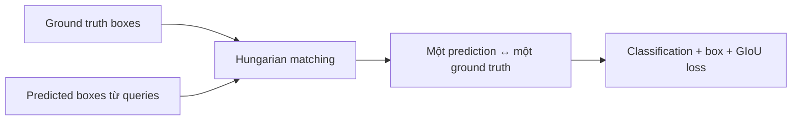

---

## Inference DETR với Hugging Face

```python
from transformers import DetrImageProcessor, DetrForObjectDetection
from PIL import Image
import requests
import torch

url = "http://images.cocodataset.org/val2017/000000039769.jpg"
image = Image.open(requests.get(url, stream=True).raw)

processor = DetrImageProcessor.from_pretrained(
    "facebook/detr-resnet-101",
    revision="no_timm"
)
model = DetrForObjectDetection.from_pretrained(
    "facebook/detr-resnet-101",
    revision="no_timm"
)

inputs = processor(images=image, return_tensors="pt")
outputs = model(**inputs)

target_sizes = torch.tensor([image.size[::-1]])
results = processor.post_process_object_detection(
    outputs,
    target_sizes=target_sizes,
    threshold=0.9
)[0]

for score, label, box in zip(
    results["scores"],
    results["labels"],
    results["boxes"]
):
    print(model.config.id2label[label.item()], score.item(), box.tolist())
```

---

## Các biến thể của DETR

### Deformable DETR

Giải quyết hai vấn đề của DETR gốc:

1. train chậm,
2. phát hiện object nhỏ chưa tốt.

Thay vì attention toàn cục trên mọi vị trí, Deformable DETR chỉ attend vào một số điểm lấy mẫu quanh reference point.

Ưu điểm:

- giảm chi phí attention,
- hội tụ nhanh hơn,
- xử lý multi-scale tốt hơn.

### Conditional DETR

Tăng tốc hội tụ bằng cách tách query thành:

- content query,
- spatial query.

Spatial query giúp decoder định vị vùng box tốt hơn.

---

# 6. Fine-tuning Object Detection Model

Tài liệu hướng dẫn fine-tune DETR cho bài toán phát hiện:

- người,
- đầu,
- mũ bảo hộ.

Dataset dùng: hardhat dataset.

## Dataset format

Một sample có dạng:

```python
{
    "image": PIL.Image,
    "image_id": 1,
    "width": 500,
    "height": 375,
    "objects": {
        "id": [1, 1],
        "area": [3068.0, 690.0],
        "bbox": [[178.0, 84.0, 52.0, 59.0]],
        "category": ["helmet"]
    }
}
```

Bounding box dùng format COCO:

```text
[x, y, width, height]
```

---

## Image processor

Với DETR, cần `AutoImageProcessor` để tạo:

- `pixel_values`,
- `pixel_mask`,
- `labels`.

```python
from transformers import AutoImageProcessor

checkpoint = "facebook/detr-resnet-50-dc5"
image_processor = AutoImageProcessor.from_pretrained(checkpoint)
```

---

## Augmentation với Albumentations

Khi augment ảnh object detection, phải augment cả bounding box.

```python
import albumentations

transform = albumentations.Compose(
    [
        albumentations.Resize(480, 480),
        albumentations.HorizontalFlip(p=1.0),
        albumentations.RandomBrightnessContrast(p=1.0),
    ],
    bbox_params=albumentations.BboxParams(
        format="coco",
        label_fields=["category"]
    ),
)
```

Điểm quan trọng: nếu chỉ augment ảnh mà không update bbox, label sẽ sai.

---

## Collate function

Object detection có số object khác nhau trên mỗi ảnh, nên cần custom collate function.

```python
def collate_fn(batch):
    pixel_values = [item["pixel_values"] for item in batch]
    encoding = image_processor.pad(pixel_values, return_tensors="pt")

    labels = [item["labels"] for item in batch]

    return {
        "pixel_values": encoding["pixel_values"],
        "pixel_mask": encoding["pixel_mask"],
        "labels": labels,
    }
```

---

## Load model để fine-tune

```python
from transformers import AutoModelForObjectDetection

id2label = {0: "head", 1: "helmet", 2: "person"}
label2id = {v: k for k, v in id2label.items()}

model = AutoModelForObjectDetection.from_pretrained(
    checkpoint,
    id2label=id2label,
    label2id=label2id,
    ignore_mismatched_sizes=True,
)
```

`ignore_mismatched_sizes=True` cần thiết vì classification head cũ có số class khác dataset mới.

---

# 7. Transformer-based Image Segmentation

Segmentation là bài toán gán nhãn cho từng pixel.

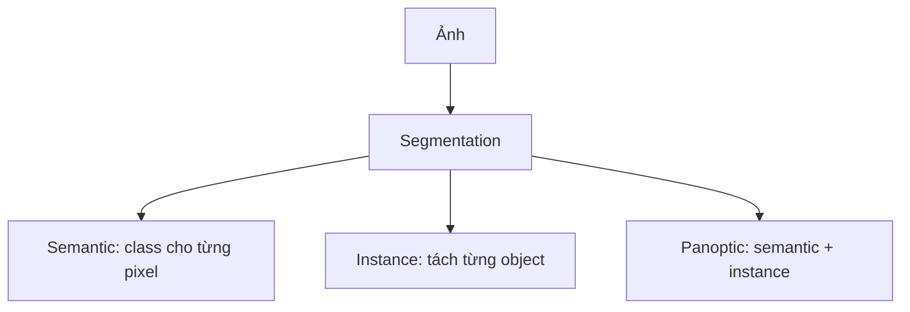

Có ba loại chính:

## Semantic segmentation

Mỗi pixel có class.

Ví dụ:

```text
pixel thuộc road, sky, person, car
```

Không phân biệt hai object cùng class.

## Instance segmentation

Phân biệt từng object riêng biệt.

Ví dụ:

```text
person #1, person #2
```

## Panoptic segmentation

Kết hợp semantic + instance segmentation.

---

## Vì sao Transformer hữu ích cho segmentation?

CNN mạnh ở local feature nhưng có giới hạn:

- khó liên kết vùng xa nhau,
- cần nhiều module thủ công,
- thường phải thiết kế riêng cho từng loại segmentation.

Transformer có attention nên dễ học quan hệ toàn cục.

---

# 8. MaskFormer

MaskFormer là model segmentation dùng Transformer, thống nhất semantic và instance segmentation.

## Kiến trúc MaskFormer

Gồm ba phần:

### 1. Pixel-level module

Trích xuất feature từ ảnh bằng backbone và pixel decoder.

Output là per-pixel embeddings.

### 2. Transformer module

Dùng Transformer decoder tạo per-segment embeddings.

Các query học đại diện cho segment.

### 3. Segmentation module

Sinh ra:

- class probability cho từng segment,
- mask embedding cho từng segment.

Mask được tạo bằng cách kết hợp:

```text
mask embedding x pixel embedding
```

Loss gồm:

- binary mask loss,
- cross entropy classification loss.

### Sơ đồ MaskFormer

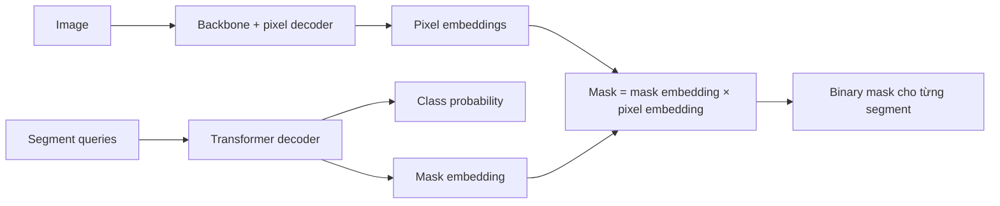

---

## Inference panoptic segmentation

```python
from transformers import pipeline
from PIL import Image
import requests

segmentation = pipeline(
    "image-segmentation",
    "facebook/maskformer-swin-base-coco"
)

url = "http://images.cocodataset.org/val2017/000000039769.jpg"
image = Image.open(requests.get(url, stream=True).raw)

results = segmentation(inputs=image, subtask="panoptic")
print(results)
```

Output gồm nhiều mask, mỗi mask có:

```python
{
    "score": 0.99,
    "label": "cat",
    "mask": PIL.Image
}
```

---

# 9. OneFormer

OneFormer là model **universal image segmentation**.

Mục tiêu: dùng một model duy nhất cho:

- semantic segmentation,
- instance segmentation,
- panoptic segmentation.

## Vấn đề trước OneFormer

Nhiều model segmentation phải train riêng cho từng task.

OneFormer dùng task-conditioned training để một model xử lý nhiều task.

---

## Ý tưởng chính

### 1. Task input

Khi inference, đưa thêm task vào model:

```text
"semantic"
"instance"
"panoptic"
```

Model dựa vào task input để thay đổi hành vi.

### 2. Task-conditioned joint training

Trong training, task được sample ngẫu nhiên để model học chung nhiều task.

### 3. Query-text contrastive loss

Model học phân biệt giữa:

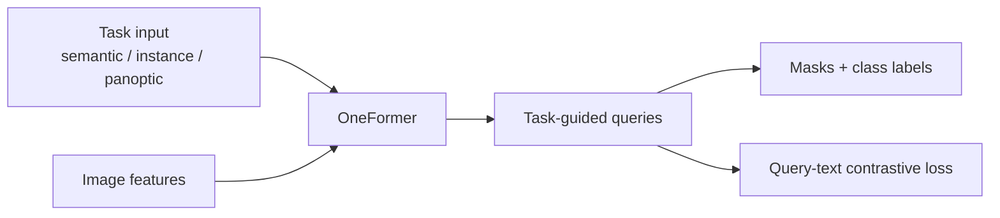

- task khác nhau,
- class khác nhau,

bằng cách so sánh visual query với text description.

---

## Ví dụ dùng OneFormer

```python
from transformers import OneFormerProcessor, OneFormerForUniversalSegmentation
from PIL import Image
import requests

processor = OneFormerProcessor.from_pretrained(
    "shi-labs/oneformer_ade20k_dinat_large"
)
model = OneFormerForUniversalSegmentation.from_pretrained(
    "shi-labs/oneformer_ade20k_dinat_large"
)

url = "https://huggingface.co/datasets/shi-labs/oneformer_demo/resolve/main/ade20k.jpeg"
image = Image.open(requests.get(url, stream=True).raw)

inputs = processor(
    images=image,
    task_inputs=["semantic"],
    return_tensors="pt"
)

outputs = model(**inputs)

seg_map = processor.post_process_semantic_segmentation(
    outputs,
    target_sizes=[image.size[::-1]]
)[0]
```

Muốn đổi task:

```python
task_inputs=["instance"]
task_inputs=["panoptic"]
```

---

# 10. Swin Transformer

Swin Transformer là một hierarchical Vision Transformer dùng **shifted windows**.

## Vấn đề của ViT gốc

ViT attention toàn cục giữa mọi patch.

Nếu có `N` patch, attention có độ phức tạp:

```text
O(N^2)
```

Ảnh lớn sẽ rất tốn compute.

---

## Window-based attention

Swin chia ảnh thành các window nhỏ.

Attention chỉ tính trong từng window.

Ví dụ:

```text
Ảnh -> nhiều window 7x7 patches
Attention chỉ trong từng window
```

Độ phức tạp giảm đáng kể, gần tuyến tính theo kích thước ảnh.

---

## Shifted window

Nếu chỉ attention trong window cố định, các window không giao tiếp tốt với nhau.

Swin giải quyết bằng cách:

1. layer đầu dùng window bình thường,
2. layer sau shift window,
3. nhờ shift, patch ở window khác có thể tương tác.

Đây là kỹ thuật quan trọng nhất của Swin.


---

## Hierarchical backbone

Swin giảm dần spatial resolution qua các stage bằng `PatchMerging`.

Tương tự CNN:

```text
Stage 1: resolution cao, channel thấp
Stage 2: resolution thấp hơn, channel cao hơn
Stage 3: resolution thấp hơn nữa
```

Điều này làm Swin phù hợp cho:

- classification,
- detection,
- segmentation.

---

## Patch Merging

Patch merging gom 4 patch lân cận thành một token mới.

```text
[B, H, W, C]
-> lấy 2x2 patches
-> concat thành 4C
-> linear reduction thành 2C
```

Kết quả:

```text
H, W giảm một nửa
C tăng lên
```

---

## Inference với Swin

```python
from datasets import load_dataset
from transformers import AutoImageProcessor, SwinForImageClassification
import torch

model = SwinForImageClassification.from_pretrained(
    "microsoft/swin-tiny-patch4-window7-224"
)
processor = AutoImageProcessor.from_pretrained(
    "microsoft/swin-tiny-patch4-window7-224"
)

dataset = load_dataset("huggingface/cats-image")
image = dataset["test"]["image"][0]

inputs = processor(image, return_tensors="pt")

with torch.no_grad():
    logits = model(**inputs).logits

pred_id = logits.argmax(-1).item()
print(model.config.id2label[pred_id])
```

---

# 11. Swin Transformer V2

Swin V2 mở rộng Swin để train model rất lớn, lên tới hàng tỷ tham số.

Cải tiến chính:

- ổn định training model lớn,
- hỗ trợ ảnh độ phân giải cao,
- dùng SimMIM self-supervised learning để giảm nhu cầu label.

Ứng dụng:

- classification,
- detection,
- segmentation,
- image restoration.

---

# 12. SwinIR và Swin2SR

Đây là các model image restoration dựa trên Swin.

## SwinIR

Dùng Swin Transformer cho:

- super-resolution,
- denoising,
- JPEG artifact removal.

## Swin2SR

Cải tiến SwinIR bằng Swin V2, tốt hơn cho ảnh độ phân giải cao.

---

# 13. CvT — Convolutional Vision Transformer

CvT là **Convolutional Vision Transformer**.

Ý tưởng: kết hợp điểm mạnh của CNN và Transformer.

## ViT gốc có gì hạn chế?

ViT dùng:

- patch embedding không overlap,
- linear projection,
- positional embedding.

Nó thiếu local structure như CNN.

---

## CvT thêm convolution vào Transformer

CvT dùng hai kỹ thuật chính:

### 1. Convolutional Token Embedding

Thay vì chia patch cứng rồi linear projection, CvT dùng convolution để tạo token.

Ưu điểm:

- có local receptive field,
- token có overlap,
- downsampling tự nhiên,
- giữ thông tin không gian tốt hơn.

### 2. Convolutional Projection

Trong self-attention, Q, K, V không được tạo bằng linear projection thông thường mà dùng convolution, thường là depthwise separable convolution.

Điều này giúp model học local context tốt hơn.

### Sơ đồ CvT

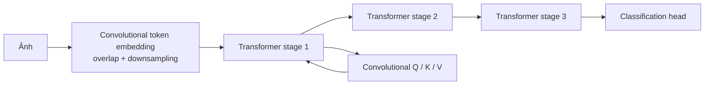

---

## CvT không cần positional encoding

Do convolution đã encode thông tin không gian cục bộ, CvT có thể bỏ positional embedding.

Đây là điểm khác ViT.

Ưu điểm:

- linh hoạt hơn với input resolution khác nhau,
- giảm parameter,
- giảm phụ thuộc vào fixed input size.

---

## So sánh nhanh

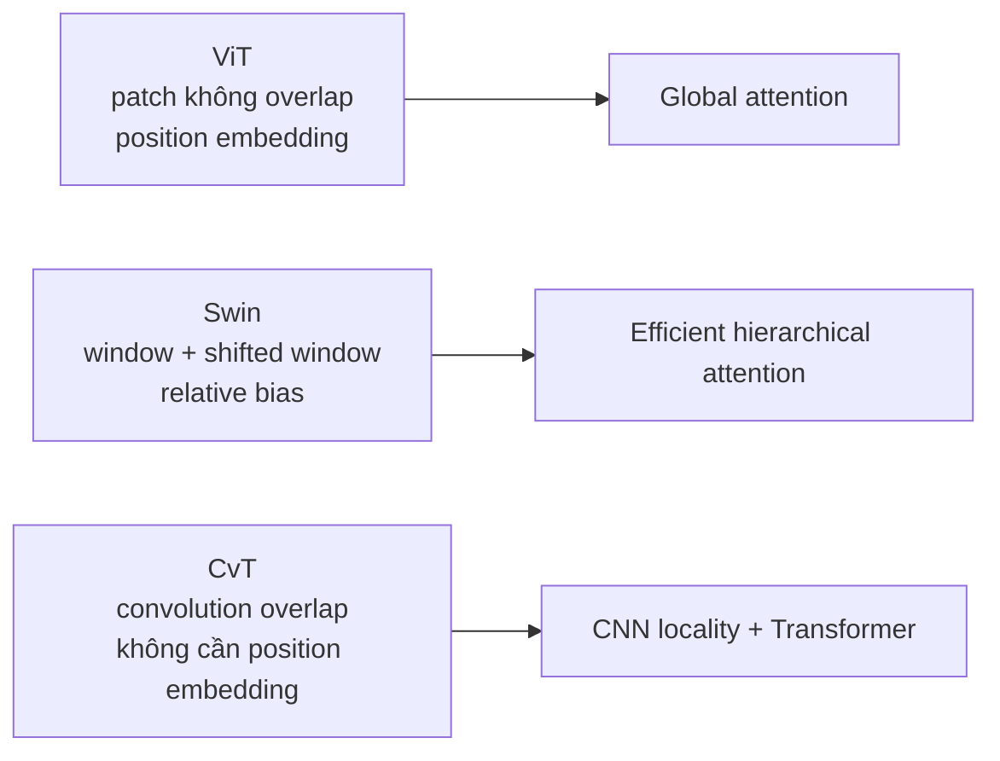

| Model | Token embedding | Attention projection | Positional encoding | Hierarchical |
|---|---|---|---|---|
| ViT | non-overlap patch | linear | cần | không |
| Swin | patch + window | linear | relative bias | có |
| CvT | convolution overlap | convolution | không cần | có |

---

## Dùng CvT với Hugging Face

```python
from transformers import AutoFeatureExtractor, CvtForImageClassification
from PIL import Image
import requests

url = "http://images.cocodataset.org/val2017/000000039769.jpg"
image = Image.open(requests.get(url, stream=True).raw)

processor = AutoFeatureExtractor.from_pretrained("microsoft/cvt-13")
model = CvtForImageClassification.from_pretrained("microsoft/cvt-13")

inputs = processor(images=image, return_tensors="pt")
outputs = model(**inputs)

pred_id = outputs.logits.argmax(-1).item()
print(model.config.id2label[pred_id])
```

---

# 14. DiNAT — Dilated Neighborhood Attention Transformer

DiNAT là Transformer dùng **Dilated Neighborhood Attention**.

Nó phát triển từ NAT — Neighborhood Attention Transformer.

---

## Neighborhood Attention là gì?

Thay vì mỗi token attention với toàn bộ ảnh, mỗi token chỉ attention với vùng lân cận.

Tương tự CNN:

```text
một pixel/token nhìn quanh hàng xóm gần nó
```

Ưu điểm:

- giữ locality,
- hiệu quả hơn global attention,
- có translational equivariance tốt hơn ViT gốc.

---

## Vấn đề của Neighborhood Attention

Nếu chỉ nhìn lân cận, model thiếu global context.

---

## Dilated Neighborhood Attention

DiNAT mở rộng neighborhood bằng dilation.

Thay vì nhìn các điểm sát nhau:

```text
x x x
x o x
x x x
```

Nó nhìn vùng thưa hơn nhưng xa hơn:

### Minh họa receptive field

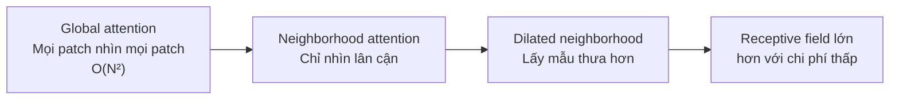

```text
x . x . x
. . . . .
x . o . x
. . . . .
x . x . x
```

Nhờ đó:

- receptive field tăng nhanh,
- có thêm global context,
- không tăng nhiều chi phí tính toán.

---

## Dùng DiNAT classification

```python
from transformers import AutoImageProcessor, DinatForImageClassification
from PIL import Image
import requests

url = "http://images.cocodataset.org/val2017/000000039769.jpg"
image = Image.open(requests.get(url, stream=True).raw)

processor = AutoImageProcessor.from_pretrained(
    "shi-labs/dinat-mini-in1k-224"
)
model = DinatForImageClassification.from_pretrained(
    "shi-labs/dinat-mini-in1k-224"
)

inputs = processor(images=image, return_tensors="pt")
outputs = model(**inputs)

pred_id = outputs.logits.argmax(-1).item()
print(model.config.id2label[pred_id])
```

---

# 15. MobileViT v2

MobileViT được thiết kế cho thiết bị tài nguyên thấp như mobile.

Mục tiêu:

- latency thấp,
- ít parameter,
- vẫn học được global representation như Transformer.

---

## Vì sao cần MobileViT?

ViT và Swin mạnh nhưng thường nặng.

CNN như MobileNet nhanh hơn trên mobile nhưng khó học quan hệ toàn cục.

MobileViT kết hợp:

```text
CNN local feature + Transformer global feature
```

---

## MobileViT Block

Một block MobileViT làm:

1. Nhận feature map từ CNN.
2. Dùng convolution để học local feature.
3. Unfold feature thành patch/token.
4. Đưa token qua Transformer.
5. Fold token lại thành feature map.
6. Dùng pointwise convolution.
7. Kết hợp với feature ban đầu.

Điểm quan trọng:

- CNN giữ local structure,
- Transformer học global dependency,
- fold/unfold giữ thông tin vị trí.

### Sơ đồ MobileViT block


---

## Separable Self-Attention

MobileViT v2 cải tiến attention.

Attention truyền thống có độ phức tạp:

```text
O(k^2)
```

với `k` là số token.

Separable self-attention giảm xuống:

```text
O(k)
```

Ngoài ra tránh batch-wise matrix multiplication nặng, giúp chạy nhanh hơn trên mobile.

---

## Dùng MobileViT v2

```python
from transformers import AutoImageProcessor, MobileViTV2ForImageClassification
from PIL import Image
import requests

url = "http://images.cocodataset.org/val2017/000000039769.jpg"
image = Image.open(requests.get(url, stream=True).raw)

processor = AutoImageProcessor.from_pretrained(
    "apple/mobilevitv2-1.0-imagenet1k-256"
)
model = MobileViTV2ForImageClassification.from_pretrained(
    "apple/mobilevitv2-1.0-imagenet1k-256"
)

inputs = processor(image, return_tensors="pt")
logits = model(**inputs).logits

pred_id = logits.argmax(-1).item()
print(model.config.id2label[pred_id])
```

---

# 16. Knowledge Distillation với Vision Transformer

Knowledge Distillation là kỹ thuật train model nhỏ, gọi là **student**, học từ model lớn, gọi là **teacher**.

## Vì sao cần distillation?

Model lớn:

- chính xác cao,
- nhưng chậm,
- tốn RAM/GPU,
- khó deploy trên edge/mobile.

Distillation giúp tạo model nhỏ hơn nhưng giữ hiệu năng gần teacher.

---

## Ý tưởng chính

Supervised learning thông thường dùng hard label:

```text
cat = 1
dog = 0
car = 0
```

Teacher cung cấp soft target:

```text
cat = 0.85
dog = 0.10
fox = 0.04
car = 0.01
```

Soft target chứa nhiều thông tin hơn.

Ví dụ nếu ảnh là mèo, teacher có thể cho dog score cao hơn car. Điều này giúp student hiểu quan hệ giữa các class.

### Sơ đồ teacher–student

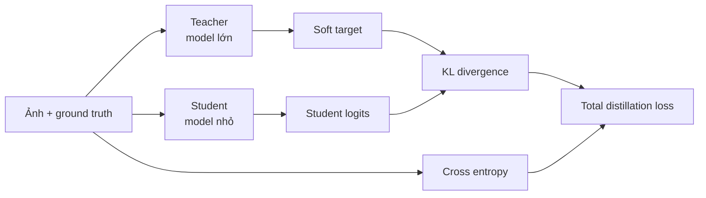

---

## Distillation loss

Student được train bằng hai loss:

```text
total loss = CE(student, ground truth) + KL(student distribution, teacher distribution)
```

Trong đó:

- CE: học từ label thật,
- KL divergence: học phân phối output của teacher.

Ví dụ PyTorch đơn giản:

```python
import torch.nn.functional as F

def distillation_loss(student_logits, teacher_logits, labels, temperature=2.0, alpha=0.5):
    ce_loss = F.cross_entropy(student_logits, labels)

    student_soft = F.log_softmax(student_logits / temperature, dim=-1)
    teacher_soft = F.softmax(teacher_logits / temperature, dim=-1)

    kl_loss = F.kl_div(
        student_soft,
        teacher_soft,
        reduction="batchmean"
    ) * (temperature ** 2)

    return alpha * ce_loss + (1 - alpha) * kl_loss
```

Công thức tóm tắt:

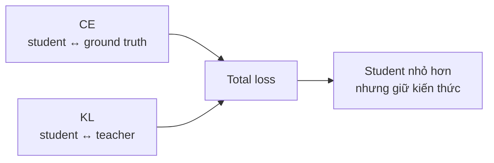

---

## Lợi ích của distillation

### 1. Model nhỏ hơn

Có thể giảm hơn 90% parameter trong một số trường hợp.

### 2. Train ổn định hơn

Soft target giúp gradient mượt hơn so với hard label.

### 3. Dùng được unlabeled data

Teacher có thể sinh pseudo-label cho dữ liệu chưa gán nhãn.

### 4. Phù hợp edge device

Rất quan trọng khi deploy trên:

- điện thoại,
- camera,
- thiết bị IoT,
- browser.

---

# 17. Những điểm kỹ thuật cần nắm chắc

## 1. ViT biến ảnh thành sequence

Cốt lõi của ViT:

```text
image -> patches -> tokens -> Transformer
```

## 2. CNN có inductive bias, ViT cần dữ liệu lớn

CNN mạnh hơn khi dataset nhỏ.

ViT mạnh khi có:

- pretrained weights,
- dữ liệu lớn,
- compute lớn.

## 3. Transfer learning là cách dùng ViT thực tế nhất

Không nên train ViT từ đầu nếu không có dataset lớn.

## 4. DETR bỏ anchor và NMS truyền thống

DETR xem detection là set prediction.

Điểm then chốt:

```text
object queries + bipartite matching
```

## 5. Segmentation Transformer dùng query để dự đoán mask

MaskFormer, OneFormer dùng query đại diện cho segment hoặc task.

## 6. Swin giảm chi phí attention bằng window

Swin quan trọng vì:

```text
window attention + shifted window + patch merging
```

## 7. CvT đưa convolution vào Transformer

CvT cải thiện locality và bỏ positional embedding.

## 8. DiNAT dùng attention cục bộ có dilation

Giữ hiệu quả tính toán nhưng mở rộng receptive field.

## 9. MobileViT tối ưu cho mobile

Kết hợp CNN và Transformer, dùng separable self-attention để giảm latency.

## 10. Knowledge Distillation giúp model nhỏ học từ model lớn

Quan trọng cho deployment thực tế.

---

# 18. Bảng tổng kết nhanh

| Model/Kỹ thuật | Mục tiêu chính | Điểm kỹ thuật quan trọng |
|---|---|---|
| ViT | Image classification | ảnh thành patch token |
| DETR | Object detection | object queries, bipartite matching |
| MaskFormer | Segmentation | mask query, pixel embedding |
| OneFormer | Universal segmentation | task-conditioned training |
| Swin | Backbone hiệu quả | shifted window attention |
| CvT | Kết hợp CNN + ViT | convolutional token embedding |
| DiNAT | Efficient attention | dilated neighborhood attention |
| MobileViT v2 | Mobile inference | separable self-attention |
| Knowledge Distillation | Model nhỏ | teacher-student, KL loss |

---

Nếu chỉ cần nhớ ngắn gọn:

```text
ViT: ảnh -> patch tokens -> Transformer.
DETR: detection không anchor, dùng object queries.
Swin: attention theo window, shift để trao đổi thông tin.
CvT/MobileViT/DiNAT: đưa bias/hiệu quả kiểu CNN vào Transformer.
MaskFormer/OneFormer: segmentation bằng query và Transformer decoder.
Distillation: model nhỏ học phân phối output từ model lớn.
```