# Unit 7 — Video Processing

## 1. Video là gì?

Một **video** thực chất là một chuỗi các ảnh tĩnh, gọi là **frames**, được hiển thị liên tiếp theo thời gian để tạo cảm giác chuyển động.

Nếu ảnh có dạng:

```text
Image: Height x Width x Channels
```

thì video có thêm chiều thời gian:

```text
Video: Time x Height x Width x Channels
```

Ví dụ:

```text
16 frames, mỗi frame 224x224 RGB
=> shape = 16 x 224 x 224 x 3
```

Điểm khác biệt cốt lõi giữa ảnh và video là:

| Dữ liệu | Thông tin chính |
|---|---|
| Image | Spatial information — vật thể, màu sắc, bố cục trong một frame |
| Video | Spatial + Temporal information — vật thể và sự thay đổi/chuyển động theo thời gian |

### Sơ đồ: video bổ sung chiều thời gian

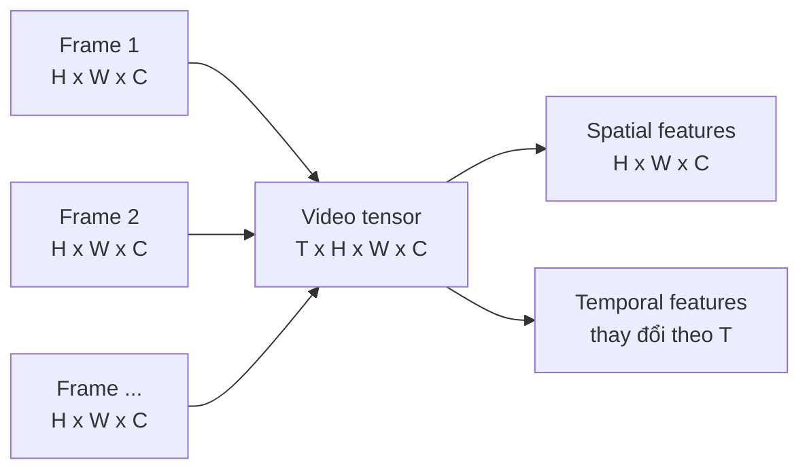

---

## 2. Các thuộc tính quan trọng của video

### 2.1 Resolution — độ phân giải

Là kích thước mỗi frame.

Ví dụ:

```text
1280 x 720   = HD
1920 x 1080  = Full HD
3840 x 2160  = 4K
```

Độ phân giải càng cao:

- chi tiết hình ảnh càng nhiều;
- dung lượng càng lớn;
- xử lý bằng model càng tốn RAM/VRAM;
- inference/training chậm hơn.

---

### 2.2 Frame rate — số frame mỗi giây

Frame rate thường được đo bằng **fps**.

Ví dụ:

```text
24 fps
30 fps
60 fps
```

Frame rate càng cao thì chuyển động càng mượt, nhưng số frame phải xử lý cũng tăng.

Ví dụ video 10 giây:

```text
30 fps => 300 frames
60 fps => 600 frames
```

Với deep learning, thường không xử lý toàn bộ frame mà sẽ **sample** một số frame đại diện.

### Sơ đồ: frame rate ảnh hưởng đến số frame

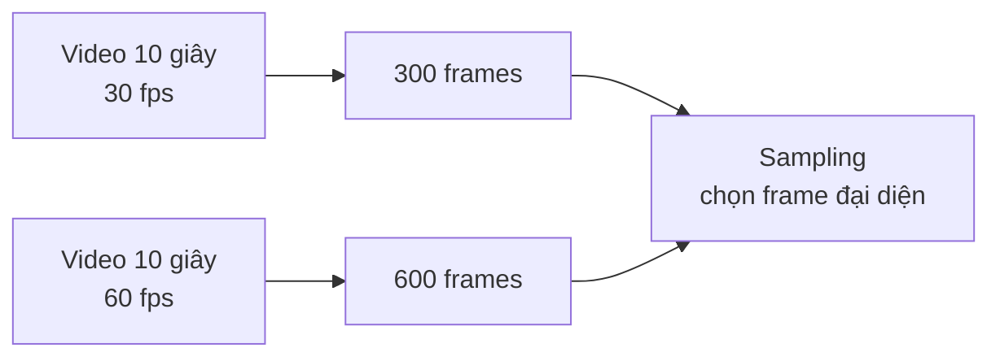

---

### 2.3 Bitrate

Bitrate là lượng dữ liệu dùng để biểu diễn video/audio trong một đơn vị thời gian.

Bitrate cao thường cho chất lượng tốt hơn nhưng:

- file nặng hơn;
- streaming cần băng thông lớn hơn;
- lưu trữ tốn hơn.

---

### 2.4 Codec

Codec là cơ chế **nén/giải nén** video.

Có hai loại chính:

| Loại codec | Đặc điểm |
|---|---|
| Lossless | Nén không mất dữ liệu |
| Lossy | Nén có mất dữ liệu, đổi lại file nhỏ hơn |

Trong thực tế, hầu hết video dùng codec lossy để tiết kiệm dung lượng.

---

# 3. Video Processing là gì?

**Video processing** trong Computer Vision là quá trình phân tích, hiểu, biến đổi hoặc trích xuất thông tin từ video.

Các bài toán phổ biến:

- action recognition: nhận diện hành động;
- object tracking: theo dõi vật thể;
- video captioning: sinh mô tả video;
- video summarization: tóm tắt video;
- background subtraction: tách nền;
- video stabilization: chống rung;
- surveillance analysis: phân tích camera giám sát;
- autonomous driving: nhận diện đường, vật cản, biển báo;
- healthcare video analysis: theo dõi bệnh nhân, hỗ trợ phẫu thuật.

### Pipeline cơ bản của video processing

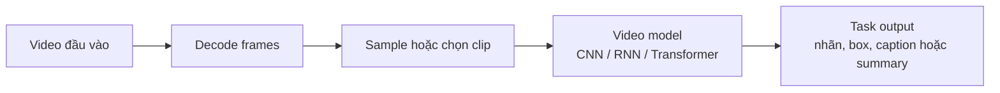

---

# 4. Thách thức chính trong video processing

## 4.1 Chi phí tính toán lớn

Video có thêm chiều thời gian nên dữ liệu lớn hơn ảnh rất nhiều.

Ví dụ:

```text
Image: 224 x 224 x 3
Video: 32 x 224 x 224 x 3
```

Video trên có lượng dữ liệu gấp 32 lần một ảnh đơn.

---

## 4.2 Storage lớn

Video độ phân giải cao, frame rate cao sẽ tạo ra khối lượng dữ liệu lớn.

---

## 4.3 Vấn đề privacy và ethics

Video thường chứa thông tin nhạy cảm:

- khuôn mặt;
- hành vi cá nhân;
- môi trường riêng tư;
- dữ liệu y tế;
- dữ liệu giám sát.

Khi triển khai thực tế cần chú ý đến bảo mật, quyền riêng tư và khả năng lạm dụng.

---

# 5. Khác biệt giữa xử lý ảnh và xử lý video

## 5.1 Với ảnh

Vision Transformer xử lý ảnh bằng cách chia ảnh thành các patch.

Ví dụ ảnh `224x224`, patch size `16x16`:

```text
Số patch theo chiều cao = 224 / 16 = 14
Số patch theo chiều rộng = 224 / 16 = 14
Tổng số patch = 14 x 14 = 196
```

Mỗi patch được biến thành một token, tương tự token trong NLP.

```text
Image => patches => embeddings => Transformer Encoder
```

Vì Transformer không tự biết vị trí token, cần thêm **positional encoding** để model hiểu patch nào nằm ở đâu trong ảnh.

---

## 5.2 Với video

Video có nhiều frame, nên token không chỉ cần biểu diễn không gian mà còn cần biểu diễn thời gian.

Có hai hướng embedding video chính:

---

# 6. Hai kỹ thuật token hóa video quan trọng

### So sánh trực quan hai cách token hóa

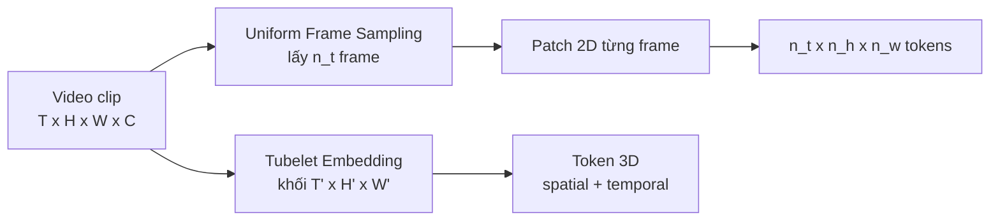

## 6.1 Uniform Frame Sampling

Ý tưởng: chọn đều một số frame từ video, sau đó xử lý từng frame như ảnh.

Ví dụ video có 100 frame, cần lấy 8 frame:

```text
[0, 14, 28, 42, 56, 70, 84, 99]
```

Mỗi frame được chia patch giống ViT.

Nếu:

```text
n_t = số frame được lấy
n_h = số patch theo chiều cao
n_w = số patch theo chiều rộng
```

thì tổng số token là:

```text
n_t x n_h x n_w
```

Ví dụ:

```text
8 frames, mỗi frame 14 x 14 patches
=> 8 x 14 x 14 = 1568 tokens
```

Ưu điểm:

- đơn giản;
- dễ dùng lại kiến trúc ViT;
- có thể tận dụng pretrained image model.

Nhược điểm:

- temporal information chỉ được học sau đó bởi Transformer;
- có thể bỏ lỡ hành động ngắn nếu sample không đúng frame.

Ví dụ code sampling đơn giản:

```python
import torch

def uniform_sample_frames(video, num_frames):
    """
    video: Tensor shape [T, H, W, C]
    num_frames: số frame muốn lấy
    """
    total_frames = video.shape[0]
    indices = torch.linspace(0, total_frames - 1, steps=num_frames).long()
    return video[indices]
```

---

## 6.2 Tubelet Embedding

Thay vì lấy patch 2D từ từng frame, tubelet lấy khối 3D gồm:

```text
time x height x width
```

Ví dụ một tubelet có kích thước:

```text
2 frames x 16 pixels x 16 pixels
```

Nó chứa cả thông tin không gian và chuyển động cục bộ theo thời gian.

Có thể hiểu Tubelet Embedding giống 3D convolution để tạo token video.

Ưu điểm:

- kết hợp spatial + temporal ngay từ bước tokenization;
- phù hợp hơn với video so với patch 2D độc lập.

Nhược điểm:

- phức tạp hơn;
- có thể tốn tính toán hơn tùy cấu hình.

Ví dụ minh họa bằng `Conv3d`:

```python
import torch
import torch.nn as nn

# Input video shape thường dùng trong PyTorch:
# [batch, channels, time, height, width]
video = torch.randn(2, 3, 16, 224, 224)

tubelet_embed = nn.Conv3d(
    in_channels=3,
    out_channels=768,
    kernel_size=(2, 16, 16),
    stride=(2, 16, 16)
)

tokens = tubelet_embed(video)

print(tokens.shape)
# [batch, hidden_dim, time_tokens, height_tokens, width_tokens]

tokens = tokens.flatten(2).transpose(1, 2)

print(tokens.shape)
# [batch, num_tokens, hidden_dim]
```

---

# 7. CNN-based Video Models

## 7.1 Vì sao CNN cần thay đổi khi xử lý video?

CNN truyền thống xử lý ảnh 2D tốt vì nó học spatial features:

- cạnh;
- texture;
- shape;
- object parts.

Nhưng video cần thêm temporal features:

- vật thể di chuyển thế nào;
- hành động diễn ra theo thứ tự nào;
- sự thay đổi giữa các frame.

Do đó các kiến trúc CNN cho video phải mở rộng để xử lý thời gian.

---

## 7.2 Two-Stream Network

Two-Stream Network dùng hai luồng xử lý riêng:

### Spatial Stream

Xử lý frame RGB bằng 2D CNN.

Nó học:

- người/vật xuất hiện ở đâu;
- bối cảnh;
- hình dạng;
- appearance.

### Temporal Stream

Xử lý chuyển động, thường qua **optical flow**.

Optical flow biểu diễn hướng và tốc độ chuyển động giữa các frame.

### Fusion

Kết quả hai stream được kết hợp để phân loại hành động.

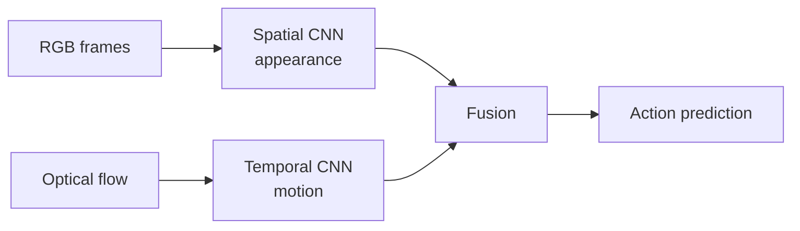

Ưu điểm:

- tách rõ appearance và motion;
- hiệu quả cho action recognition.

Nhược điểm:

- tính optical flow tốn thời gian;
- pipeline phức tạp;
- không end-to-end hoàn toàn nếu optical flow tính ngoài.

---

## 7.3 3D CNN / 3D ResNet

3D CNN mở rộng convolution từ 2D sang 3D.

2D convolution:

```text
kernel: height x width
```

3D convolution:

```text
kernel: time x height x width
```

Nhờ đó model học đồng thời:

- spatial pattern;
- temporal motion.

Ví dụ:

```python
import torch
import torch.nn as nn

conv3d = nn.Conv3d(
    in_channels=3,
    out_channels=64,
    kernel_size=(3, 7, 7),
    stride=(1, 2, 2),
    padding=(1, 3, 3)
)

x = torch.randn(4, 3, 16, 224, 224)
y = conv3d(x)

print(y.shape)
```

3D ResNet đưa residual connection vào 3D CNN, giúp train network sâu hơn.

Ưu điểm:

- học spatio-temporal trực tiếp;
- mạnh cho action recognition.

Nhược điểm:

- nhiều tham số;
- tốn compute;
- train chậm hơn 2D CNN;
- dễ overfit nếu dataset nhỏ.

---

## 7.4 R(2+1)D ResNet

R(2+1)D tách 3D convolution thành hai bước:

```text
3D Conv = Spatial 2D Conv + Temporal 1D Conv
```

Cụ thể:

1. 2D convolution học spatial features trong từng frame.
2. 1D convolution học temporal features giữa các frame.

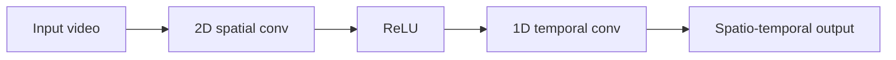

Lợi ích:

- dễ tối ưu hơn 3D convolution trực tiếp;
- thêm non-linearity giữa spatial và temporal conv;
- thường cho hiệu quả tốt hơn với cùng số tham số.

---

## 7.5 Một số hướng CNN video hiện đại

### MoCo — Momentum Contrast

MoCo là self-supervised learning dùng contrastive learning.

Ý tưởng:

- học representation từ video chưa gán nhãn;
- positive pairs nên gần nhau trong embedding space;
- negative pairs nên xa nhau.

Các thành phần chính:

- momentum encoder;
- queue chứa nhiều negative samples;
- contrastive loss.

Phù hợp khi có nhiều video nhưng ít label.

---

### X3D — Expanded 3D Networks

X3D là 3D ConvNet nhẹ, tối ưu cho video recognition.

Ý tưởng:

- mở rộng network dần theo chiều depth, width, temporal resolution;
- cân bằng accuracy và compute.

Ưu điểm:

- ít tham số;
- nhanh;
- phù hợp deployment trên edge/mobile.

---

### ST-GCN — Spatial-Temporal Graph Convolutional Network

ST-GCN dùng graph để mô hình hóa skeleton người.

Node là khớp cơ thể:

```text
head, shoulder, elbow, wrist, hip, knee, ankle...
```

Edge là liên kết xương hoặc liên kết theo thời gian.

Phù hợp cho:

- action recognition;
- sports analysis;
- surveillance;
- skeleton-based motion understanding.

### Sơ đồ: ba hướng CNN video hiện đại

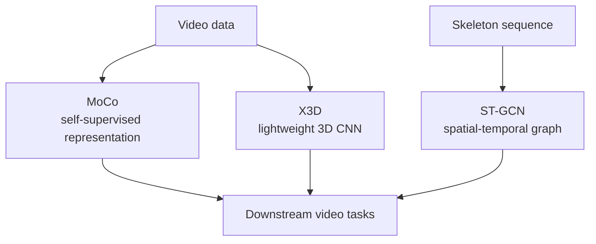

---

# 8. RNN-based Video Models

## 8.1 Vì sao dùng RNN cho video?

Video là dữ liệu sequence. RNN được thiết kế để xử lý chuỗi.

CNN tốt trong việc hiểu từng frame, nhưng không tự nhiên nắm được quan hệ thời gian dài. RNN/LSTM có hidden state, giúp lưu thông tin từ các bước trước.

Pipeline phổ biến:

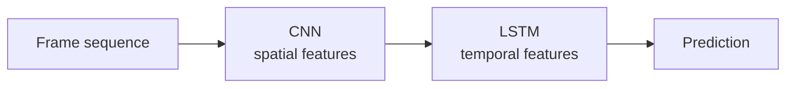

---

## 8.2 LRCN — Long-term Recurrent Convolutional Network

LRCN kết hợp CNN và LSTM.

- CNN trích xuất feature từ từng frame.
- LSTM học sự thay đổi feature theo thời gian.

Ứng dụng:

- action recognition;
- video captioning.

Ví dụ kiến trúc:

```text
Video frames
=> CNN per frame
=> sequence of feature vectors
=> LSTM
=> classifier / caption decoder
```

Ví dụ code đơn giản:

```python
import torch
import torch.nn as nn
import torchvision.models as models

class CNNLSTM(nn.Module):
    def __init__(self, hidden_dim=256, num_classes=10):
        super().__init__()

        backbone = models.resnet18(weights=None)
        self.cnn = nn.Sequential(*list(backbone.children())[:-1])
        self.feature_dim = 512

        self.lstm = nn.LSTM(
            input_size=self.feature_dim,
            hidden_size=hidden_dim,
            batch_first=True
        )

        self.classifier = nn.Linear(hidden_dim, num_classes)

    def forward(self, x):
        # x: [B, T, C, H, W]
        B, T, C, H, W = x.shape

        x = x.view(B * T, C, H, W)
        features = self.cnn(x)              # [B*T, 512, 1, 1]
        features = features.flatten(1)      # [B*T, 512]
        features = features.view(B, T, -1)  # [B, T, 512]

        output, _ = self.lstm(features)
        last = output[:, -1]

        return self.classifier(last)
```

---

## 8.3 ConvLSTM

ConvLSTM thay các phép biến đổi tuyến tính trong LSTM bằng convolution.

Khác biệt:

| LSTM thường | ConvLSTM |
|---|---|
| Input là vector | Input là feature map 2D |
| Mất cấu trúc không gian | Giữ cấu trúc không gian |
| Phù hợp chuỗi feature | Phù hợp video/weather/radar |

ConvLSTM hữu ích khi cần dự đoán sự thay đổi không gian theo thời gian, ví dụ:

- precipitation nowcasting;
- video frame prediction;
- traffic flow prediction.

---

## 8.4 Unsupervised Video Representation using LSTM

Ý tưởng:

- dùng Encoder LSTM để nén video thành vector;
- dùng Decoder LSTM để tái tạo video hoặc dự đoán frame tiếp theo.

```text
Input frames => Encoder LSTM => representation => Decoder LSTM
```

Ưu điểm:

- không cần label;
- tận dụng được lượng video lớn chưa gán nhãn.

---

## 8.5 Attention trong RNN video models

Attention giúp model chọn frame hoặc vùng quan trọng khi sinh mô tả video.

Ví dụ captioning:

```text
A man is running and then jumping.
```

Model không nên nhìn mọi frame như nhau. Nó cần chú ý mạnh vào các frame có hành động chính.

Attention có thể theo:

- temporal attention: chú ý frame quan trọng;
- spatial attention: chú ý vùng quan trọng trong frame.

---

## 8.6 Hạn chế của RNN-based models

RNN có một số vấn đề lớn:

1. **Khó học long-term dependency**

   Video dài có nhiều frame, thông tin đầu chuỗi dễ bị quên.

2. **Xử lý tuần tự**

   RNN phải xử lý frame theo thứ tự, khó song song hóa.

3. **Training/inference chậm**

   So với Transformer, RNN thường kém hiệu quả trên phần cứng hiện đại.

Vì vậy các mô hình video hiện đại chuyển nhiều sang Transformer.

---

# 9. Transformer-based Video Models

## 9.1 Recap: Vision Transformer — ViT

ViT xử lý ảnh bằng cách:

1. chia ảnh thành patch;
2. flatten patch;
3. linear projection thành token;
4. thêm positional embedding;
5. đưa vào Transformer Encoder;
6. dùng CLS token hoặc pooling để phân loại.

```text
Image
=> patches
=> patch embeddings + position embeddings
=> Transformer Encoder
=> classifier
```

Điểm mạnh:

- học global context tốt;
- scale tốt với dataset lớn.

Điểm yếu:

- cần rất nhiều dữ liệu;
- chi phí training lớn.

---

## 9.2 Vì sao video Transformer khó hơn image Transformer?

Vì số token tăng mạnh theo thời gian.

Nếu ảnh có:

```text
14 x 14 = 196 tokens
```

Video 16 frame có:

```text
16 x 14 x 14 = 3136 tokens
```

Self-attention có độ phức tạp xấp xỉ bình phương số token:

```text
O(N^2)
```

Nên khi số token tăng, chi phí attention tăng rất nhanh.

### Sơ đồ: số token làm chi phí attention tăng

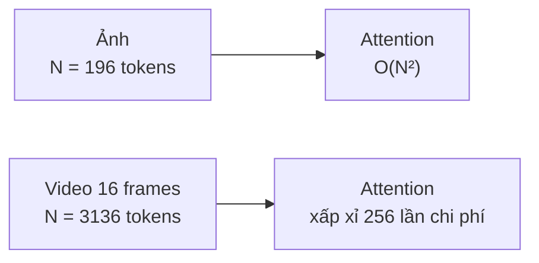

Với cùng kích thước patch, video có số token gấp 16 lần ảnh nên chi phí lý thuyết của self-attention tăng khoảng `16² = 256` lần.

---

# 10. ViViT — Video Vision Transformer

ViViT mở rộng ViT cho video classification.

Có hai vấn đề chính:

1. làm sao đưa video thành token;
2. làm sao giảm chi phí self-attention trên không-thời gian.

---

## 10.1 Video embedding trong ViViT

ViViT dùng các cách như:

- Uniform Frame Sampling;
- Tubelet Embedding.

Mục tiêu là chuyển video thành chuỗi spatio-temporal tokens.

---

## 10.2 ViViT Model 1 — Spatio-Temporal Attention

Model này đưa toàn bộ token không-thời gian vào Transformer.

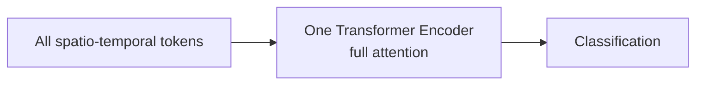

Mỗi token có thể attention tới mọi token khác ở mọi frame.

Ưu điểm:

- biểu diễn mạnh;
- học đầy đủ quan hệ spatial + temporal.

Nhược điểm:

- rất tốn compute.

Độ phức tạp:

```text
O(n_h^2 x n_w^2 x n_t^2)
```

---

## 10.3 ViViT Model 2 — Factorised Encoder

Tách xử lý spatial và temporal thành hai encoder.

Bước 1:

```text
Mỗi frame => Spatial Transformer
```

Bước 2:

```text
Frame embeddings theo thời gian => Temporal Transformer
```

Pipeline:


Độ phức tạp giảm còn:

```text
O(n_h^2 x n_w^2 + n_t^2)
```

Đây là mô hình hiệu quả nhất trong thảo luận: performance tốt, training nhanh hơn Model 1.

---

## 10.4 ViViT Model 3 — Factorised Self-Attention

Trong mỗi layer, attention được chia thành hai phần:

1. spatial attention: giữa các patch trong cùng frame;
2. temporal attention: giữa các patch cùng vị trí qua nhiều frame.

Không dùng CLS token do có sự nhập nhằng giữa không gian và thời gian.

---

## 10.5 ViViT Model 4 — Factorised Dot-Product Attention

Chia attention heads thành hai nhóm:

- một nửa heads xử lý spatial attention;
- một nửa heads xử lý temporal attention.

Mục tiêu là giảm compute nhưng vẫn giữ cả hai loại thông tin.

---

## 10.6 Bài học từ ViViT

- Model full spatio-temporal attention mạnh nhưng đắt.
- Factorization giúp giảm chi phí.
- Pretrain từ image model rất quan trọng vì video dataset thường nhỏ hơn image dataset.
- Video Transformer cần thiết kế cẩn thận để tránh số token quá lớn.

---

# 11. TimeSFormer

TimeSFormer cũng dùng Transformer cho video.

Nó nghiên cứu nhiều dạng space-time attention.

## Các loại attention

### Sparse Attention

Giống ViT, attention trong từng frame.

### Joint Space-Time Attention

Attention trên toàn bộ patch của toàn bộ frame.

Giống ViViT Model 1.

### Divided Space-Time Attention

Tách attention thành:

1. temporal attention;
2. spatial attention.

Đây là cơ chế hiệu quả nhất trong TimeSFormer, cân bằng tốt giữa accuracy và số tham số.

### Sparse Local Global Attention

Kết hợp thông tin cục bộ và toàn cục có chọn lọc.

### Axial Attention

Xử lý riêng từng trục không gian/thời gian.

### Sơ đồ: Divided Space-Time Attention


Cách tách này tránh cho mỗi token phải attention đồng thời với toàn bộ token không-thời gian.

---

# 12. Multimodal Video Models

Video không chỉ có hình ảnh. Một video có thể gồm nhiều modality:

| Modality | Ví dụ |
|---|---|
| Visual | frames/images |
| Audio | tiếng nói, nhạc nền, âm thanh môi trường |
| Text | subtitle, caption, OCR text |
| Motion | chuyển động giữa frame |
| Depth | thông tin 3D |
| Sensor | nhiệt độ, biometric, IMU... |

### Sơ đồ: hợp nhất các modality

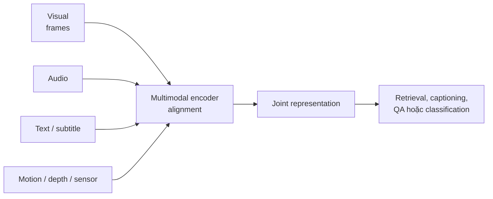

Muốn hiểu video tốt, nhiều khi phải kết hợp nhiều modality.

Ví dụ:

- cảnh một người chơi đàn: hình ảnh cho biết hành động, audio xác nhận âm thanh;
- video hướng dẫn nấu ăn: lời nói/subtitle rất quan trọng;
- surveillance: motion quan trọng hơn text/audio.

---

# 13. Video + Text Models

## 13.1 VideoBERT

VideoBERT áp dụng ý tưởng BERT cho video-text.

Nguồn input:

- text từ ASR — Automatic Speech Recognition;
- visual tokens từ video, trích bằng S3D.

Các task training:

1. **Linguistic-visual alignment**

   Dự đoán text và video có khớp nhau không.

2. **Masked Language Modeling**

   Che một số token text và dự đoán lại.

3. **Masked Frame Modeling**

   Che một số visual token/frame và dự đoán lại.

Điểm quan trọng:

- học joint video-language representation;
- không cần nhãn thủ công rõ ràng;
- dùng clustering để tạo visual tokens cho masked frame modeling.

---

## 13.2 MERLOT

MERLOT học từ dataset video-text rất lớn: **YT-Temporal-180M**.

Các nhiệm vụ chính:

- Temporal Reordering Task;
- Frame-Caption Matching;
- Masked Language Modeling.

Điểm chính của MERLOT không hẳn là kiến trúc quá mới, mà là tận dụng dữ liệu rất lớn để học reasoning đa phương thức.

---

# 14. Video + Audio + Text Models

## 14.1 VATT — Visual-Audio-Text Transformer

VATT học self-supervised từ raw video, audio và text.

Có hai biến thể:

| Kiểu | Đặc điểm |
|---|---|
| Modality-specific | encoder riêng cho từng modality |
| Modality-agnostic | một encoder chung cho nhiều modality |

Modality-specific thường mạnh hơn, nhưng modality-agnostic ít tham số hơn.

Các kỹ thuật quan trọng:

### Droptoken

Do video/audio/text có nhiều redundancy, VATT chỉ sample một phần token để train hiệu quả hơn.

### Multimodal Contrastive Learning

Dùng contrastive learning để kéo các modality tương ứng lại gần nhau trong embedding space.

Ví dụ:

```text
video clip <-> audio tương ứng
video clip <-> text caption tương ứng
```

Loss được dùng:

- NCE cho video-audio;
- MIL-NCE cho video-text.

---

## 14.2 Video-LLaMA

Video-LLaMA mở rộng LLM để hiểu video và audio.

Có hai nhánh:

1. Vision-Language branch: xử lý frame/video.
2. Audio-Language branch: xử lý audio.

Training gồm:

- pretraining để align modality;
- instruction fine-tuning để model trả lời theo chỉ dẫn.

Điểm đáng chú ý:

- audio-text data ít hơn visual-text data;
- model dùng ImageBind để hỗ trợ align audio thông qua visual-text data.

Ứng dụng:

- hỏi đáp về video;
- video conversation;
- hiểu nội dung audiovisual.

---

# 15. Multi-modality với ImageBind

ImageBind align nhiều modality vào cùng một embedding space, lấy image làm trung tâm.

Các modality có thể gồm:

- image/video;
- text;
- audio;
- depth;
- thermal;
- IMU.

Điểm mạnh:

- không cần dữ liệu paired giữa mọi cặp modality;
- chỉ cần pair giữa image và từng modality khác;
- sau đó các modality có thể nằm trong cùng không gian biểu diễn.

Ví dụ:

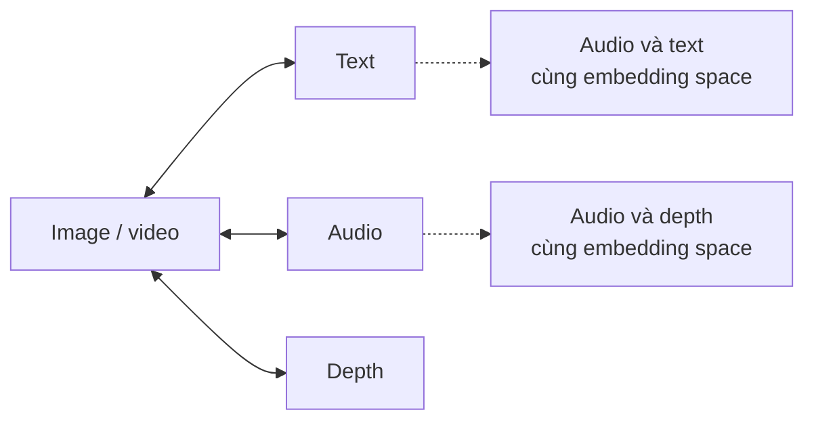

Từ đó model có thể suy ra quan hệ giữa các modality không được ghép cặp trực tiếp, dù không train trực tiếp trên từng cặp đó.

Loss chính thường là InfoNCE.

---

# 16. Những khái niệm kỹ thuật cần nắm chắc

## 16.1 Spatial vs Temporal

| Khái niệm | Ý nghĩa |
|---|---|
| Spatial | thông tin trong một frame |
| Temporal | thông tin thay đổi giữa các frame |
| Spatio-temporal | kết hợp cả không gian và thời gian |

---

## 16.2 Optical Flow

Biểu diễn chuyển động pixel giữa các frame.

Dùng trong Two-Stream Network để cung cấp motion signal.

---

## 16.3 3D Convolution

Convolution trên cả chiều thời gian và không gian.

```text
kernel = T x H x W
```

Phù hợp cho video nhưng tốn compute.

---

## 16.4 Tubelet

Một patch 3D của video:

```text
temporal length x patch height x patch width
```

Dùng để tạo token video cho Transformer.

---

## 16.5 Factorized Attention

Thay vì attention toàn bộ không-thời gian cùng lúc, tách thành:

- spatial attention;
- temporal attention.

Giúp giảm chi phí tính toán.

---

## 16.6 Contrastive Learning

Học embedding bằng cách:

- kéo positive pairs lại gần;
- đẩy negative pairs ra xa.

Dùng nhiều trong self-supervised và multimodal learning.

---

# 17. So sánh nhanh các nhóm model

| Nhóm model | Mạnh ở đâu | Yếu ở đâu |
|---|---|---|
| Two-Stream CNN | Tách appearance/motion rõ | Cần optical flow, pipeline phức tạp |
| 3D CNN | Học spatio-temporal trực tiếp | Tốn compute |
| R(2+1)D | Hiệu quả hơn 3D CNN | Vẫn là CNN, context dài hạn hạn chế |
| CNN + LSTM | Dễ hiểu, hợp sequence | Chậm, khó song song hóa |
| ConvLSTM | Giữ cấu trúc không gian | Không tối ưu cho video dài |
| ViViT/TimeSFormer | Học global temporal context tốt | Nhiều token, cần compute/dataset lớn |
| Multimodal models | Hiểu video đầy đủ hơn | Cần align modality, dữ liệu phức tạp |

---

# 18. Kết luận chính

Các điểm quan trọng nhất của unit này:

1. Video là chuỗi frame, có thêm chiều thời gian so với ảnh.
2. Video processing phải học cả spatial và temporal information.
3. CNN-based models mở rộng từ 2D CNN sang Two-Stream, 3D CNN, R(2+1)D.
4. RNN-based models như LRCN, ConvLSTM xử lý video như sequence nhưng bị hạn chế bởi xử lý tuần tự.
5. Transformer-based models như ViViT, TimeSFormer mạnh hơn trong học long-range dependency nhưng rất tốn compute.
6. Hai kỹ thuật embedding video quan trọng là Uniform Frame Sampling và Tubelet Embedding.
7. Video hiện đại thường là multimodal: visual, audio, text, motion, depth, sensor.
8. Các model như VideoBERT, VATT, Video-LLaMA, ImageBind học cách align nhiều modality trong cùng không gian biểu diễn.
9. Vấn đề kỹ thuật lớn nhất của video model là cân bằng giữa accuracy, số token, temporal coverage, compute và dữ liệu training.