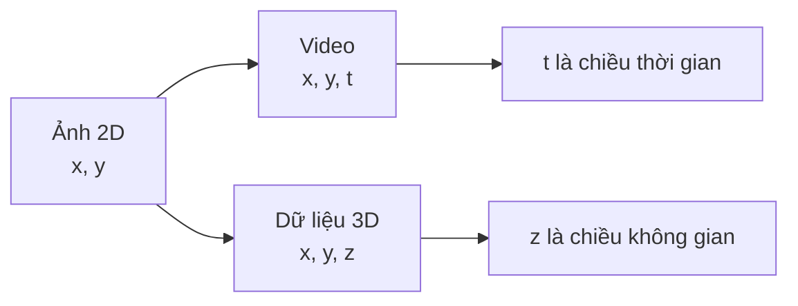
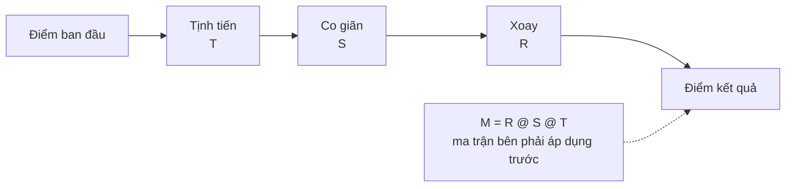
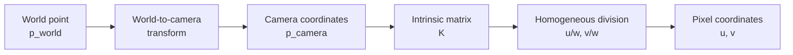
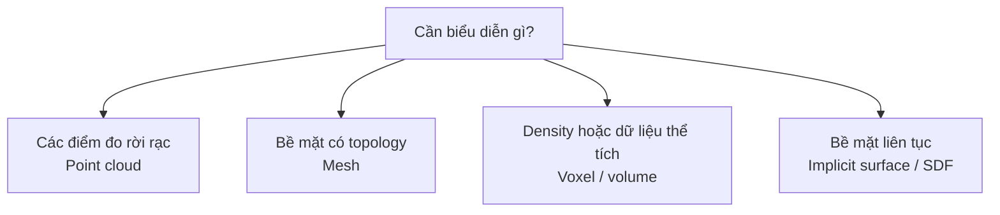
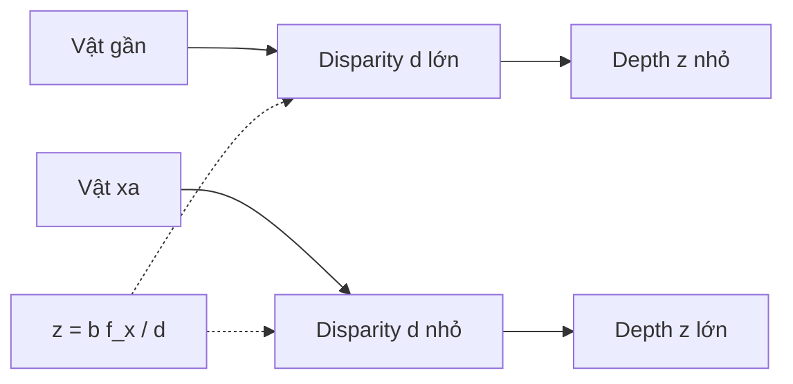
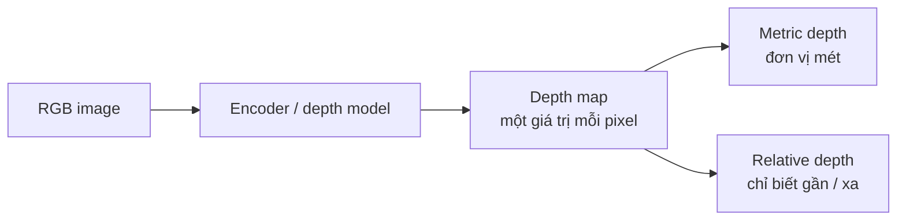
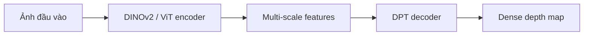
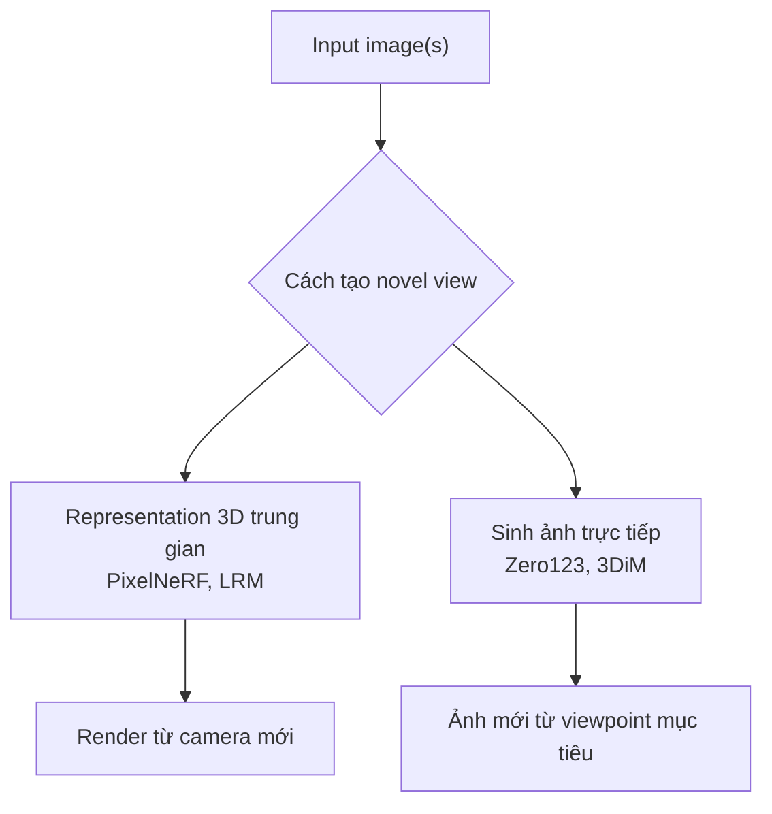
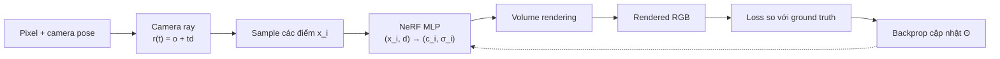

# Unit 8 — 3D Computer Vision

## 1. 3D Computer Vision là gì?

Trong ảnh 2D, dữ liệu thường có hai chiều không gian: `x` và `y`.

Trong dữ liệu 3D, ta làm việc với ba chiều không gian:

\[
(X, Y, Z)
\]

Điểm khác biệt với video là:

- Video: `x`, `y` là không gian, `t` là thời gian.
- 3D vision: `x`, `y`, `z` đều là không gian.

3D Computer Vision giúp máy tính hiểu thế giới giống cách con người cảm nhận không gian: vật nào gần, vật nào xa, hình dạng vật thể ra sao, camera đang ở đâu, scene có cấu trúc thế nào.

Các ứng dụng chính:

- Robotics: robot gắp vật, kiểm tra chất lượng.
- Xe tự hành: ước lượng khoảng cách, tránh vật cản.
- Drone/autonomous robot: localization, mapping, navigation.
- Healthcare: CT, MRI, phẫu thuật robot.
- AR/VR/MR: đặt vật thể ảo vào thế giới thật.
- Gaming/Entertainment: motion capture, dựng môi trường 3D.

### Trực quan: 3D khác video ở chiều thứ ba



---

# 2. Lịch sử ngắn của 3D Vision

Một số mốc chính:

| Năm | Công nghệ | Ý nghĩa |
|---|---|---|
| 1838 | Stereoscopy | Dùng hai ảnh lệch nhau cho hai mắt để tạo cảm giác chiều sâu |
| 1853 | Anaglyph 3D | Kính màu đỏ/xanh để tách ảnh cho mỗi mắt |
| 1936 | Polarized 3D | Kính phân cực trong rạp phim |
| 1960s | VR thử nghiệm | Màn hình lập thể, head-tracking |
| 1979 | Autostereograms | Ảnh Magic Eye, thấy 3D không cần kính |
| 1986 | IMAX 3D | 3D quy mô lớn trong điện ảnh |
| 2000s | Digital 3D cinema | Máy chiếu số, kính active shutter/circular polarization |
| 2010s | 3D TV | Phổ biến ngắn hạn, sau đó giảm do thiếu nội dung và bất tiện |
| 2010s | VR hồi sinh | Oculus Rift, HTC Vive |
| Hiện nay | AR/MR/VR | Hòa trộn thế giới thật và số |

---

# 3. Kiến thức nền: Hệ tọa độ và biến đổi 3D

## 3.1 Hệ tọa độ 3D

Một điểm 3D thường được biểu diễn:

\[
P = [X, Y, Z]
\]

Có hai convention quan trọng:

### Right-handed coordinate system

Thường dùng trong toán, vật lý, Blender, PyTorch3D, OpenGL.

### Left-handed coordinate system

Thường gặp trong DirectX.

Điểm cần nhớ: các thư viện đồ họa khác nhau có thể dùng convention khác nhau. Sai convention có thể làm vật thể bị lật, xoay ngược, hoặc camera nhìn sai hướng.

---

## 3.2 Homogeneous Coordinates

Để biểu diễn translation, rotation, scaling bằng cùng một dạng ma trận, ta mở rộng điểm 3D:

\[
[x, y, z] \rightarrow [x, y, z, 1]
\]

Đây gọi là tọa độ đồng nhất — homogeneous coordinates.

Một ma trận biến đổi 3D thường có kích thước:

\[
4 \times 4
\]

---

## 3.3 Convention nhân ma trận

Có hai kiểu phổ biến:

### OpenGL style

Điểm là column vector:

\[
x \in \mathbb{R}^{4 \times 1}
\]

Biến đổi:

```python
x_new = M @ x
```

### DirectX / PyTorch3D style

Điểm là row vector:

```python
x_new = x @ M
```

Muốn đổi giữa hai convention, thường dùng transpose:

```python
M_row = M_col.T
```

---

# 4. Các phép biến đổi 3D cơ bản

## 4.1 Translation — tịnh tiến

Di chuyển tất cả điểm theo vector:

\[
t = [t_x, t_y, t_z]
\]

Ma trận:

\[
T =
\begin{pmatrix}
1 & 0 & 0 & t_x \\
0 & 1 & 0 & t_y \\
0 & 0 & 1 & t_z \\
0 & 0 & 0 & 1
\end{pmatrix}
\]

Ví dụ:

```python
import numpy as np

translation_matrix = np.array([
    [1, 0, 0, 1],
    [0, 1, 0, 1],
    [0, 0, 1, 0],
    [0, 0, 0, 1],
])
```

Ma trận trên dịch vật thể:

- `+1` theo trục X
- `+1` theo trục Y
- không đổi theo Z

---

## 4.2 Scaling — co giãn

Ma trận scaling:

\[
S =
\begin{pmatrix}
s_x & 0 & 0 & 0 \\
0 & s_y & 0 & 0 \\
0 & 0 & s_z & 0 \\
0 & 0 & 0 & 1
\end{pmatrix}
\]

Ví dụ scale X gấp 2, Y còn 0.5:

```python
scaling_matrix = np.array([
    [2, 0, 0, 0],
    [0, 0.5, 0, 0],
    [0, 0, 1, 0],
    [0, 0, 0, 1],
])
```

---

## 4.3 Rotation — xoay

### Xoay quanh trục X

\[
R_x(\alpha) =
\begin{pmatrix}
1 & 0 & 0 & 0 \\
0 & \cos \alpha & -\sin \alpha & 0 \\
0 & \sin \alpha & \cos \alpha & 0 \\
0 & 0 & 0 & 1
\end{pmatrix}
\]

```python
angle = 20 * np.pi / 180

rotation_x = np.array([
    [1, 0, 0, 0],
    [0, np.cos(angle), -np.sin(angle), 0],
    [0, np.sin(angle), np.cos(angle), 0],
    [0, 0, 0, 1],
])
```

### Xoay quanh trục Y

\[
R_y(\beta) =
\begin{pmatrix}
\cos \beta & 0 & \sin \beta & 0 \\
0 & 1 & 0 & 0 \\
-\sin \beta & 0 & \cos \beta & 0 \\
0 & 0 & 0 & 1
\end{pmatrix}
\]

### Xoay quanh trục Z

\[
R_z(\gamma) =
\begin{pmatrix}
\cos \gamma & -\sin \gamma & 0 & 0 \\
\sin \gamma & \cos \gamma & 0 & 0 \\
0 & 0 & 1 & 0 \\
0 & 0 & 0 & 1
\end{pmatrix}
\]

Điểm cần nhớ:

- Góc thường dùng radian.
- Đổi degree sang radian:

```python
radian = degree * np.pi / 180
```

---

## 4.4 Kết hợp biến đổi

Nếu muốn áp dụng lần lượt:

1. Translation `T`
2. Scaling `S`
3. Rotation `R`

Với column-vector convention, ma trận tổng hợp là:

\[
M = R @ S @ T
\]

Code:

```python
combined = rotation_matrix @ scaling_matrix @ translation_matrix
result = combined @ points
```

Điểm quan trọng: thứ tự nhân ma trận rất quan trọng. Ma trận bên phải được áp dụng trước.

### Sơ đồ thứ tự biến đổi



---

# 5. Camera Model

## 5.1 Pinhole Camera

Pinhole camera là mô hình camera đơn giản nhất:

- Ánh sáng đi qua một lỗ nhỏ.
- Tạo ảnh đảo ngược trên mặt phẳng ảnh.
- Được dùng rộng rãi trong 3D graphics và computer vision.

Một điểm 3D được chiếu xuống mặt phẳng ảnh 2D.

---

## 5.2 Camera axes convention

Trong nội dung unit này, convention theo Blender:

- Camera nhìn theo trục `-Z`.
- Trục `X` camera hướng sang trái nếu nhìn từ camera.
- Trục `Y` hướng lên.

Đây là convention quan trọng vì nhiều công thức chiếu ảnh phụ thuộc hướng trục camera.

---

## 5.3 Intrinsic Camera Matrix

Camera pinhole có các tham số nội tại — intrinsics:

- \(f_x\): focal length theo trục x, tính bằng pixel.
- \(f_y\): focal length theo trục y, tính bằng pixel.
- \(c_x, c_y\): principal point, điểm quang trục cắt mặt phẳng ảnh.

Ma trận camera:

\[
K =
\begin{pmatrix}
f_x & 0 & c_x \\
0 & f_y & c_y \\
0 & 0 & 1
\end{pmatrix}
\]

Với điểm camera-coordinate:

\[
p = [x, y, z]
\]

Chiếu xuống ảnh:

\[
[u, v, w]^T = Kp
\]

Tọa độ pixel:

\[
u' = \frac{u}{w}, \quad v' = \frac{v}{w}
\]

---

## 5.4 Blender convention và dấu âm

Do Blender dùng camera nhìn theo `-Z`, điểm phía trước camera có `z` âm. Nếu dùng trực tiếp camera matrix chuẩn, ảnh có thể bị lật trái/phải và trên/dưới.

Một cách sửa là dùng:

\[
K =
\begin{pmatrix}
-f_x & 0 & c_x \\
0 & -f_y & c_y \\
0 & 0 & 1
\end{pmatrix}
\]

---

## 5.5 World-to-camera transform

Camera thường không nằm ở gốc tọa độ. Vì vậy pipeline thường là:

```text
World coordinates
    -> world-to-camera transform
Camera coordinates
    -> intrinsic camera matrix K
Image coordinates
```

Hay:

\[
p_{image} = K \cdot T_{world \to camera} \cdot p_{world}
\]

### Pipeline chiếu từ 3D xuống pixel



---

# 6. Các dạng biểu diễn dữ liệu 3D

## 6.1 Point Cloud

Point cloud là tập các điểm 3D:

\[
\{(x_i, y_i, z_i)\}_{i=1}^{N}
\]

Có thể kèm:

- màu RGB
- normal vector
- intensity
- feature vector

Nguồn phổ biến:

- LiDAR
- depth camera
- 3D scanner

Ưu điểm:

- Đơn giản.
- Gần với dữ liệu đo thực tế.

Nhược điểm:

- Không có thông tin kết nối giữa các điểm.
- Khó xác định bề mặt và topology.

---

## 6.2 Mesh

Mesh biểu diễn bề mặt vật thể bằng:

- vertices: đỉnh
- edges: cạnh
- faces: mặt, thường là tam giác

Ví dụ face tam giác nối 3 vertex.

Mesh có thể chứa thêm:

- normals
- màu
- texture coordinates
- material

Ưu điểm:

- Rất hiệu quả để biểu diễn vật thể rắn.
- Dùng nhiều trong game, graphics, simulation.

Thư viện Python hữu ích:

```python
import trimesh

mesh = trimesh.load("object.obj")
print(mesh.vertices.shape)
print(mesh.faces.shape)
```

---

## 6.3 Volumetric Data

Volumetric data biểu diễn không gian bằng hàm:

\[
f(x, y, z)
\]

Hàm này có thể trả về:

- density
- color
- opacity
- semantic label

Một cách đơn giản là voxel grid.

Ví dụ:

```text
3D grid:
voxel[x, y, z] = density/color/value
```

Dùng cho:

- mây
- khói
- lửa
- y học
- NeRF-like representations

Nhược điểm:

- Voxel grid tốn bộ nhớ theo bậc ba:

\[
O(N^3)
\]

---

## 6.4 Implicit Surface

Implicit surface dùng hàm:

\[
f(x, y, z) \rightarrow \mathbb{R}
\]

Bề mặt vật thể là nơi:

\[
f(x, y, z) = 0
\]

Một dạng quan trọng là Signed Distance Function — SDF:

- \(f(x,y,z) > 0\): ngoài vật thể
- \(f(x,y,z) < 0\): trong vật thể
- \(f(x,y,z) = 0\): bề mặt

SDF cho biết khoảng cách gần nhất đến bề mặt.

Ưu điểm:

- Biểu diễn bề mặt mượt.
- Có thể ray tracing bằng sphere tracing.
- Dùng nhiều trong neural rendering và reconstruction.

### Bản đồ chọn representation



---

# 7. Stereo Vision và đo 3D

## 7.1 Vấn đề với một camera

Một điểm 3D khi chiếu xuống ảnh 2D sẽ thành một pixel.

Nhưng nếu chỉ biết pixel đó, ta không biết chính xác điểm 3D nằm ở đâu.

Lý do: mọi điểm nằm trên cùng một ray đi qua camera center và pixel đó đều chiếu về cùng pixel.

Nói cách khác, từ một ảnh đơn, điểm 3D bị mơ hồ theo chiều sâu.

---

## 7.2 Ý tưởng của stereo vision

Stereo vision dùng hai ảnh của cùng một scene từ hai vị trí camera khác nhau.

Với mỗi pixel tương ứng trong hai ảnh:

- Camera trái tạo ra một ray 3D.
- Camera phải tạo ra một ray 3D.
- Giao điểm hai ray là điểm 3D.

Nếu camera đã được calibrated, ta có thể tính tọa độ 3D chính xác.

---

## 7.3 Stereo setup đơn giản

Giả sử:

- Camera trái ở gốc tọa độ.
- Camera phải nằm bên phải camera trái một đoạn \(b\), gọi là baseline.
- Hai image plane song song.
- Hai camera có cùng intrinsics.
- Hai ảnh đã được rectified.

Với điểm 3D:

\[
P = (x, y, z)
\]

Tọa độ pixel trong ảnh trái:

\[
u_{left} = f_x \frac{x}{z} + O_x
\]

\[
v_{left} = f_y \frac{y}{z} + O_y
\]

Tọa độ pixel trong ảnh phải:

\[
u_{right} = f_x \frac{x-b}{z} + O_x
\]

\[
v_{right} = f_y \frac{y}{z} + O_y
\]

Sau rectification:

\[
v_{left} \approx v_{right}
\]

Tức là điểm tương ứng nằm gần cùng một hàng ngang.

---

## 7.4 Disparity

Disparity là độ lệch ngang giữa hai ảnh:

\[
d = u_{left} - u_{right}
\]

Depth:

\[
z = \frac{b f_x}{u_{left} - u_{right}}
\]

Hay:

\[
z = \frac{b f_x}{d}
\]

Điểm cực kỳ quan trọng:

- Disparity lớn → vật gần.
- Disparity nhỏ → vật xa.
- Depth tỉ lệ nghịch với disparity.

### Quan hệ disparity và depth



---

## 7.5 Tính tọa độ 3D

Từ disparity, ta có:

\[
x = \frac{b(u_{left} - O_x)}{u_{left} - u_{right}}
\]

\[
y = \frac{b f_x (v_{left} - O_y)}{f_y(u_{left} - u_{right})}
\]

\[
z = \frac{b f_x}{u_{left} - u_{right}}
\]

Code đơn giản:

```python
def stereo_to_3d(u_left, v_left, u_right, fx, fy, ox, oy, baseline):
    disparity = u_left - u_right

    z = baseline * fx / disparity
    x = baseline * (u_left - ox) / disparity
    y = baseline * fx * (v_left - oy) / (fy * disparity)

    return x, y, z
```

---

## 7.6 Rectification

Trong thực tế, hai camera không hoàn hảo:

- focal length khác nhau
- principal point khác nhau
- orientation lệch nhẹ
- lens distortion

Vì vậy cần rectification.

Rectification biến đổi hai ảnh sao cho:

- epipolar lines nằm ngang
- điểm tương ứng có cùng hoặc gần cùng `v`
- việc tìm correspondence chỉ cần tìm theo chiều ngang

Sau rectification, stereo matching dễ hơn rất nhiều.

---

## 7.7 Calibrated vs Uncalibrated Stereo

### Calibrated stereo

Biết trước:

- intrinsics
- extrinsics
- baseline
- orientation

Dễ tính depth chính xác.

### Uncalibrated stereo

Không biết trước vị trí và orientation camera.

Vẫn có thể ước lượng geometry từ ảnh, nhưng phức tạp hơn. Cần các khái niệm như:

- fundamental matrix
- essential matrix
- epipolar geometry
- structure from motion

---

# 8. Monocular Depth Estimation

## 8.1 Monocular nghĩa là gì?

Monocular depth estimation là ước lượng depth từ một ảnh duy nhất.

Input:

```text
RGB image
```

Output:

```text
Depth map
```

Depth map thường là ảnh một kênh, mỗi pixel biểu diễn khoảng cách từ camera đến điểm tương ứng trong scene.

### Pipeline monocular depth



---

## 8.2 Vì sao khó?

Một ảnh 2D làm mất thông tin chiều sâu.

Nhiều scene 3D khác nhau có thể tạo ra cùng một ảnh 2D.

Ví dụ:

- vật nhỏ gần camera
- vật lớn xa camera

có thể có kích thước ảnh giống nhau.

Vì vậy monocular depth estimation là bài toán ill-posed/ambiguous.

---

## 8.3 Absolute depth vs Relative depth

### Absolute / Metric depth

Mỗi pixel là khoảng cách thật:

```text
depth[pixel] = 2.4 meters
```

Ưu điểm:

- Dùng được cho robotics, navigation, mapping.

Nhược điểm:

- Khó generalize.
- Phụ thuộc camera, focal length, scene scale, dataset.

---

### Relative depth

Chỉ biểu diễn quan hệ gần/xa:

```text
pixel A closer than pixel B
```

Không nhất thiết có đơn vị mét.

Ưu điểm:

- Tổng quát tốt hơn.
- Dễ train từ nhiều dataset khác nhau.
- Ít phụ thuộc scale tuyệt đối.

Nhược điểm:

- Không trực tiếp dùng cho đo đạc thật nếu chưa scale/calibrate/fine-tune.

---

## 8.4 Vấn đề khi train depth model

Không thể gom nhiều depth dataset rồi train bằng MSE đơn giản, vì:

1. Dataset có scale khác nhau.
2. Camera khác nhau, focal length khác nhau.
3. Depth có thể là direct depth hoặc inverse depth.
4. Một số dataset chỉ có depth tương đối.
5. Một số depth map có shift ambiguity.
6. Depth sensor khác nhau có noise/bias khác nhau.

---

## 8.5 Scale and Shift Invariant Loss

Để train mô hình relative depth trên nhiều dataset, cần loại bỏ ảnh hưởng của scale và shift.

Một cách là chuẩn hóa depth/disparity từng ảnh.

Chuyển depth sang disparity:

\[
d = \frac{1}{t}
\]

Sau đó chuẩn hóa:

\[
\hat{d}_i = \frac{d_i - t(d)}{s(d)}
\]

Với:

\[
t(d) = median(d)
\]

\[
s(d) = \frac{1}{HW} \sum_{i=1}^{HW} |d_i - t(d)|
\]

Loss:

\[
\mathcal{L}_1 =
\frac{1}{HW}
\sum_i
|\hat{d}_i^* - \hat{d}_i|
\]

Ý nghĩa:

- Không phạt model vì scale khác nhau.
- Tập trung học cấu trúc scene: đâu gần, đâu xa, hình dạng bề mặt.

---

## 8.6 Metrics cho depth estimation

Các metric phổ biến:

### MAE

\[
MAE = \frac{1}{N}\sum_i |d_i - \hat{d}_i|
\]

### RMSE

\[
RMSE = \sqrt{\frac{1}{N}\sum_i(d_i - \hat{d}_i)^2}
\]

### Absolute Relative Error

\[
AbsRel =
\frac{1}{N}
\sum_i
\frac{|d_i - \hat{d}_i|}{d_i}
\]

### Threshold Accuracy \(\delta_1\)

\[
\delta_1 =
\text{proportion where }
\max\left(
\frac{d_i}{\hat{d}_i},
\frac{\hat{d}_i}{d_i}
\right) < 1.25
\]

Code:

```python
def eval_depth(pred, target):
    thresh = torch.max(target / pred, pred / target)

    d1 = torch.mean((thresh < 1.25).float())
    abs_rel = torch.mean(torch.abs(pred - target) / target)
    rmse = torch.sqrt(torch.mean((pred - target) ** 2))
    mae = torch.mean(torch.abs(pred - target))

    return {
        "d1": d1,
        "abs_rel": abs_rel,
        "rmse": rmse,
        "mae": mae,
    }
```

---

# 9. Depth Anything V2 và fine-tuning metric depth

Depth Anything V2 là mô hình depth estimation mạnh hiện nay.

Các ý tưởng chính:

## 9.1 Kiến trúc DPT

DPT — Dense Prediction Transformer — giống U-Net nhưng dùng Vision Transformer làm encoder.

Pipeline cơ bản:

```text
Image
  -> ViT encoder
  -> multi-scale features
  -> decoder
  -> dense depth map
```

### Sơ đồ kiến trúc Depth Anything V2



---

## 9.2 DINOv2 encoder

Depth Anything V2 dùng DINOv2 encoder.

DINOv2 là self-supervised ViT được pretrain trên dữ liệu rất lớn, cho feature thị giác mạnh và tổng quát.

---

## 9.3 Synthetic data

Synthetic data cho depth có lợi thế:

- depth label chính xác tuyệt đối
- không có noise sensor
- dễ tạo nhiều scene đa dạng

Depth Anything V2 tận dụng dữ liệu tổng hợp để tạo depth map sắc nét hơn.

---

## 9.4 Fine-tuning absolute depth

Khi muốn depth có đơn vị thật, ta fine-tune model trên dataset cụ thể, ví dụ NYU Depth V2.

Điểm kỹ thuật quan trọng:

- Model output qua sigmoid trong khoảng `[0, 1]`.
- Nhân với `max_depth`.
- Với NYU indoor, thường `max_depth = 10`.

```python
model = DepthAnythingV2(
    encoder="vits",
    features=64,
    out_channels=[48, 96, 192, 384],
    max_depth=10,
)
```

---

## 9.5 Mask invalid depth

Dataset depth thực tế thường có pixel lỗi, ví dụ depth = 0.

Cần mask:

```python
valid_mask = (depth <= max_depth) & (depth >= 0.001)
loss = criterion(pred, depth, valid_mask)
```

Nếu không mask, loss/metric có thể sai hoặc NaN.

---

## 9.6 Learning rate khác nhau cho encoder và decoder

Encoder đã pretrained tốt, nên dùng LR nhỏ.

Decoder mới/random hoặc cần học mạnh hơn, dùng LR lớn hơn.

```python
optimizer = torch.optim.AdamW([
    {
        "params": encoder_params,
        "lr": lr,
    },
    {
        "params": decoder_params,
        "lr": lr * 10,
    },
])
```

---

# 10. Novel View Synthesis — NVS

## 10.1 NVS là gì?

Novel View Synthesis là tạo ảnh của một scene/object từ góc nhìn mới.

Input có thể là:

- một ảnh
- vài ảnh
- nhiều ảnh

Output:

```text
ảnh mới nhìn từ camera pose mới
```

Ứng dụng:

- 3D reconstruction
- AR/VR
- rendering vật thể
- tạo dataset nhiều góc nhìn
- hỗ trợ NeRF

---

## 10.2 Vì sao khó?

Bài toán thường underdetermined.

Ví dụ:

- Ta có ảnh mặt sau của biển báo.
- Không thể biết chắc mặt trước viết gì.

Nếu model dùng regression trực tiếp với MSE, vùng không chắc chắn thường bị dự đoán thành mờ/xám vì model lấy trung bình nhiều khả năng.

Do đó các phương pháp diffusion/generative được quan tâm vì có thể sinh nhiều khả năng hợp lý.

---

## 10.3 Hai nhóm phương pháp NVS

### Nhóm 1: tạo representation 3D trung gian

Ví dụ:

- PixelNeRF
- LRM
- GQN
- Scene Representation Networks

Pipeline:

```text
input images
  -> 3D representation
  -> render from new camera
  -> novel view
```

### Nhóm 2: sinh ảnh trực tiếp

Ví dụ:

- Zero123
- Zero123-XL
- Zero123++
- 3DiM

Pipeline:

```text
input image + target viewpoint
  -> diffusion/generative model
  -> novel image
```

### Hai hướng giải bài toán NVS



---

## 10.4 PixelNeRF

PixelNeRF điều kiện hóa NeRF bằng ảnh đầu vào.

Khác NeRF gốc:

- NeRF gốc train một MLP riêng cho từng scene.
- PixelNeRF dùng CNN extract feature từ ảnh input, rồi dùng feature đó khi query điểm 3D.

Pipeline:

1. Input image qua ResNet34.
2. Extract multi-scale feature.
3. Với mỗi điểm 3D \(x\), project nó vào ảnh input bằng camera projection \(\pi(x)\).
4. Lấy image feature tại vị trí đó bằng bilinear interpolation:

\[
W(\pi(x))
\]

5. Kết hợp:
   - positional encoding của \(x\)
   - viewing direction \(d\)
   - image feature
6. MLP output RGB + density.
7. Volume rendering tạo ảnh mới.

Nếu có nhiều input views:

- xử lý từng view độc lập ở các block đầu
- average feature
- xử lý tiếp qua các block sau

Loss huấn luyện thường là MSE giữa rendered novel view và ground-truth novel view.

---

## 10.5 Zero123

Zero123 sinh ảnh góc nhìn mới trực tiếp bằng diffusion model.

Input:

- một ảnh
- relative viewpoint transformation

Output:

- ảnh từ góc nhìn mới

Zero123 dựa trên Stable Diffusion Image Variations:

- dùng CLIP image embedding thay vì text prompt.
- concatenate embedding với relative camera transformation.
- latent input image được concat channel-wise với noisy latent trước khi đưa vào U-Net.

Điểm mạnh:

- Sinh được vùng chưa thấy một cách plausible.
- Không cần tạo representation 3D explicit.

Điểm yếu:

- Có thể thiếu 3D consistency tuyệt đối.
- Nhiều view sinh riêng lẻ có thể không khớp hoàn toàn.

---

# 11. NeRF — Neural Radiance Fields

## 11.1 NeRF là gì?

NeRF biểu diễn scene 3D bằng neural network, thường là MLP.

Thay vì lưu voxel grid hoặc mesh, NeRF học một hàm liên tục:

\[
F_\Theta: (\mathbf{x}, \mathbf{d}) \rightarrow (\mathbf{c}, \sigma)
\]

Trong đó:

- \(\mathbf{x} \in \mathbb{R}^3\): vị trí 3D
- \(\mathbf{d}\): hướng nhìn
- \(\mathbf{c} \in \mathbb{R}^3\): màu RGB
- \(\sigma \in \mathbb{R}\): density

Nói đơn giản:

```text
Hỏi mạng:
"Ở điểm 3D này, nhìn từ hướng này, màu là gì và có vật chất dày đặc không?"
```

---

## 11.2 Vì sao NeRF quan trọng?

Ưu điểm:

- Biểu diễn scene liên tục.
- Render được view mới rất đẹp.
- Bộ nhớ có thể nhỏ hơn voxel grid.
- Không cần mesh rõ ràng.

Nhược điểm NeRF gốc:

- Train chậm.
- Render chậm.
- Cần nhiều ảnh với camera pose tốt.

---

## 11.3 Pipeline NeRF

1. Với mỗi pixel ảnh, tạo một camera ray:

\[
r(t) = o + td
\]

Trong đó:

- \(o\): camera origin
- \(d\): ray direction
- \(t\): khoảng cách dọc ray

2. Sample nhiều điểm trên ray.

3. Đưa từng điểm vào MLP:

\[
(\mathbf{x}, \mathbf{d}) \rightarrow (\mathbf{c}, \sigma)
\]

4. Dùng volume rendering để tổng hợp màu pixel.

5. So sánh với màu pixel thật.

6. Backprop cập nhật MLP.

### Vòng lặp render và học của NeRF



---

## 11.4 Volume Rendering

Màu kỳ vọng của ray:

\[
\mathbf{C}(\mathbf{r}) =
\int_{t_n}^{t_f}
T(t)
\sigma(\mathbf{r}(t))
\mathbf{c}(\mathbf{r}(t), \mathbf{d})
dt
\]

Trong đó:

- \(t_n\): near bound
- \(t_f\): far bound
- \(T(t)\): accumulated transmittance, tức xác suất ánh sáng đi tới điểm đó mà chưa bị hấp thụ.

Bản rời rạc:

\[
\hat{\mathbf{C}}(\mathbf{r}) =
\sum_{i=1}^{N}
T_i
(1 - \exp(-\sigma_i \delta_i))
\mathbf{c}_i
\]

Với:

\[
T_i =
\exp
\left(
-\sum_{j=1}^{i-1}
\sigma_j \delta_j
\right)
\]

Trực giác:

- Nếu density trước đó cao, ray đã bị “chặn”, điểm phía sau ít đóng góp.
- Nếu density thấp, ray đi xuyên qua, điểm sau vẫn đóng góp.

---

## 11.5 Loss của NeRF

Loss phổ biến là pixel-wise reconstruction loss:

\[
\mathcal{L}_{recon}
=
\|\hat{\mathbf{C}} - \mathbf{C}^*\|^2
\]

Trong đó:

- \(\hat{\mathbf{C}}\): màu render bởi NeRF
- \(\mathbf{C}^*\): màu ground truth trong ảnh thật

---

## 11.6 Positional Encoding

MLP thường khó học chi tiết tần số cao nếu input chỉ là tọa độ raw.

NeRF dùng positional encoding:

\[
x \rightarrow [\sin(2^k \pi x), \cos(2^k \pi x)]
\]

Code:

```python
import torch
import numpy as np

def positional_encoding(x, num_frequencies=10):
    freqs = 2 ** torch.arange(num_frequencies, device=x.device)
    x = x[..., None] * freqs * 2 * np.pi

    encoded = torch.cat([torch.sin(x), torch.cos(x)], dim=-1)
    return encoded.flatten(start_dim=-2)
```

Ý nghĩa:

- Biến tọa độ thành vector nhiều tần số.
- Giúp mạng học chi tiết sắc nét hơn.
- Quan trọng cho geometry và texture high-frequency.

---

## 11.7 Sampling hiệu quả

Không nên sample đều quá nhiều trong vùng rỗng.

Các NeRF hiện đại dùng:

- hierarchical sampling
- occupancy grid
- proposal network
- hash-grid encoding

Mục tiêu:

```text
Tập trung sample tại vùng có vật thể/density cao
Giảm compute ở vùng trống
```

---

## 11.8 Các cải tiến NeRF quan trọng

### Instant-NGP

Đóng góp chính:

- trainable hash-grid encoding
- MLP nhỏ hơn
- train/render nhanh hơn nhiều

### Mip-NeRF 360

Đóng góp chính:

- scene contraction
- xử lý scene unbounded ngoài đời thực

### Zip-NeRF

Kết hợp nhiều cải tiến:

- encoding tốt
- scene contraction
- train nhanh hơn
- chất lượng cao

### Hướng nghiên cứu hiện nay

- real-time NeRF
- VR-NeRF
- SMERF
- generative NeRF
- pose estimation
- deformable NeRF
- compositional NeRF

---

# 12. Các điểm kỹ thuật cần nắm chắc

## 12.1 Camera projection

Cần hiểu pipeline:

```text
World point
  -> world-to-camera transform
  -> camera coordinates
  -> intrinsic matrix K
  -> homogeneous division
  -> pixel coordinates
```

Công thức cốt lõi:

\[
[u, v, w]^T = K [x, y, z]^T
\]

\[
pixel = [u/w, v/w]
\]

---

## 12.2 Depth từ stereo

Công thức cực kỳ quan trọng:

\[
z = \frac{b f}{d}
\]

Trong đó:

- \(z\): depth
- \(b\): baseline
- \(f\): focal length
- \(d\): disparity

Cần nhớ:

```text
disparity lớn -> gần
disparity nhỏ -> xa
```

---

## 12.3 Single image depth là ambiguous

Monocular depth estimation không thể giải chính xác chỉ bằng hình học thuần túy. Nó dựa vào học thống kê từ dữ liệu.

Vì vậy:

- relative depth dễ generalize hơn.
- metric depth cần fine-tune/calibration/domain-specific data.

---

## 12.4 Representation trade-off

| Representation | Ưu điểm | Nhược điểm |
|---|---|---|
| Point cloud | Đơn giản, gần dữ liệu sensor | Không có connectivity |
| Mesh | Hiệu quả, render nhanh | Cần topology tốt |
| Voxel/volume | Biểu diễn density tốt | Tốn bộ nhớ \(O(N^3)\) |
| SDF | Bề mặt mượt, truy vấn khoảng cách | Khó train/maintain constraint |
| NeRF | View synthesis đẹp, continuous | Train/render phức tạp |

---

## 12.5 NVS và NeRF liên quan nhưng không giống nhau

- NVS là nhiệm vụ: tạo ảnh từ góc nhìn mới.
- NeRF là một phương pháp/representation để làm NVS.

PixelNeRF dùng NeRF-like representation.

Zero123 làm NVS bằng diffusion, không cần representation 3D rõ ràng.

---

# 13. Tóm tắt ngắn gọn

Unit 8 giới thiệu nền tảng 3D Computer Vision:

1. 3D data có ba chiều không gian `x, y, z`.
2. Cần hiểu hệ tọa độ, handedness, homogeneous coordinates.
3. Transform 3D dùng ma trận 4x4: translation, scaling, rotation.
4. Camera pinhole dùng intrinsic matrix `K` để chiếu 3D xuống 2D.
5. Dữ liệu 3D có nhiều representation: point cloud, mesh, volume, implicit surface.
6. Stereo vision dùng disparity để tính depth:

\[
z = \frac{bf}{d}
\]

7. Monocular depth estimation từ một ảnh là bài toán mơ hồ, thường dùng deep learning.
8. Relative depth tổng quát hơn, metric depth thực dụng hơn nhưng khó generalize.
9. Novel View Synthesis tạo ảnh từ góc nhìn mới.
10. NeRF biểu diễn scene bằng neural network và render bằng differentiable volume rendering.