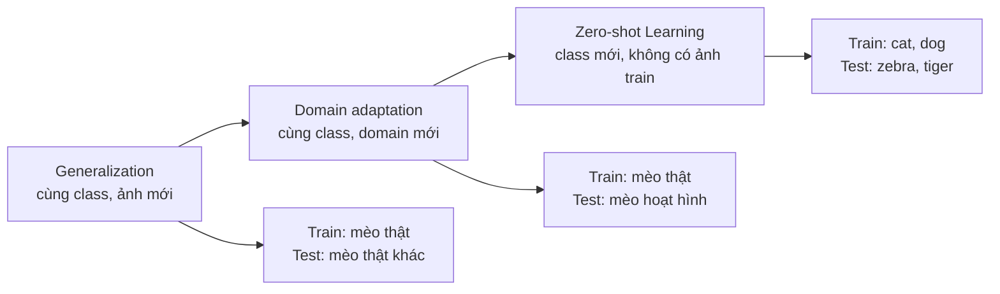
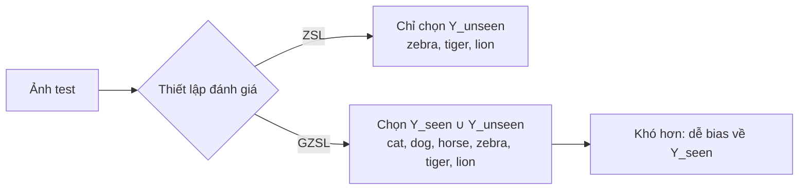
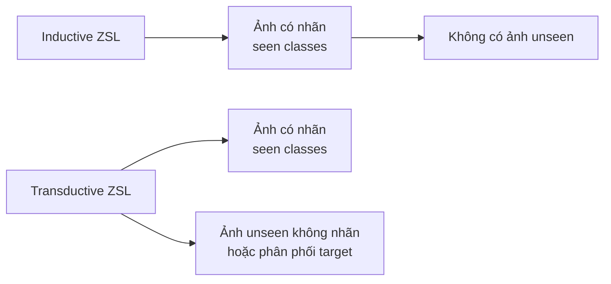
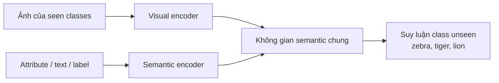
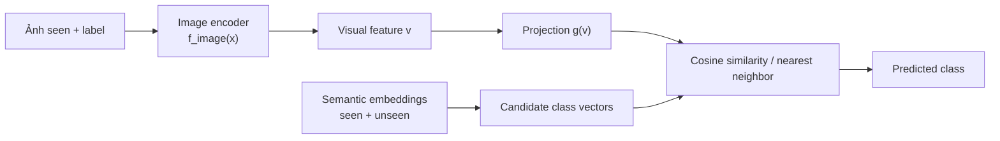
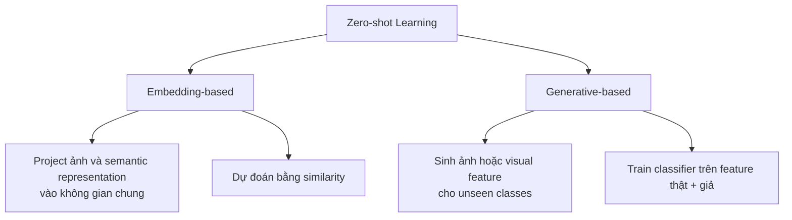
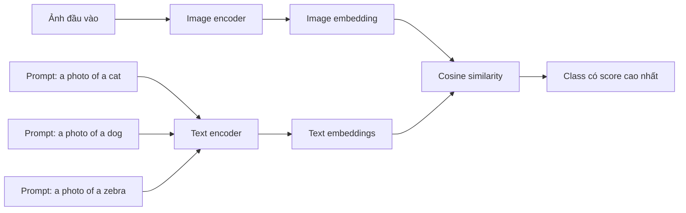
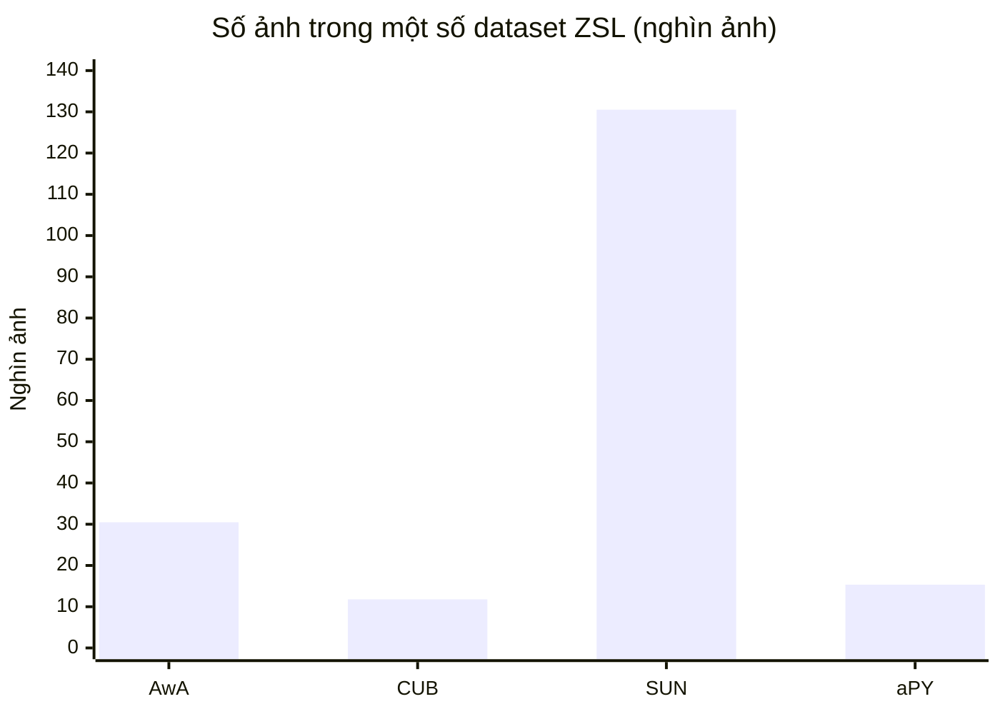

# Unit 11 — Zero-shot Learning trong Computer Vision

## 1. Bài toán tổng quát: Generalization là gì?

Khi huấn luyện một mô hình phân loại ảnh, ta không muốn mô hình chỉ “nhớ” đúng các ảnh đã thấy trong training set. Ta muốn nó nhận ra được ảnh mới nhưng vẫn thuộc cùng loại dữ liệu.

Ví dụ:

- Train trên ảnh mèo.
- Test trên ảnh mèo khác chưa từng thấy.
- Nếu mô hình nhận ra đúng, ta nói mô hình có khả năng **generalization**.

Tuy nhiên, generalization thường chỉ đúng khi ảnh train và ảnh test đến từ **cùng phân phối dữ liệu**.

Ví dụ:

| Train | Test | Khả năng thành công |
|---|---|---|
| Ảnh mèo thật | Ảnh mèo thật khác | Cao hơn |
| Ảnh mèo thật | Ảnh mèo hoạt hình | Khó hơn |
| Ảnh mèo thật | Ảnh ngựa vằn | Không thể nếu chỉ học supervised thông thường |

Nếu train trên ảnh mèo thật nhưng test trên ảnh mèo hoạt hình, đây là vấn đề **domain shift**. Việc giúp mô hình thích nghi từ domain này sang domain khác gọi là **domain adaptation**.

Nhưng Zero-shot Learning còn tham vọng hơn: mô hình phải nhận ra cả những lớp chưa từng xuất hiện khi train.

### Sơ đồ: từ generalization đến Zero-shot Learning



---

# 2. Zero-shot Learning là gì?

**Zero-shot Learning**, viết tắt là **ZSL**, là bài toán trong đó mô hình phải phân loại ảnh thuộc các class **không hề xuất hiện trong training set**.

Ví dụ:

Training classes:

```text
cat, dog, horse
```

Testing classes:

```text
zebra, tiger, lion
```

Mô hình chưa từng thấy ảnh zebra, tiger, lion trong lúc train, nhưng vẫn phải phân loại được chúng.

Điểm cốt lõi:

> Trong ZSL, tập class dùng để train và tập class dùng để test là rời nhau.

Ký hiệu:

```text
Y_seen ∩ Y_unseen = ∅
```

Trong đó:

- `Y_seen`: tập class đã thấy khi train.
- `Y_unseen`: tập class chưa từng thấy khi train.

---

# 3. ZSL khác GZSL như thế nào?

Có hai thiết lập quan trọng:

## 3.1. Classical Zero-shot Learning

Trong ZSL cổ điển, test set chỉ chứa class chưa từng thấy.

Ví dụ:

```text
Train: cat, dog, horse
Test: zebra, tiger, lion
```

Mô hình chỉ cần chọn trong các class unseen.

## 3.2. Generalized Zero-shot Learning

**Generalized Zero-shot Learning**, viết tắt **GZSL**, thực tế hơn. Test set chứa cả seen classes và unseen classes.

Ví dụ:

```text
Train: cat, dog, horse
Test: cat, dog, horse, zebra, tiger, lion
```

Đây là bài toán khó hơn vì mô hình vừa phải nhận ra class đã biết, vừa phải nhận ra class mới.

Vấn đề lớn của GZSL:

> Mô hình thường bị bias về seen classes vì đã được train trực tiếp trên chúng.

Ví dụ ảnh zebra có thể bị phân loại nhầm thành horse vì mô hình đã thấy nhiều ảnh horse, nhưng chưa từng thấy zebra.

### Sơ đồ: không gian class khi đánh giá



---

# 4. Inductive ZSL và Transductive ZSL

Dựa vào dữ liệu được phép sử dụng trong quá trình train, ZSL chia thành hai loại chính.

## 4.1. Inductive Zero-shot Learning

Trong **inductive ZSL**, mô hình chỉ được train bằng dữ liệu của seen classes.

Nó không được nhìn thấy ảnh của unseen classes, kể cả ảnh không có nhãn.

Ví dụ:

```text
Train images:
- cat images
- dog images
- horse images

No zebra images at all.
```

Mô hình chỉ biết về unseen classes thông qua thông tin phụ như:

- attribute vector,
- textual description,
- word embedding của label.

Đây là thiết lập sạch và cổ điển nhất.

## 4.2. Transductive Zero-shot Learning

Trong **transductive ZSL**, mô hình có thể được truy cập một phần thông tin từ unseen classes, thường là:

- ảnh unseen nhưng không có nhãn,
- attribute của unseen classes,
- phân phối dữ liệu chưa gán nhãn.

Ví dụ:

```text
Train:
- labeled cat, dog, horse images
- unlabeled zebra, tiger images
```

Mô hình không biết ảnh nào là zebra hay tiger, nhưng được thấy cấu trúc dữ liệu của chúng.

Transductive ZSL thường cho kết quả tốt hơn inductive ZSL vì có thêm thông tin về target domain.

### Sơ đồ: dữ liệu được phép dùng khi train



---

# 5. Vì sao Computer Vision cần semantic information?

Trong supervised image classification thông thường, mô hình học mapping:

```text
image -> class label
```

Ví dụ:

```text
image of cat -> cat
```

Nhưng với unseen class, mô hình không có ảnh train. Vậy làm sao biết zebra là gì?

Con người có thể nhận ra zebra nếu được mô tả:

> Zebra giống ngựa, nhưng có sọc trắng đen.

Ở đây, ta dùng thông tin ngữ nghĩa để liên kết class đã thấy và class chưa thấy.

Đó là lý do ZSL trong computer vision thường là bài toán **multi-modal learning**:

```text
Image modality + Text/Semantic modality
```

Mô hình không chỉ học ảnh, mà còn học mối quan hệ giữa ảnh và ý nghĩa ngữ nghĩa của class.

---

# 6. Semantic / Auxiliary Information là gì?

**Semantic information** hay **auxiliary information** là thông tin phụ giúp mô hình hiểu ý nghĩa của class.

Một số dạng phổ biến:

## 6.1. Attribute vectors

Attribute vector mô tả class bằng các đặc trưng có nghĩa.

Ví dụ với động vật:

| Class | Has stripes | Has mane | Is furry | Has hooves |
|---|---:|---:|---:|---:|
| horse | 0 | 1 | 1 | 1 |
| zebra | 1 | 0 | 1 | 1 |
| tiger | 1 | 0 | 1 | 0 |

Mỗi class được biểu diễn bằng một vector:

```python
horse = [0, 1, 1, 1]
zebra = [1, 0, 1, 1]
tiger = [1, 0, 1, 0]
```

Mô hình có thể học rằng zebra gần horse vì cùng có móng, dáng giống nhau, nhưng zebra có sọc.

## 6.2. Textual descriptions

Dùng mô tả văn bản cho class hoặc ảnh.

Ví dụ:

```text
"A zebra is a horse-like animal with black and white stripes."
```

Mô tả này có thể được mã hóa thành vector bằng các mô hình ngôn ngữ.

## 6.3. Class label vectors

Dùng embedding của chính tên class.

Ví dụ:

```text
"cat", "dog", "zebra", "tiger"
```

Các từ này được đưa qua mô hình như Word2Vec, GloVe, BERT hoặc text encoder để tạo vector.

Ví dụ:

```python
embedding("horse") ≈ embedding("zebra")
embedding("cat") ≈ embedding("tiger")
```

Nếu embedding tốt, các class có ý nghĩa gần nhau sẽ nằm gần nhau trong không gian vector.

### Sơ đồ: semantic information làm cầu nối



---

# 7. Semantic Embedding là gì?

**Semantic embedding** là vector số biểu diễn ý nghĩa của từ, câu, class hoặc mô tả.

Ví dụ từ:

```text
king, queen, man, woman
```

Trong Word2Vec, có thể có quan hệ vector nổi tiếng:

```text
king - man + woman ≈ queen
```

Điều này cho thấy embedding không chỉ là số ngẫu nhiên, mà chứa quan hệ ngữ nghĩa.

Trong ZSL, ta cần embedding cho class:

```python
embedding("horse")
embedding("zebra")
embedding("tiger")
```

Mục tiêu là đưa ảnh và class label vào cùng một không gian ngữ nghĩa để so sánh.

---

# 8. Pipeline kỹ thuật của Zero-shot Learning

Một pipeline ZSL embedding-based thường gồm các bước sau.

### Sơ đồ: pipeline embedding-based ZSL



## 8.1. Chuẩn bị dữ liệu

Ta có:

```text
Seen classes:
- images
- labels
- semantic embeddings

Unseen classes:
- semantic embeddings only
```

Ví dụ:

```text
Train images:
x_cat, x_dog, x_horse

Train labels:
cat, dog, horse

Semantic embeddings:
cat -> vector
dog -> vector
horse -> vector
zebra -> vector
tiger -> vector
```

Điểm quan trọng:

> Ảnh của zebra và tiger không được dùng khi train trong inductive ZSL.

---

## 8.2. Trích xuất visual feature

Ảnh được đưa qua CNN hoặc Vision Transformer để lấy đặc trưng ảnh.

Ví dụ:

```text
image -> ResNet/ViT -> visual feature
```

Ký hiệu:

```text
v = f_image(x)
```

Trong đó:

- `x`: ảnh đầu vào.
- `f_image`: image encoder.
- `v`: vector đặc trưng ảnh.

Ví dụ shape:

```python
v.shape = [2048]
```

nếu dùng ResNet feature.

---

## 8.3. Project visual feature sang semantic space

Mô hình học một hàm mapping:

```text
g(v) -> semantic embedding space
```

Tức là:

```text
image feature -> class semantic embedding
```

Nếu ảnh là horse, mô hình muốn:

```text
g(f_image(horse_image)) ≈ embedding("horse")
```

Loss thường tối ưu khoảng cách hoặc độ tương đồng giữa projection của ảnh và embedding class.

Một dạng đơn giản:

```python
loss = distance(projected_image_embedding, class_embedding)
```

Có thể dùng:

- Mean squared error,
- cosine similarity loss,
- contrastive loss,
- ranking loss.

---

## 8.4. Inference với unseen class

Khi test ảnh unseen, ví dụ ảnh zebra:

```text
image -> image encoder -> visual feature -> projection -> semantic vector
```

Sau đó so sánh vector này với embedding của các unseen classes.

Ví dụ:

```text
projected_image ≈ embedding("zebra")
```

Mô hình dự đoán class có embedding gần nhất.

```python
predicted_class = nearest_neighbor(
    projected_image_embedding,
    candidate_class_embeddings
)
```

Nếu dùng cosine similarity:

```python
score(class) = cosine(projected_image_embedding, class_embedding)
```

Chọn class có score cao nhất.

---

# 9. Ví dụ code đơn giản cho embedding-based ZSL

Ví dụ minh họa bằng PyTorch, bỏ qua phần train image encoder để tập trung vào ý tưởng chính.

```python
import torch
import torch.nn as nn
import torch.nn.functional as F

class ZSLProjectionModel(nn.Module):
    def __init__(self, visual_dim, semantic_dim):
        super().__init__()
        self.projection = nn.Sequential(
            nn.Linear(visual_dim, 1024),
            nn.ReLU(),
            nn.Linear(1024, semantic_dim)
        )

    def forward(self, visual_features):
        projected = self.projection(visual_features)
        projected = F.normalize(projected, dim=-1)
        return projected
```

Giả sử:

```python
visual_features.shape = [batch_size, 2048]
class_embeddings.shape = [num_classes, 300]
```

Train:

```python
model = ZSLProjectionModel(visual_dim=2048, semantic_dim=300)

visual_features = torch.randn(32, 2048)
target_embeddings = torch.randn(32, 300)

target_embeddings = F.normalize(target_embeddings, dim=-1)

projected = model(visual_features)

loss = 1 - F.cosine_similarity(projected, target_embeddings, dim=-1).mean()
loss.backward()
```

Inference:

```python
def predict_zero_shot(model, visual_feature, candidate_embeddings, candidate_labels):
    model.eval()

    with torch.no_grad():
        z = model(visual_feature.unsqueeze(0))  # [1, semantic_dim]

        candidate_embeddings = F.normalize(candidate_embeddings, dim=-1)

        scores = z @ candidate_embeddings.T  # cosine similarity if normalized

        best_idx = scores.argmax(dim=-1).item()

    return candidate_labels[best_idx]
```

Ví dụ:

```python
candidate_labels = ["zebra", "tiger", "lion"]
candidate_embeddings = torch.randn(3, 300)

visual_feature = torch.randn(2048)

pred = predict_zero_shot(
    model,
    visual_feature,
    candidate_embeddings,
    candidate_labels
)

print(pred)
```

Ý tưởng chính:

```text
Ảnh không được so trực tiếp với label dạng text.
Ảnh được project sang semantic space.
Sau đó semantic vector của ảnh được so với semantic vector của class.
```

---

# 10. DeViSE: ví dụ kinh điển về semantic embedding ZSL

Một paper quan trọng được nhắc đến là:

> DeViSE: A Deep Visual Semantic Embedding Model, Frome et al., 2013.

Ý tưởng của DeViSE:

1. Dùng một image model mạnh để trích xuất visual features.
2. Dùng word embedding để biểu diễn class label.
3. Học mapping từ visual feature sang word embedding space.
4. Khi test, dự đoán class bằng nearest neighbor trong semantic space.

Thay vì classifier thông thường:

```text
image -> softmax over fixed classes
```

DeViSE dùng:

```text
image -> vector in semantic space
```

Điều này cho phép model phân loại class mới nếu class đó có word embedding.

Vấn đề softmax truyền thống:

```text
Classifier chỉ biết các class đã định nghĩa trước.
Muốn thêm class mới thì phải train lại hoặc fine-tune.
```

Với DeViSE/ZSL:

```text
Có thể thêm class mới bằng cách thêm semantic embedding của class đó.
```

---

# 11. Embedding-based methods

Đây là nhóm phương pháp chính được unit này tập trung.

Ý tưởng:

> Học một không gian embedding chung, nơi ảnh và semantic representation có thể được so sánh trực tiếp.

Có hai hướng phổ biến:

## 11.1. Image-to-semantic

Project ảnh sang semantic space.

```text
image feature -> semantic embedding
```

Sau đó so với class embedding.

Đây là hướng giống DeViSE.

## 11.2. Semantic-to-image

Project semantic embedding sang visual feature space.

```text
class embedding -> visual prototype
```

Sau đó so với image feature.

## 11.3. Common latent space

Cả ảnh và text đều được project vào một latent space chung.

```text
image -> shared embedding
text -> shared embedding
```

CLIP là ví dụ nổi bật của hướng này.

### Sơ đồ: hai họ phương pháp ZSL



---

# 12. Generative-based methods

Ngoài embedding-based methods, còn có **generative-based methods**.

Ý tưởng:

> Dùng generative model để tạo dữ liệu giả hoặc feature giả cho unseen classes.

Ví dụ:

```text
semantic embedding("zebra") -> generate synthetic zebra features
```

Sau đó ta có thể train classifier supervised bình thường trên:

```text
real features of seen classes
synthetic features of unseen classes
```

Các model có thể dùng:

- CVAE,
- GAN,
- VAE,
- diffusion-based generator.

Ưu điểm:

- Biến ZSL thành supervised learning.
- Có thể giảm bias về seen classes trong GZSL.

Nhược điểm:

- Phụ thuộc chất lượng dữ liệu sinh ra.
- Training phức tạp hơn.
- Có nguy cơ synthetic feature không phản ánh đúng phân phối thật.

Unit này chỉ tập trung vào embedding-based methods.

---

# 13. CLIP liên quan gì đến Zero-shot Learning?

**CLIP** là một bước tiến lớn trong zero-shot computer vision.

CLIP được train trên rất nhiều cặp:

```text
(image, text)
```

Ví dụ:

```text
image of dog + "a photo of a dog"
image of car + "a photo of a car"
```

CLIP gồm hai encoder:

```text
Image Encoder
Text Encoder
```

Cả hai đưa input vào cùng một embedding space.

```text
image -> image embedding
text -> text embedding
```

Training objective:

> Ảnh đúng phải gần caption đúng, xa caption sai.

### Sơ đồ: CLIP zero-shot classification



Ở inference zero-shot classification:

1. Tạo prompt cho từng class:

```text
"a photo of a cat"
"a photo of a dog"
"a photo of a zebra"
```

2. Encode ảnh bằng image encoder.
3. Encode text prompt bằng text encoder.
4. So sánh cosine similarity.
5. Chọn prompt có similarity cao nhất.

Pseudo-code:

```python
scores = image_embedding @ text_embeddings.T
prediction = class_with_highest_score
```

CLIP khác ZSL truyền thống ở chỗ:

| Traditional ZSL | CLIP |
|---|---|
| Dùng attribute hoặc word embedding cố định | Học trực tiếp từ image-text pairs |
| Thường cần thiết kế semantic representation | Dùng natural language prompt |
| Phạm vi thường hẹp hơn | Generalize tốt trên nhiều task |
| Dataset nhỏ hơn | Pretrain cực lớn |

CLIP là ví dụ mạnh của:

```text
multi-modal contrastive learning
```

---

# 14. ZSL khác các bài toán liên quan như thế nào?

## 14.1. ZSL vs Domain Adaptation

**Domain Adaptation** xử lý khác biệt phân phối giữa source domain và target domain.

Ví dụ:

```text
Train: ảnh mèo thật
Test: ảnh mèo hoạt hình
```

Class vẫn là mèo, nhưng domain khác.

ZSL xử lý class mới hoàn toàn.

Ví dụ:

```text
Train: cat, dog
Test: zebra, tiger
```

Có thể xem ZSL là trường hợp cực đoan hơn, vì target class không có labeled image.

---

## 14.2. ZSL vs Open Set Recognition

**Open Set Recognition** yêu cầu mô hình biết khi nào input không thuộc class đã biết.

Ví dụ train:

```text
cat, dog
```

Test ảnh zebra, mô hình chỉ cần nói:

```text
unknown
```

Không cần nói cụ thể là zebra.

ZSL thì khó hơn:

```text
zebra
```

Mô hình phải gán đúng nhãn unseen.

---

## 14.3. ZSL vs OOD Detection

**Out-of-Distribution Detection** phát hiện dữ liệu khác phân phối training.

Ví dụ:

```text
Train: ảnh động vật
Test: ảnh X-ray y tế
```

Mô hình chỉ cần phát hiện đây là dữ liệu lạ.

Không cần phân loại thành class cụ thể.

---

## 14.4. ZSL vs Open Vocabulary Learning

**Open Vocabulary Learning** rộng hơn ZSL.

Mục tiêu là mô hình có thể xử lý tập class mở, gần như không giới hạn.

CLIP và các vision-language model hiện đại hướng tới open vocabulary.

Ví dụ:

```text
"red vintage car"
"golden retriever puppy"
"damaged traffic sign"
```

Không chỉ class đơn giản, mà có thể là mô tả tự nhiên.

---

# 15. Các dataset phổ biến để đánh giá ZSL

### Biểu đồ: quy mô số ảnh của các dataset có thống kê

Các giá trị dưới đây tính theo **nghìn ảnh**, chỉ để so sánh quy mô; quy mô lớn hơn không đồng nghĩa với bài toán dễ hơn. ImageNet được giữ ở phần mô tả vì mục này không nêu số ảnh cụ thể.



## 15.1. AwA — Animals with Attributes

Dataset về động vật.

Thông tin chính:

- 50 animal classes.
- 30,475 images.
- Có attribute representation.

Phù hợp để đánh giá khả năng transfer qua attribute.

Ví dụ attribute:

```text
has stripes, furry, aquatic, fast, domestic
```

---

## 15.2. CUB — Caltech-UCSD-Birds-200-2011

Dataset fine-grained về chim.

Thông tin chính:

- 200 bird species.
- 11,788 images.
- 312 binary attributes.
- Bounding boxes.
- Part locations.
- Mô tả văn bản cho ảnh.

Đây là dataset khó vì các class rất giống nhau.

Ví dụ:

```text
different species of birds
```

Mô hình cần phân biệt chi tiết nhỏ như màu cánh, mỏ, đuôi.

---

## 15.3. SUN

Dataset scene recognition.

Thông tin chính:

- 130,519 images.
- 899 scene categories.
- Dùng cho scene understanding và fine-grained scene recognition.

Ví dụ class:

```text
kitchen, forest, bedroom, airport_terminal
```

---

## 15.4. aPY — Attribute Pascal and Yahoo

Dataset coarse-grained gồm:

- 15,339 images.
- 32 subcategories.
- 3 nhóm lớn: animals, objects, vehicles.

---

## 15.5. ImageNet / ILSVRC

Dataset lớn cho classification và detection.

Dùng để đánh giá khả năng mở rộng của phương pháp ZSL trên nhiều class.

---

# 16. Những thách thức kỹ thuật quan trọng trong ZSL

## 16.1. Domain shift

Mapping học từ seen classes có thể không hoạt động tốt trên unseen classes.

Ví dụ train mapping từ:

```text
cat, dog, horse
```

Nhưng khi áp dụng cho:

```text
airplane, guitar, building
```

thì quan hệ visual-semantic có thể khác nhiều.

---

## 16.2. Hubness problem

Trong high-dimensional space, một số embedding có xu hướng trở thành nearest neighbor của quá nhiều điểm.

Điều này làm mô hình bias về vài class nhất định.

Ví dụ nhiều ảnh unseen khác nhau đều bị kéo về cùng một label.

---

## 16.3. Semantic gap

Khoảng cách giữa visual feature và semantic feature có thể rất lớn.

Ví dụ word embedding của:

```text
"tiger"
```

có thể gần:

```text
"lion"
```

nhưng visual distinction giữa tiger và lion cần thông tin sọc, màu, dáng cơ thể.

Nếu semantic embedding không đủ chi tiết, ZSL sẽ thất bại.

---

## 16.4. Bias toward seen classes trong GZSL

Trong GZSL, mô hình thường dự đoán class đã thấy vì đã train trực tiếp trên chúng.

Ví dụ ảnh zebra bị dự đoán thành horse.

Cần kỹ thuật calibration để giảm bias.

---

# 17. Công thức tổng quát của embedding-based ZSL

Giả sử:

```text
x: image
y: class label
s_y: semantic embedding của class y
f(x): visual encoder
g(f(x)): projection từ visual sang semantic
```

Training objective:

```text
g(f(x_i)) gần với s_{y_i}
```

Inference:

```text
ŷ = argmax_y similarity(g(f(x)), s_y)
```

Nếu dùng cosine similarity:

```text
ŷ = argmax_y cos(g(f(x)), s_y)
```

Trong ZSL cổ điển:

```text
y ∈ Y_unseen
```

Trong GZSL:

```text
y ∈ Y_seen ∪ Y_unseen
```

---

# 18. Những điểm cần nhớ nhất

1. **ZSL là phân loại class chưa từng thấy khi train.**

2. **ZSL không phải unsupervised learning.**  
   Nó vẫn dùng supervised data cho seen classes và dùng semantic information cho unseen classes.

3. **Semantic information là cầu nối giữa seen và unseen classes.**

4. Các dạng semantic information phổ biến:
   - attribute vectors,
   - textual descriptions,
   - class label embeddings.

5. **Embedding-based ZSL** học một không gian chung để so sánh ảnh và semantic representation.

6. **Generative-based ZSL** tạo synthetic data hoặc synthetic features cho unseen classes.

7. **GZSL thực tế hơn nhưng khó hơn ZSL cổ điển** vì phải phân biệt cả seen và unseen classes.

8. **CLIP là một ví dụ hiện đại, mạnh mẽ của zero-shot computer vision**, dùng image-text contrastive learning.

9. Các vấn đề kỹ thuật lớn:
   - domain shift,
   - semantic gap,
   - hubness,
   - bias toward seen classes.

10. Đánh giá ZSL cần dataset chuẩn như:
    - AwA,
    - CUB,
    - SUN,
    - aPY,
    - ImageNet.

---

Tóm lại, Zero-shot Learning trong Computer Vision cố gắng trả lời câu hỏi:

> Làm sao để mô hình nhận ra một class mà nó chưa từng thấy ảnh nào trong quá trình train?

Câu trả lời kỹ thuật là:

> Học mối liên hệ giữa đặc trưng ảnh và thông tin ngữ nghĩa, sau đó dùng semantic space để suy luận class mới.