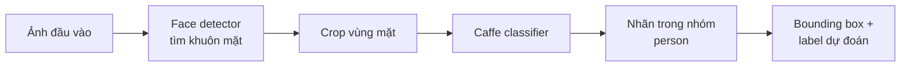
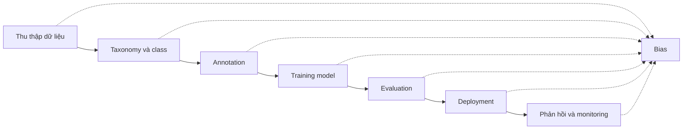
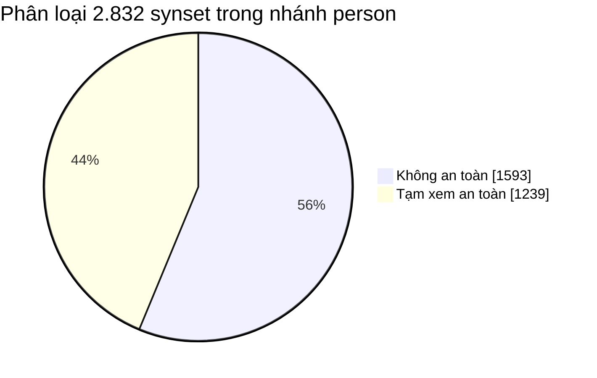
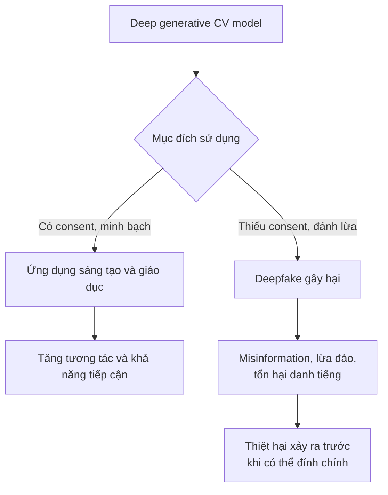
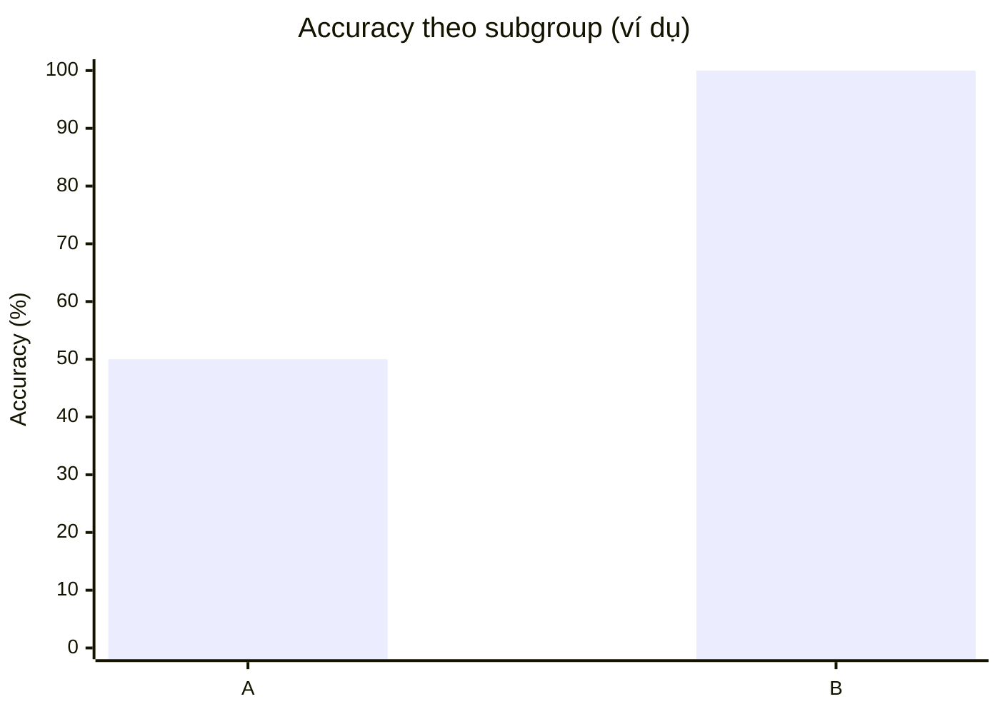
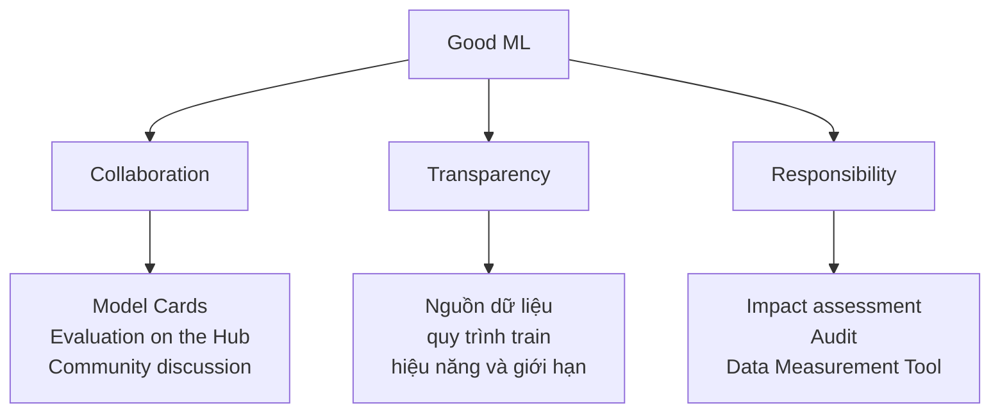
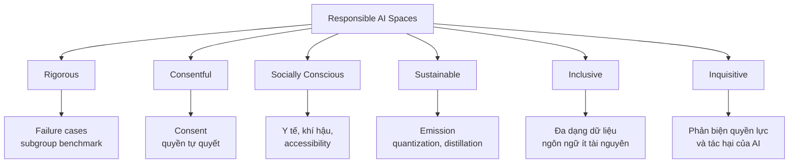

# Unit 12 — Ethics and Bias in Computer Vision

## 1. Mục tiêu của unit

Unit này tập trung vào câu hỏi:

> Làm thế nào để xây dựng, đánh giá và triển khai các hệ thống Computer Vision một cách công bằng, có trách nhiệm, minh bạch và ít gây hại nhất?

Các nội dung chính gồm:

- Phân tích case study **ImageNet Roulette**.
- Hiểu vì sao bias có thể xuất hiện trong mô hình AI/CV.
- Nhận diện các rủi ro đạo đức khi dùng mô hình thị giác máy tính.
- Tìm hiểu deepfake như một ví dụ công nghệ mạnh nhưng dễ bị lạm dụng.
- Nắm các nguyên tắc AI Ethics quan trọng.
- Biết một số hướng giảm bias và bảo vệ quyền riêng tư.
- Tìm hiểu các nỗ lực của Hugging Face trong Responsible AI.

---

# 2. ImageNet Roulette — Case study quan trọng về bias trong Computer Vision

## 2.1 ImageNet là gì?

**ImageNet** là một dataset quy mô lớn dùng cho bài toán nhận diện đối tượng.

Ban đầu, ImageNet được xây dựng với mục tiêu:

> Tạo một bản đồ lớn về thế giới đồ vật để giúp máy tính hiểu cảnh vật tốt hơn.

Một số thông tin kỹ thuật quan trọng:

| Phiên bản | Số ảnh | Số class |
|---|---:|---:|
| ImageNet-21K | khoảng 14,197,122 ảnh | 21,841 class |
| ImageNet-1K | 1,281,167 ảnh train, 50,000 validation, 100,000 test | 1,000 class |

ImageNet được tổ chức dựa trên **WordNet**, một cơ sở dữ liệu phân loại từ vựng.

Việc gán nhãn được thực hiện qua crowdsourcing, chủ yếu bằng **Amazon Mechanical Turk**.

ImageNet-1K sau đó trở thành nền tảng cho cuộc thi nổi tiếng:

> ImageNet Large Scale Visual Recognition Challenge — ILSVRC

Cuộc thi này đóng vai trò rất lớn trong sự phát triển của deep learning cho computer vision.

---

## 2.2 ImageNet Roulette là gì?

**ImageNet Roulette** là một web app do **Trevor Paglen** và **Kate Crawford** tạo ra.

Mục tiêu của họ không phải xây một sản phẩm thương mại, mà là:

> Chứng minh rằng các hệ thống phân loại con người có thể tạo ra kết quả nguy hiểm, xúc phạm và thiên lệch nếu dữ liệu huấn luyện có vấn đề.

Hệ thống này dùng các nhãn thuộc nhóm `"person"` trong ImageNet.

Pipeline kỹ thuật đơn giản như sau:

### Sơ đồ pipeline của ImageNet Roulette



Pseudo-code:

```python
image = load_image("selfie.jpg")

faces = face_detector.detect(image)

for face_box in faces:
    face_crop = crop(image, face_box)
    label = caffe_classifier.predict(face_crop)

    draw_box(image, face_box)
    draw_label(image, label)

show(image)
```

Vấn đề nằm ở chỗ: nhiều label trong nhóm `"person"` là các nhãn xúc phạm, định kiến hoặc không nên dùng để mô tả con người.

Ví dụ nội dung nhãn có thể ám chỉ:

- Người phạm tội.
- Người nghiện.
- Người có “tính cách xấu”.
- Người thuộc một nhóm sắc tộc/tôn giáo nhất định.
- Người thất bại.
- Người có đặc điểm ngoại hình bị gắn với định kiến xã hội.

Nói cách khác, model không chỉ phân loại đối tượng khách quan như `"dog"`, `"car"`, `"chair"`, mà lại gán cho con người các thuộc tính xã hội, đạo đức hoặc định kiến.

Đây là điểm cực kỳ nguy hiểm.

---

# 3. ImageNet Roulette sai ở đâu?

## 3.1 Lỗi không chỉ nằm ở model

Một điểm rất quan trọng:

> Model học từ dữ liệu. Nếu dữ liệu có nhãn độc hại, model có thể tái tạo hoặc khuếch đại sự độc hại đó.

Vấn đề không chỉ là kiến trúc model, loss function hay optimizer.

Nguồn gốc bias đến từ:

- Cách thu thập dữ liệu.
- Cách chọn class.
- Cách gán nhãn.
- Cách dùng WordNet làm hệ phân loại.
- Thiếu kiểm tra đạo đức ở nhóm label `"person"`.
- Thiếu đánh giá tác động với các nhóm người bị ảnh hưởng.

### Sơ đồ: bias có thể xuất hiện ở đâu?

Bias có thể được đưa vào hệ thống trước cả khi model bắt đầu học và tiếp tục phát sinh sau khi deploy:



---

## 3.2 Vấn đề từ WordNet synsets

ImageNet dùng cấu trúc WordNet. Trong WordNet có nhiều **synset** — nhóm từ đồng nghĩa hoặc gần nghĩa.

Một số synset trong nhánh `"person"` có thể:

- Xúc phạm.
- Mang tính phân biệt chủng tộc.
- Mang tính phân biệt giới.
- Nhạy cảm về tôn giáo, sắc tộc, tuổi tác.
- Không thể xác định chỉ bằng hình ảnh.

Ví dụ, nếu một class là `"philanthropist"` — nhà từ thiện — thì rất khó, thậm chí không hợp lý, để xác định chỉ từ ảnh khuôn mặt.

Đây gọi là vấn đề:

> **Non-imageable concepts** — các khái niệm không thể hoặc không nên suy ra từ hình ảnh.

---

# 4. Hệ quả của ImageNet Roulette

ImageNet Roulette gây chú ý lớn vì nó cho thấy:

## 4.1 Dataset benchmark cũng có thể chứa bias nghiêm trọng

ImageNet từng được xem là dataset chuẩn mực. Nhưng case này cho thấy benchmark nổi tiếng vẫn có thể có vấn đề về đạo đức.

## 4.2 Bias có thể gây hại cho cá nhân và cộng đồng

Nếu một người upload ảnh và bị gán nhãn như tội phạm hoặc một nhãn xúc phạm, điều đó có thể:

- Gây tổn thương tinh thần.
- Làm xấu hình ảnh cá nhân.
- Bị lan truyền trên mạng xã hội.
- Tăng định kiến chủng tộc, giới tính, tôn giáo.
- Làm hại các nhóm yếu thế.

## 4.3 Cần xem xét đạo đức ngay từ giai đoạn dữ liệu

Không thể chỉ nói:

> “Đó là lỗi của model.”

Mà phải hỏi:

- Dataset được lấy từ đâu?
- Ai gán nhãn?
- Label có hợp lý không?
- Label có xúc phạm không?
- Có class nào không thể suy ra từ ảnh không?
- Có nhóm người nào bị ảnh hưởng nhiều hơn không?
- Có consent của người trong ảnh không?

---

# 5. ImageNet team đã xử lý như thế nào?

Sau case này và các nghiên cứu liên quan, ImageNet team tiến hành một dự án lọc và cân bằng lại dữ liệu.

## 5.1 Problem 1 — Offensive synsets

Vấn đề:

> Nhiều synset trong WordNet không phù hợp để làm label ảnh người.

Cách xử lý:

ImageNet chia label thành 3 nhóm:

| Nhóm | Ý nghĩa |
|---|---|
| Offensive | Xúc phạm rõ ràng, ví dụ slur về chủng tộc/giới |
| Sensitive | Không nhất thiết xúc phạm trực tiếp, nhưng dễ gây hại tùy ngữ cảnh |
| Safe | Tạm xem là an toàn |

Kết quả:

- Tổng số synset trong nhánh `"person"`: 2,832.
- Synset không an toàn: 1,593.
- Synset tạm xem an toàn: 1,239.
- Khoảng 600,000 ảnh bị loại bỏ sau khi lọc.

### Biểu đồ: kết quả phân loại synset



Biểu đồ chỉ thể hiện tỷ lệ synset; con số khoảng 600.000 là số ảnh bị loại bỏ nên không cộng vào biểu đồ này.

---

## 5.2 Problem 2 — Non-imageable concepts

Vấn đề:

> Một số khái niệm không thể xác định hợp lý bằng ảnh.

Ví dụ:

- Người tốt.
- Người thất bại.
- Nhà từ thiện.
- Người có đạo đức kém.
- Người nguy hiểm.

Các nhãn kiểu này không có đặc trưng thị giác rõ ràng.

Cách xử lý:

- Worker đánh giá mức độ “có thể hình dung bằng ảnh” của từng synset.
- Thang điểm từ 1 đến 5:
  - 1: rất khó hình dung bằng ảnh.
  - 5: rất dễ hình dung bằng ảnh.
- Median rating là 2.36.
- Chỉ khoảng 219 synset có điểm trên 4.
- Các synset có imageability thấp bị loại bỏ.

Một cách kiểm tra đơn giản khi thiết kế dataset:

```python
def is_imageable(label: str) -> bool:
    """
    Rule-of-thumb:
    Nếu con người không thể xác định label chỉ từ hình ảnh,
    không nên dùng label đó cho image classification.
    """
    non_imageable_examples = {
        "philanthropist",
        "criminal",
        "unsuccessful person",
        "good person",
        "bad person",
    }
    return label not in non_imageable_examples
```

Trong thực tế, không nên dùng rule cứng như trên. Cần có đánh giá bởi nhiều annotator và quy trình kiểm duyệt rõ ràng.

---

## 5.3 Problem 3 — Diversity of images

Vấn đề:

> Dataset có thể phản ánh hoặc khuếch đại stereotype xã hội.

Ví dụ:

- Khi tìm `"construction worker"`, ảnh trả về có thể chủ yếu là nam.
- Khi tìm một nghề khác, ảnh có thể bị lệch theo giới, màu da hoặc tuổi.
- Annotator cũng có thể vô thức gán nhãn theo định kiến xã hội.

Cách xử lý:

- Phân tích các thuộc tính nhân khẩu học như:
  - Gender.
  - Color / skin tone.
  - Age.
- Loại bỏ các nhóm bị overrepresented.
- Cân bằng lại phân phối trong từng synset.

Ví dụ kỹ thuật đơn giản để kiểm tra phân phối:

```python
from collections import Counter

samples = [
    {"label": "construction_worker", "gender": "male"},
    {"label": "construction_worker", "gender": "male"},
    {"label": "construction_worker", "gender": "female"},
]

gender_count = Counter(x["gender"] for x in samples)
print(gender_count)
```

Output giả định:

```text
Counter({'male': 2, 'female': 1})
```

Trong hệ thống thực tế, cần kiểm tra theo từng class:

```python
def group_distribution(samples, class_name, attribute):
    filtered = [x for x in samples if x["label"] == class_name]
    return Counter(x[attribute] for x in filtered)

dist = group_distribution(samples, "construction_worker", "gender")
print(dist)
```

Mục tiêu không phải lúc nào cũng là cân bằng 50/50 tuyệt đối, mà là hiểu rõ:

- Dataset đang lệch như thế nào.
- Sự lệch đó có hợp lý với mục tiêu sử dụng không.
- Nó có gây hại cho nhóm nào không.

---

## 5.4 Problem 4 — Privacy concerns

Vấn đề:

> Ảnh người trong dataset có thể vi phạm quyền riêng tư, đặc biệt khi khuôn mặt có thể nhận diện được.

Nếu model hoặc dataset bị dùng sai, ảnh và nhãn có thể gây hại nghiêm trọng cho cá nhân.

Cách xử lý:

- Với ImageNet-1K, nhóm nghiên cứu chú thích khuôn mặt riêng.
- Tạo bản dataset có mặt bị làm mờ.
- Dùng các kỹ thuật:
  - Blurring.
  - Mosaicing.
  - Obfuscation.

Ví dụ làm mờ mặt bằng OpenCV:

```python
import cv2

image = cv2.imread("person.jpg")

# face_box: x, y, w, h
x, y, w, h = face_box

face = image[y:y+h, x:x+w]
blurred_face = cv2.GaussianBlur(face, (51, 51), 30)

image[y:y+h, x:x+w] = blurred_face

cv2.imwrite("person_blurred.jpg", image)
```

Điểm đáng chú ý:

> Việc làm mờ mặt chỉ gây giảm accuracy rất nhỏ trong các benchmark object recognition, nhưng lại cải thiện quyền riêng tư đáng kể.

---

# 6. Deepfake — ví dụ về công nghệ mạnh nhưng có rủi ro đạo đức

## 6.1 Deepfake là gì?

**Deepfake** là synthetic media được tạo bằng các mô hình deep generative.

Nó có thể dùng để:

- Thay mặt người này bằng người khác trong ảnh/video.
- Tạo video giả.
- Tạo giọng nói giả.
- Kết hợp video và audio để tạo nội dung rất thuyết phục.

Một ví dụ tích cực trong tài liệu là video giới thiệu khóa học MIT 6.S191, nơi deepfake được dùng để tạo cảm giác như Barack Obama đang chào mừng sinh viên.

Nhưng cùng công nghệ đó cũng có thể bị dùng để:

- Tạo video giả của chính trị gia.
- Tuyên truyền sai lệch trong bầu cử.
- Kích động thù ghét.
- Bôi nhọ cá nhân.
- Lừa đảo.
- Tấn công danh tiếng nạn nhân.

---

## 6.2 Bài học đạo đức từ deepfake

Công nghệ không tự nó tốt hay xấu.

Vấn đề là:

- Ai dùng?
- Dùng với mục đích gì?
- Có consent không?
- Có gây hại không?
- Có cơ chế phát hiện/làm rõ không?
- Người xem có đủ nhận thức để phân biệt không?

Các yếu tố cần quan tâm:

1. **Consent**  
   Có được sự đồng ý của người bị sử dụng hình ảnh/giọng nói không?

2. **Misuse prevention**  
   Hệ thống có ngăn lạm dụng không?

3. **Detection**  
   Có công cụ phát hiện nội dung giả không?

4. **Awareness**  
   Người dùng có hiểu rủi ro của synthetic media không?

5. **Damage control**  
   Nếu deepfake đã lan truyền, thiệt hại thường đã xảy ra. Vì vậy phòng ngừa quan trọng hơn sửa sai sau đó.

### Sơ đồ: cùng một công nghệ, hai hướng tác động



---

# 7. Ethics và Bias trong AI là gì?

## 7.1 Ethics

**Ethics** là tập hợp các nguyên tắc đạo đức giúp phân biệt đúng và sai.

**AI Ethics** là lĩnh vực nghiên cứu và thực hành nhằm đảm bảo AI được phát triển và sử dụng theo các chuẩn mực đạo đức, giảm rủi ro và tăng lợi ích cho xã hội.

AI Ethics liên quan đến nhiều nhóm:

- Nhà nghiên cứu.
- Kỹ sư.
- Developer.
- AI ethicist.
- Chính phủ.
- Cơ quan pháp lý.
- Công ty.
- Tổ chức.
- Người dân và người dùng cuối.

---

## 7.2 Bias

**Bias trong AI** là sự thiên lệch trong output của thuật toán.

Bias có thể đến từ:

- Dữ liệu huấn luyện.
- Quy trình gán nhãn.
- Giả định của người phát triển.
- Thiết kế model.
- Metric đánh giá.
- Cách triển khai thực tế.
- Phản hồi từ người dùng sau deployment.

Trong Computer Vision, bias có thể xuất hiện ở nhiều bài toán:

- Image classification.
- Face recognition.
- Object detection.
- Image captioning.
- Visual question answering.
- Text-to-image generation.
- Saliency/cropping algorithms.

---

# 8. Các nguyên tắc AI Ethics quan trọng

## 8.1 Asimov’s Three Laws of Robotics

Isaac Asimov đề xuất 3 luật robot:

1. Robot không được làm hại con người hoặc để con người bị hại do không hành động.
2. Robot phải tuân lệnh con người, trừ khi lệnh đó mâu thuẫn với luật thứ nhất.
3. Robot phải bảo vệ sự tồn tại của chính nó, miễn là không mâu thuẫn với luật thứ nhất và thứ hai.

Dù là từ khoa học viễn tưởng, đây là một trong những nền tảng sớm cho tư duy đạo đức công nghệ.

---

## 8.2 Asilomar AI Principles

Năm 2017, hội nghị tại Asilomar đưa ra **23 nguyên tắc AI** cho phát triển AI có trách nhiệm.

Các nguyên tắc này nhấn mạnh:

- An toàn.
- Minh bạch.
- Trách nhiệm.
- Lợi ích xã hội.
- Kiểm soát của con người.
- Tránh chạy đua AI gây hại.
- Tôn trọng giá trị con người.

---

## 8.3 UNESCO Recommendation on the Ethics of AI

UNESCO đưa ra khuyến nghị toàn cầu về đạo đức AI, được 193 quốc gia thành viên thông qua vào năm 2021.

Bốn giá trị cốt lõi:

1. **Human rights and human dignity**  
   Tôn trọng, bảo vệ và thúc đẩy nhân quyền, phẩm giá con người.

2. **Living in peaceful, just and interconnected societies**  
   Xây dựng xã hội hòa bình, công bằng, kết nối.

3. **Diversity and inclusiveness**  
   Đảm bảo đa dạng và bao trùm.

4. **Environment and ecosystem flourishing**  
   Bảo vệ môi trường và hệ sinh thái.

Mười nguyên tắc chính:

| Nguyên tắc | Ý nghĩa |
|---|---|
| Proportionality and Do No Harm | AI chỉ nên dùng khi cần thiết và không gây hại |
| Safety and Security | Tránh rủi ro an toàn và lỗ hổng bảo mật |
| Privacy and Data Protection | Bảo vệ quyền riêng tư và dữ liệu |
| Multi-stakeholder Governance | Cần nhiều bên tham gia quản trị |
| Responsibility and Accountability | Có trách nhiệm, audit được |
| Transparency and Explainability | Minh bạch, giải thích được |
| Human Oversight | Con người vẫn chịu trách nhiệm cuối cùng |
| Sustainability | Đánh giá tác động bền vững |
| Awareness and Literacy | Nâng cao hiểu biết AI cho cộng đồng |
| Fairness and Non-Discrimination | Công bằng, không phân biệt đối xử |

---

# 9. Checklist kỹ thuật khi xây dựng hệ thống CV có trách nhiệm

Khi xây dựng một model CV, nên kiểm tra theo các bước sau.

## 9.1 Dataset

Cần hỏi:

- Dữ liệu lấy từ đâu?
- Có consent không?
- Có dữ liệu cá nhân hoặc khuôn mặt không?
- Có cần làm mờ/ẩn danh không?
- Label có xúc phạm không?
- Label có thể xác định bằng hình ảnh không?
- Class có quá nhạy cảm không?
- Dataset có lệch giới, tuổi, màu da, vùng địa lý không?

---

## 9.2 Annotation

Cần kiểm tra:

- Ai là annotator?
- Annotator có guideline rõ không?
- Có nhiều annotator cho mỗi sample không?
- Có đo disagreement không?
- Có review label nhạy cảm không?
- Có cơ chế báo cáo label sai hoặc độc hại không?

---

## 9.3 Model evaluation

Không chỉ xem accuracy trung bình.

Cần đánh giá theo subgroup:

```python
def accuracy_by_group(y_true, y_pred, groups):
    result = {}

    for group in set(groups):
        idx = [i for i, g in enumerate(groups) if g == group]

        correct = sum(y_true[i] == y_pred[i] for i in idx)
        total = len(idx)

        result[group] = correct / total if total > 0 else None

    return result
```

Ví dụ:

```python
y_true = [1, 1, 0, 0, 1]
y_pred = [1, 0, 0, 0, 1]
groups = ["A", "A", "B", "B", "B"]

print(accuracy_by_group(y_true, y_pred, groups))
```

Kết quả:

```text
{'A': 0.5, 'B': 1.0}
```

Accuracy tổng thể có thể cao, nhưng một nhóm cụ thể có thể bị lỗi nhiều hơn.

### Biểu đồ: accuracy theo subgroup trong ví dụ trên



Đây chỉ là số liệu minh họa từ đoạn code trên: nhóm A đạt 50%, nhóm B đạt 100%. Không nên suy ra hiệu năng thực tế nếu chưa đo trên dataset đủ lớn.

---

## 9.4 Deployment

Trước khi deploy cần hỏi:

- Ai sẽ bị ảnh hưởng nếu model sai?
- Sai positive và sai negative gây hại thế nào?
- Có human review không?
- Có log/audit không?
- Người dùng có biết model có giới hạn gì không?
- Có cách appeal hoặc report lỗi không?
- Có monitoring sau deployment không?

---

# 10. Hugging Face và Good ML

Hugging Face định hướng:

> Democratize good machine learning — dân chủ hóa machine learning tốt.

Good ML được nhấn mạnh qua ba hướng:

## 10.1 Collaboration

Các công cụ hỗ trợ cộng đồng:

- **Model Cards**  
  File mô tả model, mục đích sử dụng, giới hạn, dữ liệu train, metric, rủi ro đạo đức.

- **Evaluation on the Hub**  
  Cho phép đánh giá model trên dataset công khai.

- **Community discussion**  
  Người dùng có thể feedback, flag Space, tạo PR.

- **Discord community**  
  Nơi trao đổi về NLP, CV, audio, RL, ethics, v.v.

---

## 10.2 Transparency

Minh bạch về:

- Mục đích model.
- Nguồn dữ liệu.
- Quy trình train.
- Hiệu năng.
- Giới hạn.
- Rủi ro.

Ví dụ:

- Ethical charter cho multimodal project.
- Thảo luận chính sách AI.

---

## 10.3 Responsibility

Tập trung vào:

- Đánh giá tác động của model.
- Làm model dễ audit hơn.
- Giáo dục cộng đồng.
- Công cụ đo lường dataset.

Ví dụ:

- Hugging Face for Education.
- Data Measurement Tool.

### Sơ đồ: ba trụ cột của Good ML



---

# 11. Sáu nhóm Hugging Face Spaces liên quan đến đạo đức

### Bản đồ sáu nhóm Responsible AI Spaces



## 11.1 Rigorous

Các project kiểm tra kỹ:

- Failure cases.
- Privacy.
- Model limitations.
- Benchmark theo subgroup.
- Bias theo gender, skin tone, ethnicity, age.
- Overfitting và memorization.

Ví dụ: **Diffusion Bias Explorer**.

---

## 11.2 Consentful

Công nghệ tôn trọng consent và quyền tự quyết của người dùng.

Ví dụ:

- **Does CLIP Know My Face**  
  Kiểm tra khả năng ảnh của bạn có thể nằm trong training data hay không.

- **Photoguard**  
  Bảo vệ ảnh khỏi chỉnh sửa bằng model generative.

---

## 11.3 Socially Conscious

ML hỗ trợ xã hội:

- Y tế.
- Khí hậu.
- Accessibility.
- Image captioning.
- Ngôn ngữ thiểu số.

---

## 11.4 Sustainable

Tập trung vào tính bền vững môi trường:

- Theo dõi emission.
- Quantization.
- Distillation.
- Model hiệu quả hơn.

Ví dụ:

- EfficientFormer.
- EfficientNetV2 Deepfakes Video Detector.

---

## 11.5 Inclusive

Mở rộng ai có thể xây và hưởng lợi từ ML:

- Dataset đa dạng hơn.
- Hỗ trợ ngôn ngữ ít tài nguyên.
- No-code/low-code tools.
- Tăng đại diện cho nhóm yếu thế.

---

## 11.6 Inquisitive

Các project đặt câu hỏi phản biện về AI:

- AI từ góc nhìn Indigenous.
- LGBTQIA2S+ và AI.
- Quyền lực trong dataset.
- Tác hại của AI system.
- Ý nghĩa thật sự của “openness”.

---

# 12. Các điểm kỹ thuật quan trọng cần nhớ

## Điểm 1

Dataset không trung lập.

Dữ liệu phản ánh:

- Người thu thập.
- Nguồn thu thập.
- Xã hội nơi dữ liệu xuất hiện.
- Annotator.
- Label taxonomy.
- Quy trình lọc dữ liệu.

---

## Điểm 2

Không phải label nào cũng nên dùng cho ảnh người.

Các label liên quan đến:

- Đạo đức.
- Tội phạm.
- Tính cách.
- Giá trị con người.
- Địa vị xã hội.
- Nhóm sắc tộc/tôn giáo.
- Xu hướng chính trị.

thường rất nguy hiểm nếu suy ra từ ảnh.

---

## Điểm 3

Accuracy tổng thể không đủ.

Cần đánh giá theo subgroup:

- Gender.
- Age.
- Skin tone.
- Ethnicity.
- Region.
- Disability.
- Language.
- Socioeconomic context.

---

## Điểm 4

Privacy là một phần của Responsible AI.

Với ảnh người, cần cân nhắc:

- Consent.
- Face blurring.
- Data minimization.
- Access control.
- Retention policy.
- Right to removal.

---

## Điểm 5

Bias mitigation không chỉ là kỹ thuật model.

Nó bao gồm:

- Dataset filtering.
- Label review.
- Balancing.
- Better annotation guidelines.
- Human oversight.
- Documentation.
- Monitoring.
- Community feedback.
- Policy và governance.

---

# 13. Công thức tư duy khi gặp một hệ thống CV mới

Có thể dùng khung câu hỏi này:

```text
1. Hệ thống nhận input gì?
2. Output là gì?
3. Output đó có ảnh hưởng đến con người không?
4. Dataset đến từ đâu?
5. Label có hợp lý và imageable không?
6. Có thông tin nhạy cảm không?
7. Có consent không?
8. Model có được đánh giá theo subgroup không?
9. Sai lầm của model gây hại thế nào?
10. Có human oversight, audit, appeal không?
11. Có documentation rõ ràng không?
12. Có monitoring sau deployment không?
```

---

# 14. Kết luận

Unit 12 nhấn mạnh rằng Computer Vision không chỉ là bài toán kỹ thuật như classification, detection hay generation.

Một hệ thống CV tốt cần:

- Chính xác.
- Công bằng.
- Minh bạch.
- Tôn trọng quyền riêng tư.
- Có trách nhiệm.
- Có kiểm tra bias.
- Có cơ chế giảm hại.
- Có sự tham gia của nhiều bên liên quan.

Case **ImageNet Roulette** là bài học rất quan trọng:

> Một dataset lớn, phổ biến và có ảnh hưởng vẫn có thể chứa bias nghiêm trọng nếu quy trình thiết kế, gán nhãn và kiểm duyệt không được xem xét cẩn thận.

Với các hệ thống hiện đại như deepfake, text-to-image, face recognition hoặc image captioning, bài học này càng quan trọng hơn vì tác động xã hội của model ngày càng lớn.